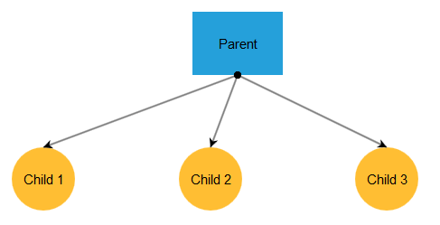

# Getting Started

The following tutorial demonstrates how you can add a simple **RadDiagram** control with several shapes and connections. The end result will be similar to **Figure 1**:

>caption **Figure 1**: A RadDiagram configuration with a few shapes and connections

1. Add a **ScriptManager** control on a Web Form.

1. Add a **RadDiagram** control on this AJAX-enabled Web Form: 
	
	>caption **Example 1**: Declaration of a **RadDiagram** control.

	**ASP.NET**

		<asp:ScriptManager runat="server" ID="ScriptManager1"  />
		<telerik:RadDiagram ID="RadDiagram1" runat="server">
		</telerik:RadDiagram>

1. Add a few shapes in the **ShapesCollection** of the diagram. It is recommended to set different values for their **X** and **Y** properties so that they are not positioned on the same location.

	>tip Setting the **Id** property of each shape is important, because you will need it when creating connections.

1. Set some of the [properties of the shapes](http://www.telerik.com/help/aspnet-ajax/t_telerik_web_ui_diagramshape.html) like **Background**, **Type**, **Width** and **Height** to make them distinctive.

	>caption **Example 2**: The diagram now contains several shapes

	**ASP.NET**

		<asp:ScriptManager runat="server" ID="ScriptManager1"  />
		<telerik:RadDiagram ID="RadDiagram1" runat="server">
			<ShapesCollection>
				<telerik:DiagramShape Id="DiagramShape5" Width="100" Height="70" X="260" Y="100" Type="rectangle">
					<ContentSettings Text="Parent" />
					<FillSettings Color="#25a0da" />
				</telerik:DiagramShape>
				<telerik:DiagramShape Id="DiagramShape6" Height="70" X="60" Y="250" Type="circle">
					<ContentSettings Text="Child 1" />
					<FillSettings Color="#FFBE33" />
				</telerik:DiagramShape>
				<telerik:DiagramShape Id="DiagramShape7" Height="70" X="245" Y="250" Type="circle">
					<ContentSettings Text="Child 2" />
					<FillSettings Color="#FFBE33" />
				</telerik:DiagramShape>
				<telerik:DiagramShape Id="DiagramShape8" Height="70" X="440" Y="250" Type="circle">
					<ContentSettings Text="Child 3" />
					<FillSettings Color="#FFBE33" />
				</telerik:DiagramShape>
			</ShapesCollection>
		</telerik:RadDiagram>

1. Add some connections between the shapes in the diagram to the **ConnectionsCollections**. It is important to specify valid shapes from which a connection starts and to which it ends. If the **ShapeId** property in **FromSettings** and **ToSettings** contains an Id of a non-existent shape, the connection will not be created.

1. You can configure some of the [properties of the connections](http://www.telerik.com/help/aspnet-ajax/t_telerik_web_ui_diagramconnection.html) like **StartCap**, **EndCap**, **FromSetting** > **Connector** and **ToSetting** > **Connector** to specify the starting and ending point of a connection, as well as the appearance of the connection's start and end cap.

1. Press F5 to run the application. You will see the diagram that is displayed in **Figure 1**. From this point you can start interacting with the diagram using the actions that are described in the [Rich User Interaction]() help article.

	>caption **Example 3**: The shapes in the diagram are connected

	**ASP.NET**

		<asp:ScriptManager runat="server" ID="ScriptManager1"  />
		<telerik:RadDiagram ID="RadDiagram1" runat="server">
			<ShapesCollection>
				<telerik:DiagramShape Id="DiagramShape1" Width="100" Height="70" X="260" Y="100" Type="rectangle">
					<ContentSettings Text="Parent" />
					<FillSettings Color="#25a0da" />
				</telerik:DiagramShape>
				<telerik:DiagramShape Id="DiagramShape2" Height="70" X="60" Y="250" Type="circle">
					<ContentSettings Text="Child 1" />
					<FillSettings Color="#FFBE33" />
				</telerik:DiagramShape>
				<telerik:DiagramShape Id="DiagramShape3" Height="70" X="245" Y="250" Type="circle">
					<ContentSettings Text="Child 2" />
					<FillSettings Color="#FFBE33" />
				</telerik:DiagramShape>
				<telerik:DiagramShape Id="DiagramShape4" Height="70" X="440" Y="250" Type="circle">
					<ContentSettings Text="Child 3" />
					<FillSettings Color="#FFBE33" />
				</telerik:DiagramShape>
			</ShapesCollection>
			<ConnectionsCollection>
				<telerik:DiagramConnection StartCap="FilledCircle" EndCap="ArrowEnd">
					<FromSettings Connector="Bottom" ShapeId="DiagramShape1" />
					<ToSettings Connector="Top" ShapeId="DiagramShape2" />
				</telerik:DiagramConnection>
				<telerik:DiagramConnection StartCap="FilledCircle" EndCap="ArrowEnd">
					<FromSettings Connector="Bottom" ShapeId="DiagramShape1" />
					<ToSettings Connector="Top" ShapeId="DiagramShape3" />
				</telerik:DiagramConnection>
				 <telerik:DiagramConnection StartCap="FilledCircle" EndCap="ArrowEnd">
					<FromSettings Connector="Bottom" ShapeId="DiagramShape1" />
					<ToSettings Connector="Top" ShapeId="DiagramShape4" />
				</telerik:DiagramConnection>
			</ConnectionsCollection>
		</telerik:RadDiagram>

# See Also

 * [RadDiagram Structure]()

 * [RadDiagram Rich User Interaction]()

 * [RadDiagram Server-Side Programming]()