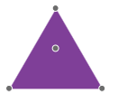
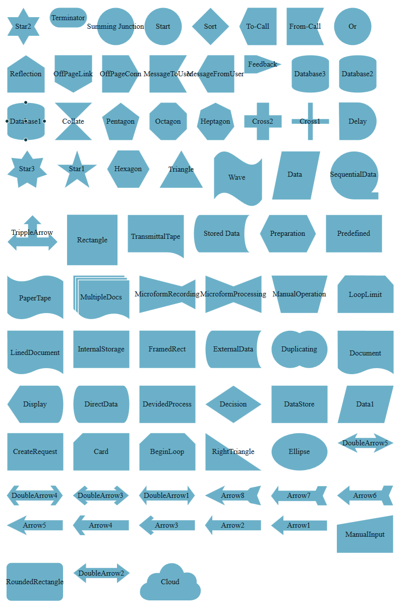

# Custom Shapes and Connectors

This article provides information about the way you can create custom shapes in the Telerik ASP.NET AJAX Diagram control and how to configure their connectors. By utilizing the	[SVG Path](http://www.w3.org/TR/SVG/paths.html#PathData) functionality you can create your custom shape path definition.

When defining a custom shape you can use the built-in connectors every shape offers, or you can define your own connectors to match the shape and functionality you need.

Below you will find examples of defining a custom shape that uses the built-in connectors (**Example 1**) and an example of setting up your own connectors on the custom shape (**Example 2**). In **Example 3**, you will find a sample configuration of the most popular shapes.

## Custom Shape with Customized Set of Built-in Connectors

To create a custom shape, you need to pass the desired SVG path to the DiagramShape’s [Path]() property.	Once the desired custom geometrical figure is created, you can configure its [ConnectorsCollection]()	that defines which of the built-in connectors will be used for this specific shape.

>caption **Figure 1**: Custom RadDiagram shape with customized set of built-in connectors.



>caption **Example 1**: Custom RadDiagram shape with customized set of built-in connectors.

````ASP.NET
<telerik:RadDiagram id="RadDiagram1" runat="server">
	<LayoutSettings Enabled="true"></LayoutSettings>
	<ShapesCollection>
		<telerik:DiagramShape Id="Triangle" Path="M43.51,0.50 L86.50,74.50 L0.50,74.50 za">
			<FillSettings Color="#7f3f98" />
			<ConnectorsCollection>
				<telerik:DiagramShapeConnector Name="Top" />
				<telerik:DiagramShapeConnector Name="BottomRight" />
				<telerik:DiagramShapeConnector Name="BottomLeft" />
				<telerik:DiagramShapeConnector Name="Auto" />
			</ConnectorsCollection>
		</telerik:DiagramShape>
	</ShapesCollection>
</telerik:RadDiagram>
````

## Custom Shape with Custom Connectors

When you need to create a custom shape, which bounds does not match with the position of the predefined connectors, you can move the connectors to a desired position. All you need to do is to create a custom **DiagramShapeConnector** and a function that returns a`kendo.datatviz.diagram.Point(x, y)` object with the coordinates where the connector will be placed. The function that positions the connector has as an argument the parent shape of the connector and has to be set as a value to the DiagramShape’s [Position]() property.

>caption **Figure 2**: Custom RadDiagram shape with custom connectors.


>caption **Example 2**: Defining a custom shape with custom connectors.

````ASP.NET
<script type="text/javascript">
	function getRightPosition(shape) {
		var p = shape.bounds().right();
		return new kendo.dataviz.diagram.Point(p.x, p.y + 25);
	}

	function getLeftPosition(shape) {
		var p = shape.bounds().left();
		return new kendo.dataviz.diagram.Point(p.x, p.y + 25);
	}
</script>
<telerik:RadDiagram ID="RadDiagram2" runat="server">
	<LayoutSettings Enabled="true"></LayoutSettings>
	<ShapesCollection>
		<telerik:DiagramShape Id="TrippleArrow" Width="135" Height="95"
			Path="m1,53.69333l17.5647,-17.56445l0,8.78235l23.15292,0l0,-26.34678l-8.78181,0l17.56417,-17.56444l17.5647,17.56444l-8.78238,0l0,26.34678l23.15297,0l0,-8.78235l17.56473,17.56445l-17.56473,17.56466l0,-8.78231l-63.87057,0l0,8.78231l-17.5647,-17.56466l0,0z">
			<FillSettings Color="#7f3f98" />
			<ConnectorsCollection>
				<telerik:DiagramShapeConnector Name="Top" />
				<telerik:DiagramShapeConnector Name="SideRight" Position="getRightPosition" />
				<telerik:DiagramShapeConnector Name="SideLeft" Position="getLeftPosition" />
				<telerik:DiagramShapeConnector Name="Auto" />
			</ConnectorsCollection>
		</telerik:DiagramShape>
	</ShapesCollection>
</telerik:RadDiagram>
````

## Sample Paths for Common Shape Definitions

In **Example 3** you can find the **Path** definitions for the most popular geometrical figures, so you can directly use them in your application. You can find the list of the resulting shapes in **Figure 3**.

>caption **Figure 3**: Set of commonly used custom shapes in RadDiagram.



>caption **Example 3**: Sample declarations of the common custom shapes shown in **Figure 3**.

````ASP.NET
<telerik:RadDiagram ID="RadDiagram3" runat="server" Width="1200px" Height="2000" Skin="WebBlue">
	<LayoutSettings Enabled="true">
		<GridSettings Width="750" />
	</LayoutSettings>
	<ShapesCollection>
		<telerik:DiagramShape Id="SequentialData" Width="150" Height="150"
			Path="m50.21875,97.4375l0,0c-26.35457,0 -47.71875,-21.25185 -47.71875,-47.46875l0,0c0,-26.21678 21.36418,-47.46875 47.71875,-47.46875l0,0c12.65584,0 24.79359,5.00155 33.74218,13.90339c8.94862,8.90154 13.97657,20.97617 13.97657,33.56536l0,0c0,12.58895 -5.02795,24.66367 -13.97657,33.56542l13.97657,0l0,13.90333l-47.71875,0z">
			<ContentSettings Text="SequentialData" />
		</telerik:DiagramShape>
		<telerik:DiagramShape Id="Data"
			Path="m2.5,97.70305l19.07013,-95.20305l76.27361,0l-19.0702,95.20305l-76.27354,0z">
			<ContentSettings Text="Data" />
		</telerik:DiagramShape>
		<telerik:DiagramShape Id="Wave"
			Path="m2.5,15.5967c31.68356,-45.3672 63.37309,45.3642 95.05661,0l0,81.65914c-31.68353,45.36404 -63.37305,-45.36732 -95.05661,0l0,-81.65914z">
			<ContentSettings Text="Wave" />
		</telerik:DiagramShape>
		<telerik:DiagramShape Id="Arrow1"
			Path="M25,0.5 L25,10.5 L111.5,10.5 L111.5,30.5 L25,30.5 L25,39.5 L0.5,20.5 z">
			<ContentSettings Text="Arrow1" />
		</telerik:DiagramShape>
		<telerik:DiagramShape Id="Arrow2"
			Path="M15,0 L15,10 L111.5,10 L111.5,30 L15,30 L15,39.5 L0.5,20 z">
			<ContentSettings Text="Arrow2" />
		</telerik:DiagramShape>
		<telerik:DiagramShape Id="Arrow3"
			Path="M24,0.5 L30,5.8299999 L25,10 L111.5,10 L111.5,30 L25,30 L30,34.23 L24,39.5 L0.5,20 z">
			<ContentSettings Text="Arrow3" />
		</telerik:DiagramShape>
		<telerik:DiagramShape Id="Arrow4"
			Path="M15,0.5 L25,0.5 L18,10 L111.5,10 L111.5,30 L18,30 L25,39.5 L15,39.5 L0.5,20 z">
			<ContentSettings Text="Arrow4" />
		</telerik:DiagramShape>
		<telerik:DiagramShape Id="Arrow5"
			Path="M40,0.5 L35,10 L111.49947,10 L111.49947,30 L35,30 L40,39.5 L0.5,20 z">
			<ContentSettings Text="Arrow5" />
		</telerik:DiagramShape>
		<telerik:DiagramShape Id="Arrow6"
			Path="M25,0.5 L25,10 L89,10 L93,0.5 L111.5,0.5 L103,20 L111.5,39.5 L93,39.5 L89,30 L25,30 L25,39.5 L0.5,20 z">
			<ContentSettings Text="Arrow6" />
		</telerik:DiagramShape>
		<telerik:DiagramShape Id="Arrow7"
			Path="M15,0.5 L15,10.5 L89,10.5 L93,1.5 L111.5,1.5 L103,20.5 L111.5,39.5 L93,39.5 L89,31 L15,31 L15,39.5 L0.5,21 z">
			<ContentSettings Text="Arrow7" />
		</telerik:DiagramShape>
		<telerik:DiagramShape Id="Arrow8"
			Path="M111.5,0.5 L103.69976,20 L111.5,39.5 L90,35 L85,30 L34.5,30 L40,39.5 L0.5,20 L40,0.5 L35,10 L85,10 L90,5 z">
			<ContentSettings Text="Arrow8" />
		</telerik:DiagramShape>
		<telerik:DiagramShape Id="Arrow11" Width="120"
			Path="M97,0.5 L111.5,20 L97,39.5 L97,30 L15.5,30 L15.5,39.5 L0.5,20 L15.5,0.5 L15.5,10 L97,10 z">
			<ContentSettings Text="DoubleArrow1" />
		</telerik:DiagramShape>
		<telerik:DiagramShape Id="Arrow21" Width="120"
			Path="M87,1 L112.5,20 L87,40 L87,30 L25.5,30 L25.5,40 L0.5,20 L25.5,0.5 L25.5,10 L87,10 z">
			<ContentSettings Text="DoubleArrow2" />
		</telerik:DiagramShape>
		<telerik:DiagramShape Id="Arrow31" Width="120"
			Path="M88,0.5 L111.5,20 L88,39.5 L82,34.2 L87,30 L25,30 L30,34 L24,39.5 L0.5,20 L24,0.5 L30,6 L25,10 L87,10 L82,5.83 z">
			<ContentSettings Text="DoubleArrow3" />
		</telerik:DiagramShape>
		<telerik:DiagramShape Id="Arrow41" Width="120"
			Path="M15,0.5 L25,0.5 L18,10 L94,10 L87,0.5 L97,0.5 L111.5,20 L97,39.5 L87,39.5 L94,30 L18,30 L25,39.5 L15,39.5 L0.5,20 z">
			<ContentSettings Text="DoubleArrow4" />
		</telerik:DiagramShape>
		<telerik:DiagramShape Id="Arrow51" Width="120"
			Path="M40,0.5 L35,10 L77,10 L72,0.5 L111.5,20 L72,39.5 L77,30 L35,30 L40,39.5 L0.5,20 z">
			<ContentSettings Text="DoubleArrow5" />
		</telerik:DiagramShape>
		<telerik:DiagramShape Id="Cloud" Path="M14.248657,39.417725 C14.248657,39.417725 14,29.667244 21.3302,24.000578 C28.663574,18.333912 39.328003,20.250563 39.328003,20.250563 C39.328003,20.250563 43.494385,0.5 63.741943,0.5 C82.739746,0.5 87.655762,19.750601 87.655762,19.750601 C87.655762,19.750601 100.32007,16.000544 108.31909,24.750582 C114.66797,31.695599 112.90283,40.4174 112.90283,40.4174 C112.90283,40.4174 123.16272,45.471794 120.81873,58.500729 C117.81824,75.179268 98.904663,74.25106 98.904663,74.25106 L18.581177,74.25106 C18.581177,74.25106 0.5,73.084129 0.5,57.750725 C0.5,42.417324 14.248657,39.417725 14.248657,39.417725 z">
			<ContentSettings Text="Cloud" />
		</telerik:DiagramShape>
		<telerik:DiagramShape Id="Cross1" Path="M32.78,0.50 L42.22,0.50 L42.22,32.78 L74.50,32.78 L74.50,42.22 L42.22,42.22 L42.22,74.50 L32.78,74.50 L32.78,42.22 L0.50,42.22 L0.50,32.78 L32.78,32.78 z">
			<ContentSettings Text="Cross1" />
		</telerik:DiagramShape>
		<telerik:DiagramShape Id="Cross2" Path="M25.33,0.50 L49.67,0.50 L49.67,25.33 L74.50,25.33 L74.50,49.67 L49.67,49.67 L49.67,74.50 L25.33,74.50 L25.33,49.67 L0.50,49.67 L0.50,25.33 L25.33,25.33 z">
			<ContentSettings Text="Cross2" />
		</telerik:DiagramShape>
		<telerik:DiagramShape Id="Ellipse" Path="M111.50,37.50 C111.50,57.91 86.67,74.50 56.00,74.50 C25.33,74.50 0.50,57.91 0.50,37.50 C0.50,17.09 25.33,0.50 56.00,0.50 C86.67,0.50 111.50,17.09 111.50,37.50 z">
			<ContentSettings Text="Ellipse" />
		</telerik:DiagramShape>
		<telerik:DiagramShape Id="Hexagon" Path="M21.56,0.50 L63.56,0.50 L84.50,37.50 L63.56,74.50 L21.56,74.50 L0.50,37.50 z">
			<ContentSettings Text="Hexagon" />
		</telerik:DiagramShape>
		<telerik:DiagramShape Id="Heptagon" Path="M0.50,48.01 L7.78,15.18 L37.38,0.50 L67.10,15.18 L74.50,47.88 L54.00,74.50 L21.12,74.50 z">
			<ContentSettings Text="Heptagon" />
		</telerik:DiagramShape>
		<telerik:DiagramShape Id="Octagon" Path="M22.79,0.50 L53.04,0.50 L74.46,21.88 L74.50,52.62 L52.30,74.50 L22.91,74.50 L0.50,52.88 L0.50,21.75 z">
			<ContentSettings Text="Octagon" />
		</telerik:DiagramShape>
		<telerik:DiagramShape Id="Pentagon" Path="M37.50,0.50 L74.50,28.76 L60.35,74.50 L14.65,74.50 L0.50,28.76 z">
			<ContentSettings Text="Pentagon" />
		</telerik:DiagramShape>
		<telerik:DiagramShape Id="RightTriangle" Path="M0.50,0.50 L111.50,74.50 L0.50,74.50 z">
			<ContentSettings Text="RightTriangle" />
		</telerik:DiagramShape>
		<telerik:DiagramShape Id="RoundedRectangle" Path="M0,9 C0,4.0294371 4.0294371,0 9,0 L103,0 C107.97057,0 112,4.0294371 112,9 L112,66 C112,70.970566 107.97057,75 103,75 L9,75 C4.0294371,75 0,70.970566 0,66 z">
			<ContentSettings Text="RoundedRectangle" />
		</telerik:DiagramShape>
		<telerik:DiagramShape Id="Star1" Path="M40.00,0.50 L49.34,28.76 L79.50,28.76 L55.10,46.24 L64.35,74.50 L40.00,57.02 L15.60,74.50 L24.90,46.24 L0.50,28.76 L30.66,28.76 z">
			<ContentSettings Text="Star1" />
		</telerik:DiagramShape>
		<telerik:DiagramShape Id="Star2" Path="M32.50,0.50 L43.22,19.09 L64.50,19.09 L53.83,37.52 L64.50,55.91 L43.22,55.91 L32.50,74.50 L21.78,55.91 L0.50,55.91 L11.17,37.52 L0.50,19.09 L21.78,19.09 z">
			<ContentSettings Text="Star2" />
		</telerik:DiagramShape>
		<telerik:DiagramShape Id="Star3" Path="M40.00,0.50 L51.13,17.24 L71.70,15.15 L64.99,33.92 L79.50,48.08 L60.02,54.78 L57.59,74.50 L40.00,64.07 L22.41,74.50 L19.98,54.78 L0.50,48.08 L15.01,33.92 L8.30,15.15 L28.87,17.24 z">
			<ContentSettings Text="Star3" />
		</telerik:DiagramShape>
		<telerik:DiagramShape Id="Triangle" Path="M43.51,0.50 L86.50,74.50 L0.50,74.50 za">
			<ContentSettings Text="Triangle" />
		</telerik:DiagramShape>
		<telerik:DiagramShape Id="BeginLoop" Path="M22.74,0.50 L90.10,0.50 L111.45,21.91 L111.50,74.50 L0.50,74.50 L0.50,21.79 z">
			<ContentSettings Text="BeginLoop" />
		</telerik:DiagramShape>
		<telerik:DiagramShape Id="Card" Path="M 0.50 19.00 L 19.00,0.50 H 111.50 V 74.50 H 0.50 Z">
			<ContentSettings Text="Card" />
		</telerik:DiagramShape>
		<telerik:DiagramShape Id="Collate" Path="M37.50,37.75 L74.50,74.50 L0.50,74.50 z M0.50,0.50 L74.50,0.50 L37.50,37.25 z">
			<ContentSettings Text="Collate" />
		</telerik:DiagramShape>
		<telerik:DiagramShape Id="CreateRequest" Path="M0.50000262,0.5 L111.5,0.5 L111.5,74.5 L0.50000262,74.5 z M0.5,15.500003 L111.5,15.500003 M0.5,59.500004 L111.5,59.500004">
			<ContentSettings Text="CreateRequest" />
		</telerik:DiagramShape>
		<telerik:DiagramShape Id="Database1" Path="M74.5,13 C74.5,19.903559 57.934536,25.5 37.5,25.5 C17.065464,25.5 0.5,19.903559 0.5,13 C0.5,6.0964408 17.065464,0.5 37.5,0.5 C57.934536,0.5 74.5,6.0964408 74.5,13 z M74.5,13.5 L74.498734,62.643272 C73.507751,69.247826 57.295956,74.499954 37.5,74.499954 C17.704042,74.499954 1.4922448,69.247826 0.50126934,62.643272 L0.5,13.5">
			<ContentSettings Text="Database1" />
		</telerik:DiagramShape>
		<telerik:DiagramShape Id="Database2" Path="M74.5,13 C74.5,19.903559 57.934536,25.5 37.5,25.5 C17.065464,25.5 0.5,19.903559 0.5,13 C0.5,6.0964408 17.065464,0.5 37.5,0.5 C57.934536,0.5 74.5,6.0964408 74.5,13 z M74.5,13.5 L74.498734,62.643272 C73.507751,69.247826 57.295956,74.499954 37.5,74.499954 C17.704042,74.499954 1.4922448,69.247826 0.50126934,62.643272 L0.5,13.5 M74.5,18.25 C74.5,25.153559 57.934536,30.75 37.5,30.75 C17.065464,30.75 0.5,25.153559 0.5,18.25">
			<ContentSettings Text="Database2" />
		</telerik:DiagramShape>
		<telerik:DiagramShape Id="Database3" Path="M74.5,13 C74.5,19.903559 57.934536,25.5 37.5,25.5 C17.065464,25.5 0.5,19.903559 0.5,13 C0.5,6.0964408 17.065464,0.5 37.5,0.5 C57.934536,0.5 74.5,6.0964408 74.5,13 z M74.5,13.5 L74.498734,62.643272 C73.507751,69.247826 57.295956,74.499954 37.5,74.499954 C17.704042,74.499954 1.4922448,69.247826 0.50126934,62.643272 L0.5,13.5 M74.5,18.25 C74.5,25.153559 57.934536,30.75 37.5,30.75 C17.065464,30.75 0.5,25.153559 0.5,18.25 M74.5,23.25 C74.5,30.153559 57.934536,35.75 37.5,35.75 C17.065464,35.75 0.5,30.153559 0.5,23.25">
			<ContentSettings Text="Database3" />
		</telerik:DiagramShape>
		<telerik:DiagramShape Id="Data1" Path="M 19.00,0.50 L 111.50 0.50 L 93.00,74.50 L 0.50,74.50 Z">
			<ContentSettings Text="Data1" />
		</telerik:DiagramShape>
		<telerik:DiagramShape Id="DataStore" Path="M0.5,0.5 L14.5,0.5 L14.5,74.5 L0.5,74.5 z M14.500003,0.5000003 L111.5,0.5000003 L111.5,74.5 L14.500003,74.5">
			<ContentSettings Text="DataStore" />
		</telerik:DiagramShape>
		<telerik:DiagramShape Id="Decision" Path="M56.00,0.50 L111.50,37.50 L56.00,74.50 L0.50,37.50 z">
			<ContentSettings Text="Decision" />
		</telerik:DiagramShape>
		<telerik:DiagramShape Id="Delay" Path="M 0,0 H 37.5 A 10,10 0 0 1 37.5,74.50 H 1 Z">
			<ContentSettings Text="Delay" />
		</telerik:DiagramShape>
		<telerik:DiagramShape Id="DevidedProcess" Path="M0.50000006,0.5 L111.5,0.5 L111.5,14.5 L0.50000006,14.5 z M111.5,14.500001 L111.5,74.501999 L0.5,74.501999 L0.5,14.500001">
			<ContentSettings Text="DevidedProcess" />
		</telerik:DiagramShape>
		<telerik:DiagramShape Id="DirectData" Path="M12.86,0.50 L99.39,0.50 C106.21,0.50 111.50,17.08 111.50,37.50 C111.50,57.92 106.21,74.50 99.39,74.25 L12.86,74.25 C6.04,74.25 0.50,57.92 0.50,37.50 C0.50,17.08 6.04,0.50 12.86,0.50 z">
			<ContentSettings Text="DirectData" />
		</telerik:DiagramShape>
		<telerik:DiagramShape Id="Display" Path="M25.22,0.50 L99.39,0.50 C106.21,0.50 111.50,17.08 111.50,37.50 C111.50,57.92 106.21,74.50 99.39,74.25 L25.22,74.25 L0.50,37.50 z">
			<ContentSettings Text="Display" />
		</telerik:DiagramShape>
		<telerik:DiagramShape Id="Document" Path="M0.50,0.50 L111.50,0.75 L111.50,86.51 C111.50,86.51 87.26,64.60 53.49,80.39 C16.92,97.50 0.80,74.48 0.80,74.48 z">
			<ContentSettings Text="Document" />
		</telerik:DiagramShape>
		<telerik:DiagramShape Id="Duplicating" Path="M37.42,0.50 C44.11,0.50 50.35,2.29 55.80,5.42 L56.00,5.52 L56.20,5.42 C61.65,2.29 67.89,0.50 74.58,0.50 C94.95,0.50 111.50,17.09 111.50,37.50 C111.50,57.91 94.95,74.50 74.58,74.50 C67.89,74.50 61.65,72.71 56.20,69.58 L56.00,69.46 L55.80,69.58 C50.37,72.71 44.11,74.50 37.42,74.50 C17.10,74.50 0.50,57.91 0.50,37.50 C0.50,17.14 17.10,0.50 37.42,0.50 z">
			<ContentSettings Text="Duplicating" />
		</telerik:DiagramShape>
		<telerik:DiagramShape Id="ExternalData" Path="M12.83,0.50 L111.50,0.50 L111.50,0.60 L111.40,0.70 C106.07,4.94 102.13,19.79 102.13,37.50 C102.13,55.21 106.07,70.06 111.40,74.30 L111.50,74.40 L111.50,74.50 L12.83,74.50 C6.03,74.50 0.50,57.92 0.50,37.50 C0.50,17.08 6.03,3.81 12.83,0.50 z">
			<ContentSettings Text="ExternalData" />
		</telerik:DiagramShape>
		<telerik:DiagramShape Id="Feedback" Path="M0.50,0.50 L24.89,0.50 L74.50,18.50 L24.88,36.50 L0.50,36.50 z">
			<ContentSettings Text="Feedback" />
		</telerik:DiagramShape>
		<telerik:DiagramShape Id="FramedRect" Path="M0.50,0.50 L111.50,0.50 L111.50,74.50 L0.50,74.50 z M14.87,13.43 L97.13,13.43 L97.13,61.57 L14.87,61.57 z">
			<ContentSettings Text="FramedRect" />
		</telerik:DiagramShape>
		<telerik:DiagramShape Id="InternalStorage" Path="M 0.50,19.00 H 111.50 M 19.00,0.50 V 74.50 M 0.50,0.50 H 111.50 V 74.50 H 0.50 Z">
			<ContentSettings Text="InternalStorage" />
		</telerik:DiagramShape>
		<telerik:DiagramShape Id="LinedDocument" Path="M0.5,0.5 L14.5,0.5 L14.5,84.277 L14.251022,84.183327 C5.0858073,80.599884 0.79999673,74.479614 0.79999644,74.479614 L0.5,0.50087458 z M14.500002,0.50000077 L111.5,0.50000077 L111.5,86.510292 C111.5,86.510292 87.260002,64.600212 53.489998,80.390266 C36.347809,88.410606 23.699032,87.613289 15.097685,84.502586 L14.500002,84.277725">
			<ContentSettings Text="LinedDocument" />
		</telerik:DiagramShape>
		<telerik:DiagramShape Id="LoopLimit" Path="M0.5,19 L15.3,0 L95,0.5 L111.5,19 L111.5,74.5 L0.5,74.5 z">
			<ContentSettings Text="LoopLimit" />
		</telerik:DiagramShape>
		<telerik:DiagramShape Id="ManualInput" Path="M 0 19 L 111.5,0 V 74.5 H 0 Z">
			<ContentSettings Text="ManualInput" />
		</telerik:DiagramShape>
		<telerik:DiagramShape Id="ManualOperation" Path="M0.5,0.5 L111.5,0.5 L91.75,74.5 L19,74.5 z">
			<ContentSettings Text="ManualOperation" />
		</telerik:DiagramShape>
		<telerik:DiagramShape Id="MessageFromUser" Path="M21.79,0.50 L74.50,0.50 L74.50,74.50 L21.79,74.50 L0.50,37.50 z">
			<ContentSettings Text="MessageFromUser" />
		</telerik:DiagramShape>
		<telerik:DiagramShape Id="MessageToUser" Path="M0.50,0.50 L74.50,0.50 L74.50,0.60 L52.90,37.50 L74.50,74.40 L74.50,74.50 L0.50,74.50 z">
			<ContentSettings Text="MessageToUser" />
		</telerik:DiagramShape>
		<telerik:DiagramShape Id="MicroformProcessing" Path="M0.50,0.50 L56.00,21.86 L111.50,0.50 L111.50,74.50 L56.00,53.13 L0.50,74.50 z">
			<ContentSettings Text="MicroformProcessing" />
		</telerik:DiagramShape>
		<telerik:DiagramShape Id="MicroformRecording" Path="M0.50,0.50 L84.74,21.86 L111.50,8.12 L111.50,67.15 L84.74,53.13 L0.50,74.50 z">
			<ContentSettings Text="MicroformRecording" />
		</telerik:DiagramShape>
		<telerik:DiagramShape Id="MultipleDocs" Path="M107.55,9.90L111.50,9.90 L111.50,86.38 C111.50,86.38 89.40,66.83 58.56,80.92 C28.82,94.50 13.90,79.70 10.99,76.30 L10.86,76.15 L10.86,9.90 L107.55,9.90 z M5.43,4.95 L101.58,4.95 L101.59,4.95 L106.57,4.95 L106.57,8.43 L10.86,8.43 L9.38,8.43 L9.38,9.90 L9.38,74.56 L9.38,74.56 C7.73,73.23 6.63,72.05 6.04,71.36 L5.94,71.25 L5.93,71.23 L5.43,70.88 z M0.50,0.50 L101.63,0.50 L101.58,3.47 L5.43,3.47 L3.95,3.47 L3.95,69.72 L3.55,69.37 C1.52,67.61 0.55,66.24 0.55,66.24 z">
			<ContentSettings Text="MultipleDocs" />
		</telerik:DiagramShape>
		<telerik:DiagramShape Id="OffPageConnection" Path="M0.50,0.50 L53.27,0.50 L74.50,37.50 L53.27,74.50 L0.50,74.50 z">
			<ContentSettings Text="OffPageConn" />
		</telerik:DiagramShape>
		<telerik:DiagramShape Id="OffPageLink" Path="M74.50,0.50 L74.50,53.36 L37.50,74.50 L0.50,53.36 L0.50,0.50 z">
			<ContentSettings Text="OffPageLink" />
		</telerik:DiagramShape>
		<telerik:DiagramShape Id="OffPageReflection" Path="M37.50,0.50 L74.50,25.17 L74.50,74.50 L0.50,74.50 L0.50,25.17 z">
			<ContentSettings Text="Reflection" />
		</telerik:DiagramShape>
		<telerik:DiagramShape Id="Or" Path="M74.5,37.5 C74.5,57.934536 57.934536,74.5 37.5,74.5 C17.065464,74.5 0.5,57.934536 0.5,37.5 C0.5,17.065464 17.065464,0.5 37.5,0.5 C57.934536,0.5 74.5,17.065464 74.5,37.5 z M0.5,37.5 L37,37.5 M38,37.5 L74.5,37.5 M37.5,0.5 L37.5,74.5">
			<ContentSettings Text="Or" />
		</telerik:DiagramShape>
		<telerik:DiagramShape Id="PaperTape" Path="M0.50,0.60 C0.50,0.60 19.53,21.86 53.32,6.05 C60.21,2.83 66.70,1.19 72.65,0.60 L73.59,0.50 L82.36,0.50 L83.06,0.55 C98.91,2.09 109.67,10.41 111.50,11.94 L111.50,86.50 C111.50,86.50 87.22,64.51 53.32,80.36 C16.65,97.50 0.50,74.41 0.50,74.41 z">
			<ContentSettings Text="PaperTape" />
		</telerik:DiagramShape>
		<telerik:DiagramShape Id="Predefined" Path="M 1,0.50 V 74.50 M 19.00,0.50 V 74.50 M 0.50 0.50 H 111.50 V 74.50 H 0.50 Z">
			<ContentSettings Text="Predefined" />
		</telerik:DiagramShape>
		<telerik:DiagramShape Id="Preparation" Path="M 0.50,37.50 L 19.10,0.50  H 93.50 L 111.50,37.70 L 93.00,74.5 H19.00 Z'">
			<ContentSettings Text="Preparation" />
		</telerik:DiagramShape>
		<telerik:DiagramShape Id="FromCall" Path="M0.5,0.5 L14.5,0.5 L14.5,74.5 L0.5,74.5 z M14.5,0.5 L74.5,0.5 L59,37.5 L74.5,74.5 L14.5,74.5">
			<ContentSettings Text="From-Call" />
		</telerik:DiagramShape>
		<telerik:DiagramShape Id="ToCall" Path="M60.5,0.5 L74.5,0.5 L74.5,74.5 L60.5,74.5 z M60.5,74.5 L17.166668,74.5 L0.5,37.5 L17.166668,0.5 L60.5,0.5">
			<ContentSettings Text="To-Call" />
		</telerik:DiagramShape>
		<telerik:DiagramShape Id="Sort" Path="M0.5,37.5 L37.5,0.5 L74.5,37.5 M0.5,37.5 L74.5,37.5 L37.5,74.5 z">
			<ContentSettings Text="Sort" />
		</telerik:DiagramShape>
		<telerik:DiagramShape Id="Start" Path="M74.5,37.5 C74.5,57.91 57.91,74.5 37.5,74.5 C17,74.5 0.5,57.91 0.5,37.5 C0.5,17 17,0.5 37.5,0.5 C57.91,0.5 74.5,17 74.5,37.5 z">
			<ContentSettings Text="Start" />
		</telerik:DiagramShape>
		<telerik:DiagramShape Id="StoredData" Path="M12,0.5 C16.099238,0.5 12.198184,0.5 12.29682,0.5 L12.5,0.5 L12.5,0.5 L111.5,0.5 L111.5,0.5 L111.40821,0.5 C105.33196,1.5 100.5,17.704042 100.5,37.5 C100.5,57.295956 105.33196,73.5 111.5,74.5 L111.5,74.5 L111.5,74.5 L12.5,74.5 L12.5,74.5 L12.29682,74.5 C12.198184,74.5 12.099238,74.5 12,74.5 C5.6487255,74.5 0.5,57.934536 0.5,37.5 C0.5,17.065464 5.6487255,0.5 12,0.5 z">
			<ContentSettings Text="Stored Data" />
		</telerik:DiagramShape>
		<telerik:DiagramShape Id="SummingJunction" Path="M74.5,37.5 C74.5,57.934536 57.934536,74.5 37.5,74.5 C17.065464,74.5 0.5,57.934536 0.5,37.5 C0.5,17.065464 17.065464,0.5 37.5,0.5 C57.934536,0.5 74.5,17.065464 74.5,37.5 z M12.75,10.75 L38.25,36.25 M39,36.75 L64.5,62.25 M63.5,11.5 L11.5,63.5">
			<ContentSettings Text="Summing Junction" />
		</telerik:DiagramShape>
		<telerik:DiagramShape Id="Terminator" Path="M20.5,0.5 L54.5,0.5 L54.5,0.5 L55,0.5 C65.5,0.5 74.5,9 74.5,20 C74.5,30 65,39.5 55,39.5 L54.5,39.5 L54.5,39.5 L20.5,39.5 L20.5,39.5 L20,39.5 C9,39.5 0.5,30 0.5,20 C0.5,9 9,0.5 20,0.5 L20.5,0.5 z">
			<ContentSettings Text="Terminator" />
		</telerik:DiagramShape>
		<telerik:DiagramShape Id="TransmittalTape" Path="M0.50,0.50 L77.85,0.50 L111.50,0.50 L111.50,86.50 C111.50,86.50 98.42,74.31 78.05,74.31 L0.50,74.31 z">
			<ContentSettings Text="TransmittalTape" />
		</telerik:DiagramShape>
		<telerik:DiagramShape Id="Rectangle" Path="m0,0 L0,100 L100,100 L100,0z">
			<ContentSettings Text="Rectangle" />
		</telerik:DiagramShape>
		<telerik:DiagramShape Id="DiagramShape2" Path="m1,53.69333l17.5647,-17.56445l0,8.78235l23.15292,0l0,-26.34678l-8.78181,0l17.56417,-17.56444l17.5647,17.56444l-8.78238,0l0,26.34678l23.15297,0l0,-8.78235l17.56473,17.56445l-17.56473,17.56466l0,-8.78231l-63.87057,0l0,8.78231l-17.5647,-17.56466l0,0z">
			<ContentSettings Text="TrippleArrow" />
		</telerik:DiagramShape>
	</ShapesCollection>
</telerik:RadDiagram>	
````

# See Also

 * [ASP.NET Diagram Control Product Overview]()

 * [ASP.NET Diagram Shape Object]()

 * [ASP.NET Diagram Connector Object]()

 * [SVG Path](http://www.w3.org/TR/SVG/paths.html#PathData)