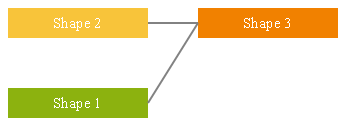

# Server-side Programming

You can configure the settings of **RadDiagram** and create its elements on the code-behind via the Server-Side API of this customizable ASP.NET Diagram control.

## Configuring a Diagram From the Code-Behind

**Example 1** shows a possible application of the Server-Side API of the diagram. The code in the example configures some settings of the diagram, of its layout, then adds sever shapes and connects them. You can use it to do all of this on the sever-side and achieve the result in **Figure 1**.

>caption **Figure 1**: A diagram that is configured from the code-behind.



>caption **Example 1**: Configuring a diagram on the server-side.

````C#
protected void Page_Load(object sender, EventArgs e)
{
	RadDiagram RadDiagram1 = new RadDiagram();

	// General diagram settings
	RadDiagram1.Width = 800;
	RadDiagram1.Height = 600;
	RadDiagram1.ShapeDefaultsSettings.Width = 140;
	RadDiagram1.ShapeDefaultsSettings.Height = 30;
	RadDiagram1.ShapeDefaultsSettings.StrokeSettings.Color = "#fff";
	Form.Controls.Add(RadDiagram1);

	// Layout settings
	RadDiagram1.LayoutSettings.Enabled = true;
	RadDiagram1.LayoutSettings.Type = Telerik.Web.UI.Diagram.LayoutType.Layered;
	RadDiagram1.LayoutSettings.Subtype = Telerik.Web.UI.Diagram.LayoutSubtype.Right;
	RadDiagram1.LayoutSettings.VerticalSeparation = 20;
	RadDiagram1.LayoutSettings.HorizontalSeparation = 30;

	// Programmatic creation of shapes and connections
	AddDiagramShape("Shape1", "#8CB20F", "Shape 1", "#fff", RadDiagram1);
	AddDiagramShape("Shape2", "#F8C43A", "Shape 2", "#fff", RadDiagram1);
	AddDiagramShape("Shape3", "#F18100", "Shape 3", "#fff", RadDiagram1);
	ConnectDiagramShapes("Shape1", "Shape3", RadDiagram1);
	ConnectDiagramShapes("Shape2", "Shape3", RadDiagram1);


}

protected void AddDiagramShape(string shapeID, string backgroundColor, string contentText, string contentColor, RadDiagram diagram)
{
	var shape = new DiagramShape()
	{
		Id = shapeID,
	};
	shape.ContentSettings.Text = contentText;
	shape.ContentSettings.Color = contentColor;
	shape.FillSettings.Color = backgroundColor;
	diagram.ShapesCollection.Add(shape);
}

protected void ConnectDiagramShapes(string startShapeID, string endShapeID, RadDiagram diagram)
{
	var connection = new DiagramConnection();
	connection.FromSettings.ShapeId = startShapeID;
	connection.ToSettings.ShapeId = endShapeID;
	diagram.ConnectionsCollection.Add(connection);
}
````
````VB
Protected Sub Page_Load(sender As Object, e As EventArgs)
	Dim RadDiagram1 As New RadDiagram()

	' General diagram settings
	RadDiagram1.Width = 800
	RadDiagram1.Height = 600
	RadDiagram1.ShapeDefaultsSettings.Width = 140
	RadDiagram1.ShapeDefaultsSettings.Height = 30
	RadDiagram1.ShapeDefaultsSettings.StrokeSettings.Color = "#fff"
	Form.Controls.Add(RadDiagram1)

	' Layout settings
	RadDiagram1.LayoutSettings.Enabled = True
	RadDiagram1.LayoutSettings.Type = Telerik.Web.UI.Diagram.LayoutType.Layered
	RadDiagram1.LayoutSettings.Subtype = Telerik.Web.UI.Diagram.LayoutSubtype.Right
	RadDiagram1.LayoutSettings.VerticalSeparation = 20
	RadDiagram1.LayoutSettings.HorizontalSeparation = 30

	' Programmatic creation of shapes and connections
	AddDiagramShape("Shape1", "#8CB20F", "Shape 1", "#fff", RadDiagram1)
	AddDiagramShape("Shape2", "#F8C43A", "Shape 2", "#fff", RadDiagram1)
	AddDiagramShape("Shape3", "#F18100", "Shape 3", "#fff", RadDiagram1)
	ConnectDiagramShapes("Shape1", "Shape3", RadDiagram1)
	ConnectDiagramShapes("Shape2", "Shape3", RadDiagram1)
End Sub

Protected Sub AddDiagramShape(shapeID As String, backgroundColor As String, contentText As String, contentColor As String, diagram As RadDiagram)
	Dim shape = New DiagramShape()
	shape.Id = shapeID
	shape.ContentSettings.Text = contentText
	shape.ContentSettings.Color = contentColor
	shape.FillSettings.Color = backgroundColor
	diagram.ShapesCollection.Add(shape)
End Sub

Protected Sub ConnectDiagramShapes(startShapeID As String, endShapeID As String, diagram As RadDiagram)
	Dim connection = New DiagramConnection()
	connection.FromSettings.ShapeId = startShapeID
	connection.ToSettings.ShapeId = endShapeID
	diagram.ConnectionsCollection.Add(connection)
End Sub
````

## RadDiagram Public Properties and Methods

[Server-Side API of the RadDiagram class.](http://www.telerik.com/help/aspnet-ajax/t_telerik_web_ui_raddiagram.html)

## DiagramConnection Public Properties and Methods

[Server-Side API of the DiagramConnection class.](http://www.telerik.com/help/aspnet-ajax/t_telerik_web_ui_diagramconnection.html)

## DiagramConnectionPoint Public Properties and Methods

[Server-Side API of the DiagramConnectionPoint class.](http://www.telerik.com/help/aspnet-ajax/t_telerik_web_ui_diagramconnectionpoint.html)

## DiagramLayout Public Properties and Methods

[Server-Side API of the DiagramLayout class.](http://www.telerik.com/help/aspnet-ajax/t_telerik_web_ui_diagramlayout.html)

## DiagramShape Public Properties and Methods

[Server-Side API of the DiagramShape class.](http://www.telerik.com/help/aspnet-ajax/t_telerik_web_ui_diagramshape.html)