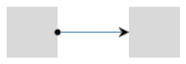

# Connection

This article explains how to configure the connections between two or more shapes in **Telerik ASP.NET Diagramming component**.	Below you can find examples that show how to create a standard shape connection, as well as how to set intermediate connection points to a connection.

The **DiagramConnection** object is a visual link or connection in the graph or diagram. Each diagram has a connections collection, containing all configured	connections. Connections are usually created in order to connect to shapes of a Diagram instance. Through the **DiagramConnection** object you have access to	properties like **StartCap** and **EndCap**, and composite properties for configuring the **FromSettings**,	**HoverSettings**, **StrokeSettings**, **ToSettings**, **PointsCollection**, etc.

### StartCap

The start cap (arrow, head or decoration) represents the beginning of the connection. The appearance of this point can be controlled by configuring its **StartCap** property:

* *"none"*—no cap

* *"ArrowStart"*—a filled arrow

* *"FilledCircle"*—a filled circle

>caption **Figure 1**. StartCap - the start point of a connection


### EndCap

The end cap (arrow, head or decoration) represents the end of the connection. The appearance of this point can be controlled by configuring its **EndCap** property:

* *"none"*—no cap

* *"ArrowEnd"*—a filled arrow

* *"FilledCircle"*—a filled circle

>caption **Figure 2**: EndCap - the end point of a connection


### ContentSettings

Defines the content settings for the connection, including the **Text** of the connection and the **Color** of the text.

### FromSettings

Defines the connection settings for the source shape, including the **ID** of the shape and the **Connector** we will connect to.

### ToSettings

Defines the connection settings for the target shape, including the **ID** of the shape and the **Connector** we	will connect to.

### StrokeSettings

Defines the stroke configuration of a connection. You can configure the following stroke-specific properties through the DiagramConnection's composite **StrokeSettings** property:

**Color**—defines the color of the connection.

**Width**—defines the thickness or width of the connection.

**DashType**—defines the dash type of the connection. The following dash types are supported:

* *"Solid"*—a solid line.

* *"Dash"*—a line consisting of dashes.

* *"DashDot"*—a line consisting of a repeating pattern of dash-dot.

* *"Dot"*—a line consisting of dots.

* *"LongDash"*—a line consisting of a repeating pattern of long-dash.

* *"LongDashDot"*—a line consisting of a repeating pattern of long-dash-dot.

* *"LongDashDotDot"*—a line consisting of a repeating pattern of long-dash-dot-dot.

>caption **Figure 3**: Connection Dash Types


### HoverSettings

Defines the hover configuration of a connection. Through the inner **StrokeSetting**'s tag you can configure the preferable hover **Color**, **Width** and **DashType** of the hovered connection.

>caption **Figure 4**. A connection with a defined hover color:


### PointsCollection

Sets the intermediate points of the connection (set in global coordinates according to the diagram SVG top left corner). It is important to note that currently these points cannot be manipulated in the interface.

>caption **Figure 5**. Intermediate connection points


>caption **Example 1**: Setting intermediate connection points:

````ASP.NET
<telerik:RadDiagram ID="RadDiagram1" runat="server">
	<ShapesCollection>
		<telerik:DiagramShape Id="a1" Width="100" Height="60" X="20" Y="20"></telerik:DiagramShape>
		<telerik:DiagramShape Id="a2" Width="100" Height="60" X="300" Y="20"></telerik:DiagramShape>
	</ShapesCollection>
</telerik:RadDiagram>
````
````C#
protected void Page_Load(object sender, EventArgs e)
{
	Telerik.Web.UI.DiagramConnection connection = new Telerik.Web.UI.DiagramConnection();
	connection.FromSettings.ShapeId = "a1";
	connection.ToSettings.ShapeId = "a2";
	connection.PointsCollection.Add(new Telerik.Web.UI.DiagramConnectionPoint() { X = 150, Y = 50 });
	connection.PointsCollection.Add(new Telerik.Web.UI.DiagramConnectionPoint() { X = 150, Y = 20 });
	connection.PointsCollection.Add(new Telerik.Web.UI.DiagramConnectionPoint() { X = 250, Y = 20 });
	connection.PointsCollection.Add(new Telerik.Web.UI.DiagramConnectionPoint() { X = 250, Y = 50 });
	RadDiagram1.ConnectionsCollection.Add(connection);
}
````
````VB
Protected Sub Page_Load(sender As Object, e As EventArgs) Handles Me.Load
	Dim connection As New Telerik.Web.UI.DiagramConnection()
	connection.FromSettings.ShapeId = "a1"
	connection.ToSettings.ShapeId = "a2"
	connection.PointsCollection.Add(New Telerik.Web.UI.DiagramConnectionPoint() With {.X = 150, .Y = 50})
	connection.PointsCollection.Add(New Telerik.Web.UI.DiagramConnectionPoint() With {.X = 150, .Y = 20})
	connection.PointsCollection.Add(New Telerik.Web.UI.DiagramConnectionPoint() With {.X = 250, .Y = 20})
	connection.PointsCollection.Add(New Telerik.Web.UI.DiagramConnectionPoint() With {.X = 250, .Y = 50})
	RadDiagram1.ConnectionsCollection.Add(connection)
End Sub
````

### ConnectionDefaultSettings

By configuring the default connection settings you can preset the initial values for main properties like StartCap and EndCap, stroke active and hovercolor, etc. This lets you set common settings for all connections in the diagram instead of setting them for each individual connection.

## Connections Configuration

>caption **Figure 6**. A diagram with a Connection that utilizes the properties described above.



>caption **Example 2**. How to use the Connection properties to configure their appearance:

````ASP.NET
<telerik:RadDiagram ID="RadDiagram2" runat="server">
	<LayoutSettings Type="Tree" Subtype="Right" Enabled="true">
	</LayoutSettings>
	<ShapesCollection>
		<telerik:DiagramShape Id="s1"></telerik:DiagramShape>
		<telerik:DiagramShape Id="s2"></telerik:DiagramShape>
	</ShapesCollection>
	<ConnectionsCollection>
		<telerik:DiagramConnection StartCap="FilledCircle" EndCap="ArrowEnd">
			<FromSettings ShapeId="s1" Connector="Right" />
			<ToSettings ShapeId="s2" Connector="Left" />
			<StrokeSettings Color="#4682B4" />
			<HoverSettings>
				<StrokeSettings Color="#e83737" />
			</HoverSettings>
		</telerik:DiagramConnection>
	</ConnectionsCollection>
</telerik:RadDiagram>
````

# See Also

 * [ASP.NET Diagram Control Product Overview]()

 * [RadDiagram Server-Side Programming]()