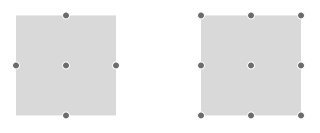

# Connector


This article explains what a connector is, how to use it and how to configure the connectors of a __DiagramShape__ object in __Telerik ASP.NET	Diagram component__. Asample configuration of the described properties can be seen in __Example 1__.

## 

The __DiagramConnector__ is a visual intermediate between the Connection and the Shape. It represents the attachment point of a Connection to a	Shape.

Connectors are part of a [Shape]()'s definition and you can specify the binding of a connection to a shape directlyvia the shape or via one of its connectors. If you specify a shape as a connection's endpoint the auto-connector will be used. This means that the endpoint of the connectionwill switch to the most convenient (in the sense of shortest path) connector automatically. If you specify a shape's connector as an endpoint for a connection the endpoint willremain attached to that given Connector instance.
>caption 


### ConnectorsCollection

Defines the connectors the shape owns. By default each shape has five active connectors – four for the directions and one auto connector. You can control the active	connectors of a shape by adding them to the shape’s __ConnectorsCollection__. Through the __DiagramShapeConnector__ object	you can configure the values of its properties like __Name__, __Description__ and __Position__.

__Name__—defines which of the nine predefined connectors to be enabled. The available values are: __auto__, __bottom__,__bottomLeft__, __bottomRight__, __left__, __right__, __top__,	__topLeft__ and __topRight__.
>caption Figure 1. Connector names


__Description__—the connector description.

__Position__—the function that positions the connector. It can be used in order to add custom connectors to a custom shape.

## 
>caption Figure 2. Connectors configuration



__Example 1__: In this example you can see how to enable all built-in connectors of a shape. The first shape in __Figure 1__ has the defaultset of five connectors, while the second one has all nine connectors defined:

````ASPNET
			<telerik:RadDiagram ID="RadDiagram1" runat="server" Height="700">
				<ShapesCollection>
					<telerik:DiagramShape Id="s1" X="40" Y="40">
					</telerik:DiagramShape>
					<telerik:DiagramShape Id="s2" X="250" Y="40">
						<ConnectorsCollection>
							<telerik:DiagramShapeConnector Name="Auto"  Description="" Position=""/>
							<telerik:DiagramShapeConnector Name="Bottom" />
							<telerik:DiagramShapeConnector Name="BottomLeft" />
							<telerik:DiagramShapeConnector Name="BottomRight" />
							<telerik:DiagramShapeConnector Name="Left" />
							<telerik:DiagramShapeConnector Name="Right" />
							<telerik:DiagramShapeConnector Name="Top" />
							<telerik:DiagramShapeConnector Name="TopLeft" />
							<telerik:DiagramShapeConnector Name="TopRight" />
						</ConnectorsCollection>
					</telerik:DiagramShape>
				</ShapesCollection>
			</telerik:RadDiagram>
````


# See Also

 * [ASP.NET Diagram Control Product Overview]()

 * [RadDiagram Server-Side Programming]()
