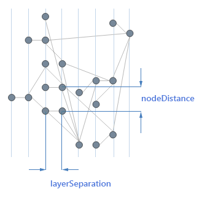

# Layered

**RadDiagram** supports several layered layout based algorithms which are explained in this article.

## "Layered" Layout Type

When the [LayoutSettings]()’ **Type** property is set to *“Layered”* the diagram	is organized with an emphasis on flow and minimizing the crossing between layers of shapes. This layout works well when few components are present and some sort of top-down flow is	present. The concept of flow in this context being a more or less clear direction of the connections with a minimum of cycles (connections flowing back upstream). Layered graph layout	is a type of graph layout in which the nodes of a (directed) graph are drawn in horizontal or vertical layers with the links directed in the complementary direction. It is also known	as Sugiyama or hierarchical graph layout. When the graph is a tree the layout reduces to a standard tree layout and thus can be considered as an extension to the classic tree layout.

There are several criteria on which this algorithm is based and which are respected in as far as the incidence structure allows it:

* links have a preferred direction (the complementary direction of the subtype) and attempt to flow as much as possible in this way;

* linked nodes try to stay closed to one another (clustering of nodes);

* links crossings should be minimized;

* links should be as short as possible (cross a few layers as possible).

The construction of a layered graph drawing proceeds in a series of steps (assuming a horizontal layer from here on):

* If the input graph is not already a directed acyclic graph, a set of edges is identified the reversal of which will make it acyclic.

* The nodes of the directed acyclic graph resulting from the first step are assigned to layers, such that each link goes from a higher layer to a lower layer.

* Edges that span multiple layers are replaced by paths of dummy vertices so that, after this step, each edge in the expanded graph connects two vertices on adjacent	layers of the drawing.

* The nodes within each layer are permuted in an attempt to reduce the number of crossings among the edges connecting it to the previous layer.

* Each node is assigned a coordinate within its layer, consistent with the permutation calculated in the previous step.

* The edges reversed in the first step of the algorithm are returned to their original orientations, the dummy vertices are removed from the graph and the vertices	and edges are drawn.
>caption Figure 1. Layered Layout

## Layered Layout Specific Subtypes

The subtype further defines the layout type by specifying in greater detail the behavior expected by the layout algorithm. The Layered layout specific subtypes are:

* **Horizontal**—the links are directed horizontally.

* **Vertical**—the links are directed vertically.

* **Down**—the links are directed downwards.

* **Up**—the links are directed upwards.

* **Left**—the links are directed to the left.

* **Right**—the links are directed downwards.

# See Also

 * [ASP.NET Diagram Control Product Overview]()

 * [RadDiagram Layout Basics]()
