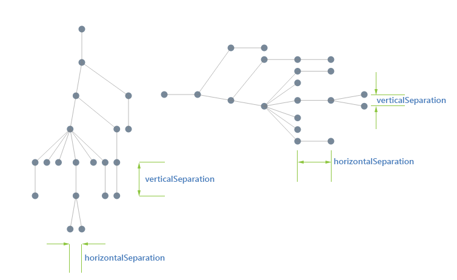
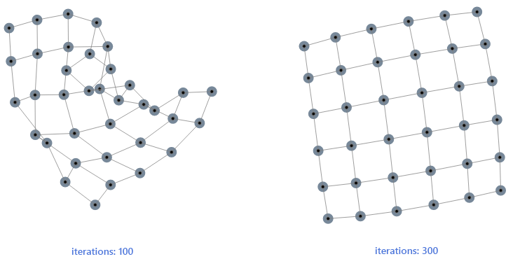
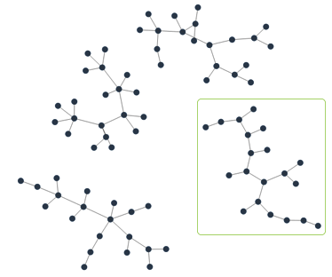
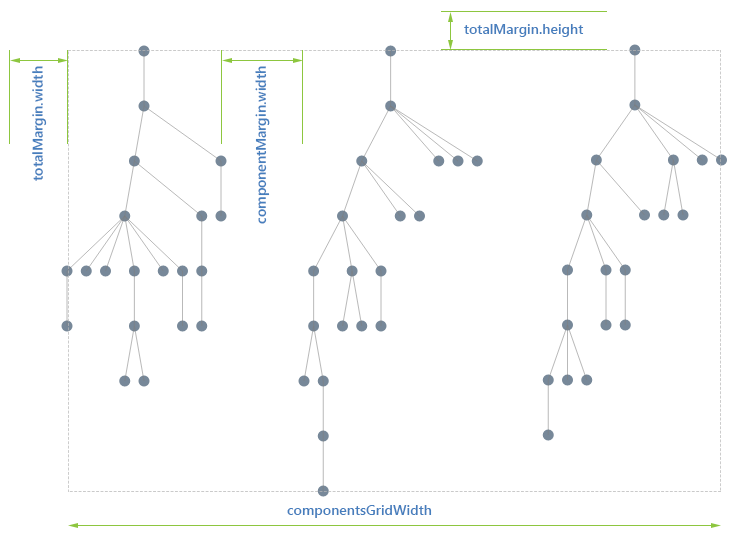

# Layout Overview

This article explains the layout algorithms **RadDiagram** provides and how to configure them.	**RadDiagram** offers three of the most common layout algorithms that should cover most of your layout needs: **tree layout**,	**force-directed layout** and **layered layout**.

## Basics

The layout of a diagram consists in arranging the shapes (sometimes also the connections) in some fashion in order to achieve an aesthetically pleasing experienceto the user. It aims at giving a more direct insight in the information contained within the diagram and its relational structure.

On a technical level, layout consists of a multitude of algorithms and optimizations:

* analysis of the relational structure (loops, multi-edge occurrence, etc.),

* connectedness of the diagram and the splitting into disconnected components,

* crossings of connections,

* bends and length of links and

* various ad-hoc calculations which depend on the type of layout.

The criteria on which an algorithm is based vary but the common denominator is:

* a clean separation of connected components (sub-graphs);

* an orderly organization of the shapes in such a way that siblings are close to another, i.e. a tight packing of shapes which belong together (parent of child relationship);

* a minimum of connection crossings.

## LayoutSettings Configuration

The **LayoutSettings** property is the gateway to a variety of layout algorithms. You can choose which layout will be applied on the currentdiagram by configuring its **Type** and **Subtype** properties. The LayoutSettings properties can contain parametersspecific to the layout as well as parameters customizing the global grid layout. Parameters which apply to other layout algorithms can be included but willbe ignored if they are not applicable to the chosen layout type.

>note To use the layout in the **RadDiagram** control you should enable it in the **LayoutSettings** composite property.	Then use the **Type** and **Subtype** properties to define the desired layout.
>

### Type

The type of the layout algorithm to use. The available values are:

* [Tree]()

* [Force]()

* [Layered]()

### SubType

The subtype further defines the layout type by specifying in greater detail the behavior expected by the layout algorithm. Possible values are:

* **Down**—*tree layout* and *layered layout* specific subtype.

* **Up**—*tree layout* and *layered layout* specific subtype.

* **Left**—*tree layout* and *layered layout* specific subtype.

* **Right**—*tree layout* and *layered layout* specific subtype.

* **MindmapHorizontal**—*tree layout* specific subtype.

* **MindmapVertical**—*tree layout* specific subtype.

* **Radial**—*tree layout* specific subtype.

* **TipOver**—*tree layout* specific subtype.

* **Horizontal**—*layered layout* specific subtype.

* **Vertical**—*layered layout* specific subtype.

### HorizontalSeparation

The distance between the siblings if the tree is up/down or between levels if the tree is left/right. In *TipOver tree layout* this settingis used only for the direct children of the root.

### VerticalSeparation

The distance between levels if the tree is up/down or between siblings if the tree is left/right. This property is not used in *TipOver tree layout* but rather replacedwith three additional ones - **UnderneathVerticalTopOffset**, **UnderneathVerticalSeparation** and**UnderneathHorizontalOffset**.
>caption Figure 1. Difference between vertical and horizontal separation in Tree-down and Tree-right layout

### RadialFirstLevelSeparation

Controls the distance between the root and the immediate children of the root. *This setting is specific to the Radial tree layout*.

### RadialSeparation

Defines the radial separation between the levels (except the first one which is defined by the aforementioned **radialFirstLevelSeparation**).*This setting is specific to the Radial tree layout*.

### StartRadialAngle

Defines where the circle/arc starts. The positive direction is **clockwise** and the angle is in **degrees**. *	This setting is	specific to the Radial tree layout*.

### EndRadialAngle

Defines where the circle/arc ends. The positive direction is **clockwise** and the angle is in **degrees**. *	This setting is specific to the Radial tree layout*.

### EndRadialAngle

Defines the vertical separation between a parent and its first child. This offsets the whole set of children with respect to its parent. *	This setting is	specific to the TipOver tree layout*.

### UnderneathVerticalSeparation

Defines the vertical separation between siblings and sub-branches. *This setting is specific to the TipOver tree layout*.

### UnderneathVerticalTopOffset

Defines the horizontal offset from a child with respect to its parent. *This setting is specific to the TipOver tree layout*.

### Iterations

The number of times that all the forces in the diagram are being calculated and balanced. The default value is 300, which should be enough for diagramsup to a hundred nodes. By increasing this parameter you increase the correctness of the simulation but it does not always lead to a more stable topology.In some situations a diagram simply does not have a stable minimum energy state and oscillates (globally or locally) between the minima. In such a situationincreasing the iterations will not result in a better topology.

In situations where there is enough symmetry in the diagram the increased number of iterations does lead to a better layout. In the example below the 100iterations is not enough to bring the grid to a stable state while 300 iterations bring all the nodes in such a position that the (virtual) energy of thediagram is a minimum.

*This setting is specific to the Force-directed layout.*
>caption Figure 2. Difference between 100 and 300 iterations in Force-directed layout:

### NodeDistance

In the **Force-directed layout** this setting defines the optimal length between 2 nodes, which directly correlates to the state of thelink between them. If a link is longer than needed the force will pull the nodes together, if the link is short - the force will push the nodes apart. The optimallength is more and indication in the algorithm than a guarantee that all nodes will be at this distance. The result of the layout is really a combination of theincidence structure of the diagram, the initial topology (positions of the nodes) and the number of iterations.

In the **Layered layout** it defines the minimum distance between nodes on the same level. Due to the nature of the algorithm this distancewill only be respected if the whole crossing of links and optimization does not induce a shift of the siblings.

*This setting is specific to the Force-directed layout and Layered layout*.

### LayerSeparation

The height (in a vertical layout) or width (in a horizontal layout) between the layers. *This setting is specific to the Layered layout.*

### GridSettings

Each layout algorithm has a different set of parameters customizing the layout but they also all have a common collection of parameters which relate to the way'pieces' of a diagram are organized.
>caption Figure 3. Diagram components

A diagram can have disconnected pieces, known as components, which can be organized in a way independent of the way a component on its own is arranged.In the picture above, this is one diagram consisting of four components.

When you apply a certain layout, an analysis will first split the diagram in components, arrange each component individually and thereafter organize the componentsin a grid. The common parameters referred above deal with this grid layout, they define the width, margin and padding of the (invisible) grid used to organize thecomponents.
>caption Figure 2. Diagram components organization

The available properties are:

**Width**—defines the width of the grid. The bigger this parameter is, the more components will be organized in a horizontal row.	The count of the components depends on the diagram configuration and the type of the layout applied to each of them. The default is set to 800.

**OffsetX**—defines the left offset of the grid layout. The default is 50.

**OffsetY**—defines the top offset of the grid layout. The default is 50.

**ComponentSpacingX**—defines the horizontal spacing between each component. The default is 50.

**ComponentSpacingY**—defines the vertical spacing between each component. The default is 50.

# See Also

 * [Tree Layout]()

 * [Force-directed Layout]()

 * [Layered Layout]()
