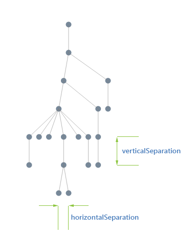
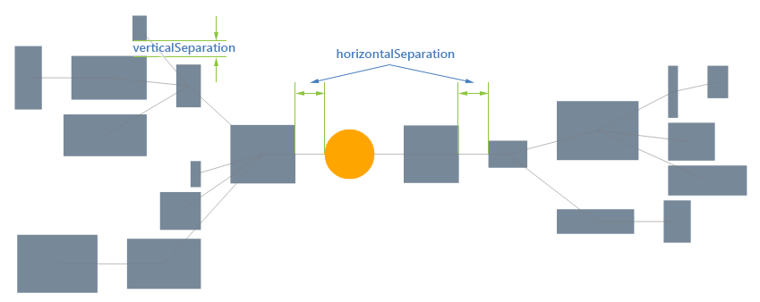
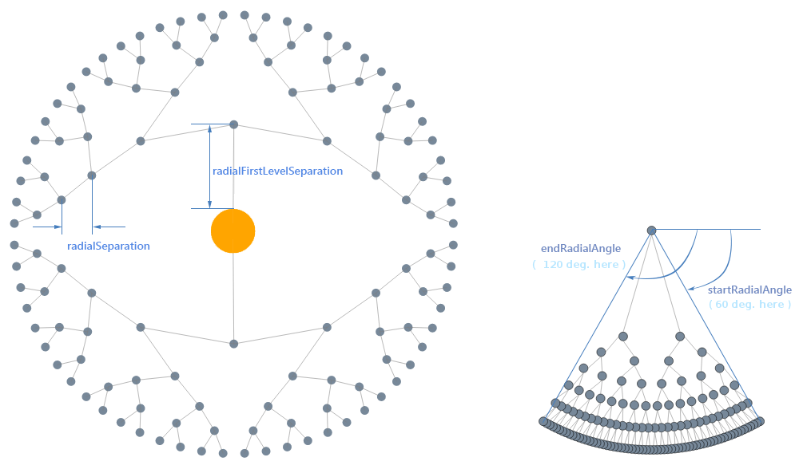
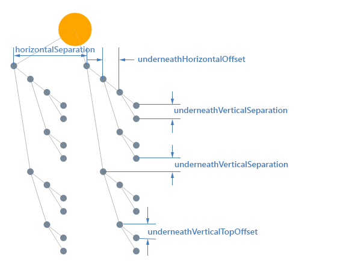

# Tree

**RadDiagram** supports several tree layout based algorithms which are explained in this article.

## "Tree" Layout Type

When the [LayoutSettings]()’ **Type** property is set to *"Tree"* the diagram is organized in a hierarchical way and is typically used in organizational representations.

## Tree Layout Specific Subtypes

The subtype further defines the layout type by specifying in greater detail the behavior expected by the layout algorithm. The Tree layout specific subtypes are radial tree layout, mind mapping and the classic tree diagrams.

### Generic Tree

When organizing a diagram in a classic tree layout, you can specify its orientation by configuring one of the following subtypes:

* **Down**—the root is arranged at the top and its children downwards.

* **Up**—the root is arranged at the bottom and its children upwards.

* **Left**—layout the root is arranged at the left and its children sideways to the right.

* **Right**—layout the root is arranged at the right and its children sideways to the left.

>caption **Figure 1**: Tree-down Layout

### Mindmap Tree

The Mindmap layout of **RadDiagram** is available in two possible directions, you can specify the desired one by choosing between these subtypes:

* **MindmapHorizontal**—The root sits at the center and its children are spread equally to the left and right.

* **MindmapVertical**—The root sits at the center and its children are spread equally above and below.

>caption **Figure 2**: Mindmap-horizontal Layout

### Radial Tree

When the subtype of a tree is set to **Radial** the root sits at the center and its children are spread radially around.

>caption **Figure 3**: Radial-tree Layout

### TipOver Tree

The **TipOver** algorithm is a special version of the tree-down layout where the grand-children (and iteratively) are arranged vertically	while the direct children are arranged horizontally. This arrangement has the advantage that it doesn't spread as much as the classic tree-down layout. 

>caption **Figure 4**: TipOver-Tree Layout

# See Also

 * [ASP.NET Diagram Control Product Overview]()

 * [RadDiagram Layout Basics]()
