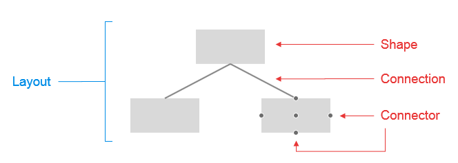

# Structure Overview

**Telerik .NET Diagram** control consists of series of distinct elements that have a strict hierarchy which corresponds directly to the structure	of the control in the markup (or code-behind). **Figure 1** explaining the basic structure and shows the names of each element. You can see the code	that creates it in **Example 1**.

>caption **Figure 1**: Basic elements in RadDiagram.



The main elements of the **RadDiagram** control are:

* [Layout]()—the diagram layout consists in an automatic organization of a diagram based on the way its shapes are connected (the so-called incidence structure). It allows you to choose the order in which the diagram objects will be rendered	(e.g. as a tree, mind map, etc.).

* [Shape]()—the Shape object represents a visual node in the graph or diagram. Each diagram has a shapes collection, containing all configured shapes.

* [Connection]()—the Connection object is a visual link or connection in the graph or diagram. Each diagram has a connections collection, containing all configured connections. Connections are usually created in order to connect shapes of a Diagram instance.

* [Connector]()—the Connector object is a visual intermediate between the Connection and the Shape,	it represents the attachment point of a Connection to a Shape.

## Configuring Diagram Elements

>caption **Example 1**: The following example shows how to create the basic RadDiagram configuration, the result of which is displayed in **Figure 1**:

````ASPNET
<telerik:RadDiagram ID="RadDiagram1" runat="server">
	<LayoutSettings Type="Tree" Subtype="Down" Enabled="true">
	</LayoutSettings>
	<ShapesCollection>
		<telerik:DiagramShape Id="a1" Width="100" Height="50">
		</telerik:DiagramShape>
		<telerik:DiagramShape Id="b1" Width="100" Height="50">
		</telerik:DiagramShape>
		<telerik:DiagramShape Id="b2" Width="100" Height="50">
		</telerik:DiagramShape>
	</ShapesCollection>
	<ConnectionsCollection>
		<telerik:DiagramConnection>
			<FromSettings Connector="Bottom" ShapeId="a1" />
			<ToSettings Connector="Top" ShapeId="b1" />
			<StrokeSettings />
		</telerik:DiagramConnection>
		<telerik:DiagramConnection>
			<FromSettings Connector="Bottom" ShapeId="a1" />
			<ToSettings Connector="Top" ShapeId="b2" />
		</telerik:DiagramConnection>
	</ConnectionsCollection>
</telerik:RadDiagram>
````

# See Also

 * [ASP.NET Diagram Control Product Overview]()

 * [RadDiagram Server-Side Programming]()