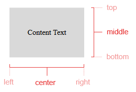
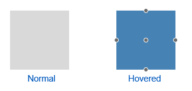
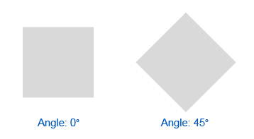
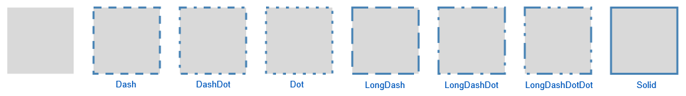
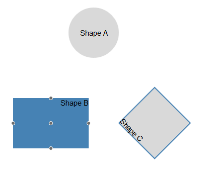

# Shape


This article provides information about the shapes that you can use in the __RadDiagram__ control and how to configure them. Below you can also findinformation on how to utilize the main __DiagramShape__ class, as a sample configuration of the described properties can be seen in__Example 1__.

## 

The __DiagramShape__ object represents a visual node in the graph or diagram. The diagram object has a shapes collection, containing all configured shapes.__RadDiagram__ provides rich API for customizing almost each part of the DiagramShape object – from standard properties like __Width__,__Height__, __Background__ to specific ones like __Type__, __Path__, __Visual__,__X__ and __Y__, and composite properties for configuring the __ContentSettings__, __HoverSettings__,__RotationSettings__ and __StrokeSettings__.

### Type

Specifies the type of the Shape using any of the built-in shape type. Currently three options are available:

* *"Rectangle"*—this is the default option, representing an SVG rectangle shape.

* *"Circle"*—represents an SVG circle/ellipse shape.

* *"Image"*—creates a shape using the image located in the path passed to the Source property.	The source is applicable only when the shape Type is set to "Image".
>caption Figure 1: A diagram with Image shapes.


__Example 1__: How to use images to create shapes in RadDiagram:

````ASPNET
			<telerik:RadDiagram ID="RadDiagram2" runat="server">
				<ShapesCollection>
					<telerik:DiagramShape Id="cocktails" Type="Rectangle" X="50" Y="50" Width="310" Height="40">
						<ContentSettings Text="Cocktails" />
					</telerik:DiagramShape>
					<telerik:DiagramShape Id="cocktail1" Source="/Images/Mochito.jpg" Type="Image" X="50" Y="100" Width="150" Height="150" />
					<telerik:DiagramShape Id="cocktail2" Source="/Images/StrawberyMochito.jpg" Type="Image" X="210" Y="100" Width="150" Height="150" />
				</ShapesCollection>
			</telerik:RadDiagram>
````


### Path

The path option of a shape is a description of a custom geometrical figure. The format follows the standard SVG format. For more information, see the	[SVG Path data article](http://www.w3.org/TR/SVG/paths.html#PathData) and the [Custom shapes and connectors article]().

### X and Y

Defines the x and y-coordinate of the shape when added to the diagram.

### Visual

A function returning a visual element to render for this shape. You can define a [custom visualtemplate]() in the function given as a value to this property.

### ContentSettings

By configuring the __ContentSettings__ composite property you can add and arrange the text content of a shape. The__Text__ property defines the text displayed in the shape, the __Align__	property—the alignment of this text (e.g., “middle center”) and the __Color__ property—the color of the text.
>caption Figure 2: Content Alignment



### EditableSettings

Specifies editable properties for shapes. For example, it contains a __Connect__ property that defines whether the connectors of a shape appear when that shape is hovered.

### FillSettings

Specifies the fill options for a shape, like the __Color__ and __Opacity__ if its background.

### HoverSettings

Defines the hover configuration of a shape, like background __Color__ of the hovered shape.
>caption Figure 3: Shape hovering



### RotationSettings

Here you can define the rotation __Angle__ of a shape. For example:
>caption Figure 4: Shape rotation



### StrokeSettings

The Stroke represents the border around a shape. You can configure the following stroke-specific properties through the RadDiagram composite__StrokeSettings__ property:

__Color__—defines the color of the shape's stroke.

__Width__—defines the thickness or width of the shape's stroke.

__DashType__—defines the dash type of the shape. The following dash types are supported:

* *"Dash"*—a line consisting of dashes.

* *"DashDot"*—a line consisting of a repeating pattern of dash-dot.

* *"Dot"*—a line consisting of dots.

* *"LongDash"*—a line consisting of a repeating pattern of long-dash.

* *"LongDashDot"*—a line consisting of a repeating pattern of long-dash-dot.

* *"LongDashDotDot"*—a line consisting of a repeating pattern of long-dash-dot-dot.

* *"Solid"*—a solid line.
>caption Figure 5: Stroke Dash Types



### ShapeDefaultSettings

Configuring the default shape settings you can preset the initial values for the main properties like width, height,	background color, position, etc., so you do not have to do this for every shape you add.

## Shapes Configuration
>caption Figure 6. A diagram with a few Shapes that utilize the properties described above.



__Example 2__: How to use the Shape properties to configure their appearance:

````ASPNET
	        <telerik:RadDiagram ID="RadDiagram1" runat="server">
	            <ShapesCollection>
	                <telerik:DiagramShape Id="s1" Height="100" X="130" Y="20" Type="circle">
	                    <ContentSettings Text="Shape A" Align="middle center" />
	                </telerik:DiagramShape>
	                <telerik:DiagramShape Id="s2" Width="150" Height="100" X="20" Y="200">
	                    <ContentSettings Text="Shape B" Align="top right" />
	                    <HoverSettings>
	                        <FillSettings Color="4682B4" />
	                    </HoverSettings>
	                </telerik:DiagramShape>
	                <telerik:DiagramShape Id="s3" Width="100" Height="100" X="250" Y="200">
	                    <ContentSettings Text="Shape C" Align="bottom left" />
	                    <RotationSettings Angle="45" />
	                    <StrokeSettings Color="#4682B4" DashType="Solid" Width="2" />
	                </telerik:DiagramShape>
	            </ShapesCollection>
	        </telerik:RadDiagram>
````


# See Also

 * [ASP.NET Diagram Control Product Overview]()

 * [RadDiagram Server-Side Programming]()

 * [Custom Shapes and Connectors]()
