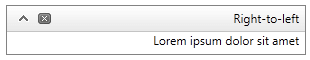

# Right-to-left Support


## 

The __RadDock__ fully supports right-to-left (RTL) language locales. It is created and added to the page root (as a direct child of the form element) and in order to turn on the RTL support you should set __dir=rtl to the html or body__ element or set the __direction:rtl__ CSS property as well.

````ASPNET
	        html
	        {
	            direction: rtl;
	        }
````


````ASPNET
	    <telerik:RadDock runat="server" ID="RadDock1" Title="Right-to-left">
	        <ContentTemplate>
	            <asp:Label ID="Label1" Text="Lorem ipsum dolor sit amet" runat="server"></asp:Label>
	        </ContentTemplate>
	    </telerik:RadDock>
````



# See Also

 * [See this live in an online demo](http://demos.telerik.com/aspnet-ajax/dock/examples/righttoleft/defaultcs.aspx)
