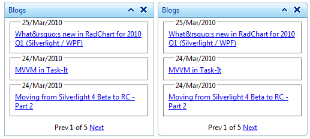
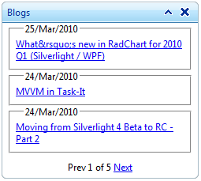

# HTML Rendering and CSS


## Understanding the Skin CSS File

Styles for **RadDock** are defined using Cascading Style Sheet (CSS) syntax. Each style consists of a selector that identifies an HTML element to be styled, and property/value pairs that describe each of the style specifics, e.g. color, padding, margins, etc. See the CSS Skin File Selectors topic for more information on the specific CSS selectors used for **RadDock** skins.

Each style maps to a "class" attribute in an HTML tag. For example, consider the HTML rendering of a RadDock control:

Please, note that the HTML could be different if you choose between different RadDoc configurations. If you choose not to have rounded corners the output HTML will be:

````HTML 
<td class="rdLeft" unselectable="on" style="">&nbsp;</td>
````


And if you choose to have rounded corners the output HTML will be:

````HTML 
<td class="rdLeft rdRoundedCorner" unselectable="on" style="">&nbsp;</td>
````





Below is represented the HTML code that renders a RadDock, set with a specific options. If you want to make changes you should do that in the inline styles (when possible) or you should [create a custom skin]() and to change the styles in the CSS file.

````HTML 
<div style="width: 250px; min-width: 10px; min-height: 400px;" class="RadDockZone RadDockZone_Default rdVertical "
id="RadDockZone2">
<div style="width: 100%;" class="RadDock RadDock_Default " id="RadDock1">
   <table class="rdTable">
       <tbody>
           <tr class="rdTop">
               <td class="rdLeft rdRoundedCorner" unselectable="on" style="">
                    
               </td>
               <td class="rdCenter">
                   <div class="rdTitleBar rdDraggable" id="RadDock1_T" style="cursor: move;">
                       <em style="width: 164px;">Blogs</em>
                       <ul class="rdCommands">
                           <li><a title="Collapse"><span class="rdCollapse"> </span></a></li>
                           <li><a title="Close"><span class="rdClose"> </span></a></li>
                       </ul>
                   </div>
               </td>
               <td class="rdRight rdRoundedCorner" unselectable="on" style="">
                    
               </td>
           </tr>
           <tr class="rdMiddle">
               <td class="rdLeft rdRoundedCorner" unselectable="on" style="">
                    
               </td>
               <td class="rdCenter" style="height: auto;">
                   <div class="rdContent" id="RadDock1_C">
                       <div id="RadDock1_C_BlogsControl_UpdatePanel1">
                           <div style="width: 100%;" id="RadDock1_C_BlogsControl_RadListView1_PanelBlogs">
                               <fieldset>
                                   <legend style="margin-left: 10px;">25/Mar/2010</legend>
                                   <div style="width: 100%;">
                                       <a href="https://blogs.telerik.com/blogs/posts/10-03-25/what_rsquo_s_new_in_radchart_for_2010_q1_silverlight_wpf-2472561038.aspx">
                                           What&rsquo;s new in RadChart for 2010 Q1 (Silverlight / WPF) </a>
                                   </div>
                               </fieldset>
                               <fieldset>
                                   <legend style="margin-left: 10px;">24/Mar/2010</legend>
                                   <div style="width: 100%;">
                                       <a href="https://blogs.telerik.com/blogs/posts/10-03-24/mvvm_in_task-it.aspx">MVVM in
                                           Task-It </a>
                                   </div>
                               </fieldset>
                               <fieldset>
                                   <legend style="margin-left: 10px;">24/Mar/2010</legend>
                                   <div style="width: 100%;">
                                       <a href="https://blogs.telerik.com/blogs/posts/10-03-24/moving_from_silverlight_4_beta_to_rc_-_part_2.aspx">
                                           Moving from Silverlight 4 Beta to RC - Part 2 </a>
                                   </div>
                               </fieldset>
                               <div style="text-align: center; padding-top: 10px;">
                                   <a disabled="disabled" id="RadDock1_C_BlogsControl_RadListView1_btnPrev">Prev</a>
                                   <span style="vertical-align: top; position: relative;">1 of 5</span> <a href="javascript:**doPostBack('RadDock1$C$BlogsControl$RadListView1$btnNext','')"
                                       id="RadDock1_C_BlogsControl_RadListView1_btnNext">Next</a>
                               </div>
                               <input type="hidden" name="RadDock1_C_BlogsControl_RadListView1_ClientState" id="RadDock1_C_BlogsControl_RadListView1_ClientState"
                                   autocomplete="off">
                               <span style="display: none;" id="RadDock1_C_BlogsControl_RadListView1"></span>
                           </div>
                       </div>
               </td>
               <td class="rdRight rdRoundedCorner" unselectable="on" style="">
                    
               </td>
           </tr>
           <tr class="rdBottom">
               <td class="rdLeft rdRoundedCorner" unselectable="on" style="">
                    
               </td>
               <td class="rdCenter" unselectable="on" style="">
                    
               </td>
               <td class="rdRight rdRoundedCorner" unselectable="on" style="">
                    
               </td>
           </tr>
       </tbody>
   </table>
</div>
<input type="hidden" name="RadDockZone2_ClientState" id="RadDockZone2_ClientState"
   autocomplete="off">
<div style="height: 253px; width: 100%; display: none;" id="RadDockZone2_D" class="RadDock RadDock_Default rdPlaceHolder">
</div>		
````


The code above will render a RadDock block as shown in the picture bellow:




# See Also

 * [Tutorial: Creating a Custom Classic Skin]()

 * [Tutorial: Creating a Custom Lightweight Skin]()
