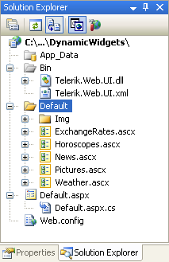

# Adding Controls Inside Dynamically Created Docks


## 

When implementing a dynamic personalized Portal site using the techniques described in [Dynamically Creating RadDock Controls](), the dynamically created controls often contain specialized custom controls. When re-creating the __RadDock__ controls after a postback, the application needs to re-create these custom controls as well. The following example shows one way to accomplish this.

1. Create a new AJAX-enabled Web application.

1. In order to add some custom controls to your application, locate the __"Live Demos\Dock\Examples"__ folder under your installation directory and drag the __"Default"__ folder from there to your solution in the Solution Explorer. Delete the "Default.html", "DefaultCS.aspx", and "DefaultVB.aspx" files. The Solution Explorer should looks something like the following screen shot:
>caption 



1. To let the user select a control to add to the page, drag a __DropDownList__ from the toolbox onto your page. Click on the ellipsis button next to its __Items__ property, and add five items, setting the following properties:

1. __Text__="ExchangeRates.ascx", __Value__="~/Default/ExchangeRates.ascx", __Selected__=__True__

1. __Text__="Horoscopes.ascx", __Value__="~/Default/Horoscopes.ascx"

1. __Text__="News.ascx", __Value__="~/Default/News.ascx"

1. __Text__="Pictures.ascx", __Value__="~/Default/Pictures.ascx"

1. __Text__="Weather.ascx", __Value__="~/Default/Weather.ascx"

1. Drag a __Button__ from the toolbox onto the page, and set its __Text__ property to "Add Dock";

1. Add a __RadDockLayout__ with a few __RadDockZone__ controls inside it.

1. Just like in the [Dynamically Creating RadDock Controls]() topic, add a property for storing the current dock states:

1. At the top of the codebehind for your Web page, add two new __using__ statements (C#) or __Imports__ statements (VB) for System.Collections.Generic and Telerik.Web.UI:

````C#
	     
	using System.Collections.Generic;
	using Telerik.Web.UI; 
				
````


````VB.NET
	
	
	Imports System.Collections.Generic
	Imports Telerik.Web.UI 
	
````


1. Add the following property definition to the class definition of your Web page:

>tabbedCode

````C#
	     
	 //Store the info about the added docks in the session.
	 private List<DockState> CurrentDockStates
	 {
	   get
	   {
	     List<DockState> _currentDockStates = (List<DockState>)Session["CurrentDockStates"];
	     if (Object.Equals(_currentDockStates, null))
	     {
	       _currentDockStates = new List<DockState>();
	       Session["CurrentDockStates"] = _currentDockStates;
	     }
	     return _currentDockStates;
	   }
	   set
	   {
	     Session["CurrentDockStates"] = value;
	   }
	 }
				
````
````VB
	
		'Store the info about the added docks in the session.
	    Private Property CurrentDockStates() As List(Of DockState)
	        Get
	            Dim _currentDockStates As List(Of DockState) = _
	              DirectCast(Session("CurrentDockStates"), List(Of DockState))
	            If [Object].Equals(_currentDockStates, Nothing) Then
	                _currentDockStates = New List(Of DockState)()
	                Session("CurrentDockStates") = _currentDockStates
	            End If
	            Return _currentDockStates
	        End Get
	        Set(ByVal value As List(Of DockState))
	            Session("CurrentDockStates") = value
	        End Set
	    End Property
	
````
>end

1. Add a __Click__ event handler to the Button on the Web page. This event handler creates a new __RadDock__ control, creates a custom control inside it, and adds it to the first __RadDockZone__ control. Note that the __Tag__ property is used to store the information needed to create the custom control:

````C#
	     
	private RadDock CreateRadDock()
	{
	 int docksCount = CurrentDockStates.Count;
	 RadDock dock = new RadDock();
	 dock.ID = string.Format("RadDock{0}", docksCount);
	 dock.Title = string.Format("Dock {0}", docksCount);
	 dock.UniqueName = Guid.NewGuid().ToString();
	 dock.Width = Unit.Pixel(300);
	 return dock;
	}
	protected void Button1_Click(object sender, EventArgs e)
	{
	  RadDock dock = CreateRadDock();
	  dock.Tag = DropDownList1.SelectedValue;
	  LoadWidget(dock);
	  RadDockZone1.Controls.Add(dock);
	}
	
	private void LoadWidget(RadDock dock)
	{
	  if (string.IsNullOrEmpty(dock.Tag))
	   return;
	  Control widget = LoadControl(dock.Tag);
	  dock.ContentContainer.Controls.Add(widget);
	} 
				
````


````VB.NET
	
	
	    Private Function CreateRadDock() As RadDock
	        Dim docksCount As Integer = CurrentDockStates.Count
	        Dim dock As New RadDock()
	        dock.ID = String.Format("RadDock{0}", docksCount)
	        dock.Title = String.Format("Dock {0}", docksCount)
	        dock.UniqueName = Guid.NewGuid().ToString()
	        dock.Width = Unit.Pixel(300)
	        Return dock
	    End Function
	    Protected Sub Button1_Click(ByVal sender As Object, ByVal e As EventArgs) Handles Button1.Click
	        Dim dock As RadDock = CreateRadDock()
	        dock.Tag = DropDownList1.SelectedValue
	        LoadWidget(dock)
	        RadDockZone1.Controls.Add(dock)
	    End Sub
	    Private Sub LoadWidget(ByVal dock As RadDock)
	        If String.IsNullOrEmpty(dock.Tag) Then
	            Return
	        End If
	        Dim widget As Control = LoadControl(dock.Tag)
	        dock.ContentContainer.Controls.Add(widget)
	    End Sub
	
````


1. Add code to save and load the state of dynamically created controls when a postback occurs.

1. Add a __SaveDockLayout__ event handler to the __RadDockLayout__ component. This event handler calls the __RadDockLayout.GetRegisteredDocksState__ method to obtain the current list of dock states and saves the list to the __CurrentDockStates__ property.

>tabbedCode

````C#
	     
	
	protected void RadDockLayout1_SaveDockLayout(object sender, DockLayoutEventArgs e)
	{
	 CurrentDockStates = RadDockLayout1.GetRegisteredDocksState();
	} 
				
````
````VB
	
	
	    Protected Sub RadDockLayout1_SaveDockLayout( _
	                  ByVal sender As Object, _
	                  ByVal e As DockLayoutEventArgs) _
	                  Handles RadDockLayout1.SaveDockLayout
	        CurrentDockStates = RadDockLayout1.GetRegisteredDocksState()
	    End Sub
	
````
>end

1. Add a __Page_Init__ event handler that recreates the __RadDock__ controls (including their child custom controls) after a postback:

>tabbedCode

````C#
	     
	protected void Page_Init(object sender, EventArgs e)
	{
	 for (int i = 0; i < CurrentDockStates.Count; i++)
	 {
	   RadDock dock = new RadDock();
	   dock.ID = string.Format("RadDock{0}", i);
	   dock.ApplyState(CurrentDockStates[i]);
	   RadDockLayout1.Controls.Add(dock);
	   LoadWidget(dock);
	 }
	} 
				
````
````VB
	
	    Protected Sub Page_Init(ByVal sender As Object, ByVal e As EventArgs) Handles Me.Init
	        Dim i As Integer
	        For i = 0 To CurrentDockStates.Count - 1
	            Dim dock As RadDock = New RadDock()
	            dock.ID = String.Format("RadDock{0}", i)
	            dock.ApplyState(CurrentDockStates(i))
	            RadDockLayout1.Controls.Add(dock)
	            LoadWidget(dock)
	        Next i
	    End Sub
	
````
>end

1. Add a __LoadDockLayout__ event handler so that the __RadDockLayout__can restore the layout:

>tabbedCode

````C#
	     
	protected void RadDockLayout1_LoadDockLayout(object sender, DockLayoutEventArgs e)
	{
	 foreach (DockState state in CurrentDockStates)
	 {
	   e.Positions[state.UniqueName] = state.DockZoneID;
	   e.Indices[state.UniqueName] = state.Index;
	 }
	} 
				
````
````VB.NET
	
	    Protected Sub RadDockLayout1_LoadDockLayout( _
	                    ByVal sender As Object, _
	                    ByVal e As DockLayoutEventArgs) _
	                    Handles RadDockLayout1.LoadDockLayout
	        For Each state As DockState In CurrentDockStates
	            e.Positions(state.UniqueName) = state.DockZoneID
	            e.Indices(state.UniqueName) = state.Index
	        Next state
	    End Sub
	
````
>end

>tip To improve performance, you may want to use a hidden update panel for saving state when minimizing, movingand closing docks. This way the docks state is saved faster as there is no need to update the docking zones.	See[My Portal](http://demos.telerik.com/aspnet-ajax/Dock/Examples/MyPortal/DefaultCS.aspx)for a live example that uses this technique.
>


# See Also

 * [SaveDockLayout]()

 * [LoadDockLayout]()

 * [Lifecycle]()

 * [Adding Content to RadDock]()
