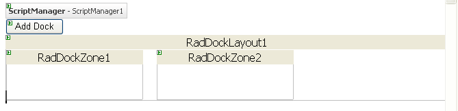

# Creating RadDock Dynamically


One common use of __RadDock__ is creating dynamic personalized __Portal__ sites. These sites are highly dynamic and require programmatic creation of the __RadDock__ controls on the page related to the currently logged users based on database records. In this case the __RadDock__ controls are often the core of the Page layout. To ensure proper operation of their content controls, you should follow the following simple rules:

1. Create the __RadDock__ controls and their content in __Page_Init__. This is mandatory if they contain controls which initiate postback or AJAX callback events. If you create a __RadDock__ control in other event, such as __Button_Click__, it must be recreated in __Page_Init__ on the next postback so that its events can be raised properly.

1. Use the __LoadDockLayout__ event of the __RadDockLayout__ control to supply it with information about the initial positions of the __RadDock__ controls: their index and parent __RadDockZone__ control ID.

1. Use the __SaveDockLayout__ event to save, in one place, the positions and the state of all __RadDock__ controls inside the __RadDockLayout__ control. If you need to, you can use any other event to store the positions and the state of the __RadDock__ controls, for example __Button_Click__.

1. Always set the __UniqueName__ property of the __RadDock__ controls.

## Example

The following example demonstrates how to dynamically create RadDock controls on a Web site, similar to the [Dynamically Created Docks](http://demos.telerik.com/aspnet-ajax/Dock/Examples/DynamicDocks/DefaultCS.aspx) example.

1. Create a new ASP.NET AJAX-enabled Web Site. Add a __Button__, __RadDockLayout__, and a few __RadDockZone__ controls inside the __RadDockLayout__:

````ASPNET
	    <form id="form2" runat="server">
	    <asp:ScriptManager ID="ScriptManager1" runat="server" />
	    <div>
	        <asp:Button ID="Button1" runat="server" Text="Add Dock" />
	        <telerik:RadDockLayout id="RadDockLayout1" runat="server">
	            <telerik:RadDockZone ID="RadDockZone1" runat="server"  Width="200px" MinHeight="200px" Style="float:left;margin-right:20px;">
	            </telerik:RadDockZone>
	            <telerik:RadDockZone ID="RadDockZone2" runat="server" Width="200px" MinHeight="200px" Style="float:left">
	            </telerik:RadDockZone>
	        </telerik:RadDockLayout>
	    </div>
	    </form>
````


>caption 



1. The Web page needs some way to store the state of the __RadDock__ controls so that it persists across visits to the page. __RadDock__ includes a special class, named __DockState__, which is designed for storing the state information about a __RadDock__ control. This example uses a list of these __DockState__ objects to stores the state information for dynamically created __RadDock__ controls. Normally, you would use a permanent medium such as a database to store the list. For simplicity, this example uses the __Session__.

1. At the top of the codebehind for your Web page, add two new __using__ statements (C#) or __Imports__ statements (VB) for System.Collections.Generic and Telerik.Web.UI:

>tabbedCode

````C#
	     
	
	using System.Collections.Generic;
	using Telerik.Web.UI; 
				
````
````VB
	
	
	    Imports System.Collections.Generic
	    Imports Telerik.Web.UI 
	
````
>end

1. Add the following property definition to the class definition of your Web page:

>tabbedCode

````C#
	     
	private List<DockState> CurrentDockStates
	{
	 //Store the info about the added docks in the session.
	 private List<DockState> CurrentDockStates
	 {
	   get
	   {
	     List<DockState> _currentDockStates = (List<DockState>)Session["CurrentDockStates"];
	     if (Object.Equals(_currentDockStates, null))
	     {
	       _currentDockStates = new List<DockState>();
	       Session["CurrentDockStates"] = _currentDockStates;
	     }
	     return _currentDockStates;
	   }
	   set
	   {
	     Session["CurrentDockStates"] = value;
	   }
	 }
	} 
				
````
````VB
	
	    Private Property CurrentDockStates() As List(Of DockState)
	        Get
	            Dim _currentDockStates As List(Of DockState) = _
	              DirectCast(Session("CurrentDockStates"), List(Of DockState))
	            If [Object].Equals(_currentDockStates, Nothing) Then
	                _currentDockStates = New List(Of DockState)()
	                Session("CurrentDockStates") = _currentDockStates
	            End If
	            Return _currentDockStates
	        End Get
	        Set(ByVal value As List(Of DockState))
	            Session("CurrentDockStates") = value
	        End Set
	    End Property
	
````
>end

1. Add a __Click__ event handler to the Button on the Web page. This event handler creates a new __RadDock__ control and adds it to the first __RadDockZone__ control. Note that when creating a new __RadDock__ control, it must have a __UniqueName__ so that the __RadDockLayout__ component can distinguish it and accurately manage its state:

>tabbedCode

````C#
	     
	private RadDock CreateRadDock()
	{
	 int docksCount = CurrentDockStates.Count;
	 RadDock dock = new RadDock();
	 dock.ID = string.Format("RadDock{0}", docksCount);
	 dock.Title = string.Format("Dock {0}", docksCount);
	 dock.Text = string.Format("Added at {0}", DateTime.Now);
	 dock.UniqueName = Guid.NewGuid().ToString();
	 dock.Width = Unit.Pixel(300);
	 return dock;
	}
	protected void Button1_Click(object sender, EventArgs e)
	{
	 RadDock dock = CreateRadDock();
	 RadDockLayout1.Controls.Add(dock);
	 dock.Dock(RadDockZone1);
	} 
				
````
````VB
	
	    Private Function CreateRadDock() As RadDock
	        Dim docksCount As Integer = CurrentDockStates.Count
	        Dim dock As New RadDock()
	        dock.ID = String.Format("RadDock{0}", docksCount)
	        dock.Title = String.Format("Dock {0}", docksCount)
	        dock.Text = String.Format("Added at {0}", DateTime.Now)
	        dock.UniqueName = Guid.NewGuid().ToString()
	        dock.Width = Unit.Pixel(300)
	        Return dock
	    End Function
	    Protected Sub Button1_Click(ByVal sender As Object, ByVal e As EventArgs) Handles Button1.Click
	        Dim dock As RadDock = CreateRadDock()
	        RadDockLayout1.Controls.Add(dock)
	        dock.Dock(RadDockZone1)
	    End Sub
	
````
>end

>tip If you want the dynamically created __RadDock__ controls to store additional information, you can use the __Tag__ property to save that information. For an example that uses this technique, see[Adding Controls Inside Dynamically Created Docks]().
>


1. Run the application. Note that you never have more than one __RadDock__ control. This is because the dynamically created controls disappear from the page whenever there is a postback, such as when the button __Click__ event occurs. You must re-create these controls every time the page loads.

1. In order to let ensure that the state of all created __RadDock__ controls persists over a postback, add code to save and load their state.

1. Add a __SaveDockLayout__ event handler to the __RadDockLayout__ component. This event handler calls the __RadDockLayout.GetRegisteredDocksState__ method to obtain the current list of dock states and saves the list to the __CurrentDockStates__ property.

>tabbedCode

````C#
	     
	
	protected void RadDockLayout1_SaveDockLayout(object sender, DockLayoutEventArgs e)
	{
	    CurrentDockStates = RadDockLayout1.GetRegisteredDocksState();
	} 
				
````
````VB
	
	
	    Protected Sub RadDockLayout1_SaveDockLayout( _
	                  ByVal sender As Object, _
	                  ByVal e As DockLayoutEventArgs) _
	                  Handles RadDockLayout1.SaveDockLayout
	        CurrentDockStates = RadDockLayout1.GetRegisteredDocksState()
	    End Sub
	
````
>end

1. Add a __Page_Init__ event handler to your Web page that recreates the __RadDock__ controls after a postback. It uses the __CurrentDockStates__ property (which was set in the __SaveDockLayout__ event handler) to initialize their properties using the __RadDock.ApplyState__ method. This event handler does not need to add the __RadDock__controls to their parent dock zones, it is enough that they are added to the __RadDockLayout__ or one of its children. The __RadDockLayout__ control will restore the parent dock zones and position after the __LoadDockLayout__event.

>tabbedCode

````C#
	     
	protected void Page_Init(object sender, EventArgs e)
	{
	 for (int i = 0; i < CurrentDockStates.Count; i++)
	 {
	   RadDock dock = new RadDock();
	   dock.ID = string.Format("RadDock{0}", i);
	   dock.ApplyState(CurrentDockStates[i]);
	   RadDockLayout1.Controls.Add(dock);
	 }
	} 
				
````
````VB
	
	    Protected Sub Page_Init(ByVal sender As Object, ByVal e As EventArgs) Handles Me.Init
	        Dim i As Integer
	        For i = 0 To CurrentDockStates.Count - 1
	            Dim dock As RadDock = New RadDock()
	            dock.ID = String.Format("RadDock{0}", i)
	            dock.ApplyState(CurrentDockStates(i))
	            RadDockLayout1.Controls.Add(dock)
	        Next i
	    End Sub
	
````
>end

>note When the __RadDock__ controls are recreated on __Page_Init__ , it is important that you always set the same value in their property __ID__ . This way you will ensure that the layout of the __RadDock__ controls will be persisted after a postback.
>


1. Add a __LoadDockLayout__ event handler. This event handler tells the __RadDockLayout__ control the parent dock zones and indices of the __RadDock__ controls that were added in the __Page_Init__ event handler. __RadDockLayout__ uses this information to restore the layout:

>tabbedCode

````C#
	     
	protected void RadDockLayout1_LoadDockLayout(object sender, DockLayoutEventArgs e)
	{
	 foreach (DockState state in CurrentDockStates)
	 {
	   e.Positions[state.UniqueName] = state.DockZoneID;
	   e.Indices[state.UniqueName] = state.Index;
	 }
	} 
				
````
````VB
	
	    Protected Sub RadDockLayout1_LoadDockLayout( _
	                    ByVal sender As Object, _
	                    ByVal e As DockLayoutEventArgs) _
	                    Handles RadDockLayout1.LoadDockLayout
	        For Each state As DockState In CurrentDockStates
	            e.Positions(state.UniqueName) = state.DockZoneID
	            e.Indices(state.UniqueName) = state.Index
	        Next state
	    End Sub
	
````
>end

# See Also

 * [Lifecycle]()

 * [SaveDockLayout]()

 * [LoadDockLayout]()
