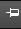
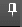
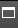
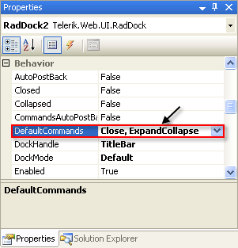

# Commands Overview


In the top right corner of the __RadDock__ title bar, the __RadDock__ control displays its command icons. Each icon represents a command that the user can trigger by clicking on the icon. The command icons can include any combination of three built-in commands, or you can add your own custom commands to the __RadDock__ control.

## Built-in Commands

The built-in commands perform their function without any programming on your part. If you are not adding any custom commands to the __RadDock__ control, you can specify which built-in commands using the __DefaultCommands__ property. __DefaultCommands__ can be set to any of the following values:

* __None__: the title bar shows no command icons.

* __PinUnpin__: When the __RadDock__ control is docked, the title bar shows no icons. When the __RadDock__ control is floating, the title bar includes a single "Pin" or "Unpin" icon:

* 
>caption 

When the __RadDock__ control is unpinned, the title includes a single "Pin" icon. When the user clicks the icon, the __RadDock__ control becomes pinned, so that it cannot be dragged.

* 
>caption 

When the RadDock control is pinned, the title bar includes a single "Unpin" icon. When the user clicks this icon, the __RadDock__ control becomes unpinned and can be dragged to a new location.

* __ExpandCollapse__: The title bar includes a single "Collapse" or "Expand" icon:

* 
>caption 

When the content area is showing, the title includes a single "Collapse" icon. When the user clicks the icon, the __RadDock__ control minimizes, showing only its title bar.

* 
>caption 

In the minimized state, the title bar includes a single "Expand" icon. When the user clicks this icon, the __RadDock__ control expands to show its content area.

* __Close__: the title bar includes a single "Close" icon:

* 
>caption 

When the user clicks the icon, the __RadDock__ control closes, vanishing from the page.

* __All:__ The title bar shows the "Pin" or "Unpin" icon (unless docked), followed by the "Collapse" or "Expand" icon, followed by the "Close" icon.

* __Other combinations__: In the designer, you can specify any combination of two icons by listing their built-in commands, separated by a comma:
>caption 

At runtime, you can specify a combination of built-in commands using the "or" operator:


````C#
	
	        RadDock1.DefaultCommands = Telerik.Web.UI.Dock.DefaultCommands.Close |
	                                  Telerik.Web.UI.Dock.DefaultCommands.PinUnpin;
	
````
````VB
	
	        RadDock1.DefaultCommands = Telerik.Web.UI.Dock.DefaultCommands.Close _
	                                Or Telerik.Web.UI.Dock.DefaultCommands.PinUnpin
	
````


>note The appearance of the built-in icons shown above is for the "Default" skin. Each skin provides its own icons for the built-in commands.
>


## Custom Commands

If you want to add your own custom commands to the title bar (or perform additional actions beyond the default behavior when the user clicks on the built-in commands), you must use the __Commands__ collection. When the __Commands__ property is set, __RadDock__ ignores its __DefaultCommands__ property and only those commands in the __Commands__ collection appear on the title bar.

Add commands to the __Commands__ collection using the [DockCommand Collection Editor](). When you add a built-in command type to the __Commands__ collection, it automatically performs its default action, unless you cancel it from an __OnClientCommand__ event handler. When you add a custom command, you can implement the response to user clicks using either the client-side __OnClientCommand__ event or the server-side __Command__ event. (You can also use these events to augment the default behavior of the built-in commands.)

Each command in the __Commands__ collection has the following attributes:

* __ClientTypeName__: this specifies the command class that implements the command. The following classes are built-in:

* __Telerik.Web.UI.DockPinUnpinCommand__: the built-in pin/unpin command.

* __Telerik.Web.UI.DockExpandCollapseCommand__: the built-in expand/collapse command.

* __Telerik.Web.UI.DockCloseCommand__: the built-in close command.

* __Telerik.Web.UI.DockCommand__: the default class for single-value custom commands. You can use this class directly, implementing the command behavior in the client-side __OnClientCommand__ or server-side __Command__ event handler, or you can create your own class that inherits from __DockCommand__.

* __Telerik.Web.UI.DockToggleCommand__: the default class for custom commands with two states (such as the expand and collapse states of the built-in expand/collapse command).

* __AutoPostBack__: Set this to __true__ if you want a postback where the server-side __Command__ event fires when the user clicks on the command.

* __OnClientCommand__: this is the name of a Javascript function that responds to the client-side event when the user clicks on the command. This function can implement the response to the command and/or cancel the default processing of the command.

>note If you cancel the default processing of a command, the server-side __Command__ event does not fire.
>


* __Name__: This string is the name of the command. It is useful for identifying the command in an event handler. The built-in commands use the names "PinUnpin", "ExpandCollapse" and "Close". You can specify the name for custom commands.

* __CssClass__: This is the name of a class that gives the command its appearance on the title bar. Use this to customize the look of the custom commands you add to the title bar.

* __Text:__ This string is the text that appears as a tool tip when the user hovers the mouse over the command icon.

In addition, the toggle commands have the following properties:

* __AlternateCssClass__: This is the name of a class that gives the alternate state of the command its appearance on the title bar. Use this like the __CssClass__.

* __AlternateText__: This is the text that appears as a tool tip when the user hovers the mouse over the command icon when it is in the alternate state.

* __State__: This indicates the state of the command. It can be "Primary" or "Alternate".


# See Also

 * [Events Triggered on Command Execution]()

 * [Styling Custom Commands]()

 * [Specifying Command ToolTips]()

 * [DockCommand Collection Editor]()
