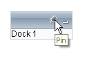

# Specifying Command ToolTips


The commands that appear in the title bar of a RadDock control display a tooltip when the user hovers the mouse over them:



By default, commands have the following built-in tooltips:


| Command | Tooltip text |
| ------ | ------ |
| **PinUnpin** (when unpinned)|"Pin"|
| **PinUnpin** (when pinned)|"Unpin"|
| **ExpandCollapse** (when expanded)|"Collapse"|
| **ExpandCollapse** (when collapsed)|"Expand"|
| **Close** |"Close"|
|Custom Commands|"Custom"|

You can easily override these tooltips, to localize the Web page, or simply to substitute your own strings. (For example, you probably want to change the default tooltip text for custom commands.)

To customize the tooltips for the built-in commands, use the following properties:

* The **PinText** property specifies the tooltip for the **PinUnpin** command when the **RadDock** control is unpinned.

* The **UnpinText** property specifies the tooltip for the **PinUnpin** command when the **RadDock** control is pinned.

* The **CollapseText** property specifies the tooltip for the **ExpandCollapse** command when the **RadDock** control is expanded.

* The **ExpandText** property specifies the tooltip for the **ExpandCollapse** command when the RadDock control is collapsed.

* The **CloseText** property specifies the tooltip for the **Close** command.

>tip These properties are marked with the **LocalizableAttribute** and can be automatically localized by the .NET Framework if the application contains the proper resource strings. For more information about the integrated in the .NET Framework localization capabilities, see the following MSDN article:
>[https://msdn2.microsoft.com/en-us/library/ms228208(VS.80).aspx](https://msdn2.microsoft.com/en-us/library/ms228208(VS.80).aspx)
>


To customize the tooltips for custom commands, use the **Text** and **AlternateText** properties of the command object.

## Example

The following example shows a **RadDock** control with customized tooltips:

````ASP.NET
<telerik:RadDock
   ID="RadDock1"
   runat="server"
   OnClientCommand="HandleCommands"
   CollapseText="Minimize"
   ExpandText="Restore">
 <Commands>
    <telerik:DockCommand
        CssClass="DoSomethingClass"
        Name="DoSomething"
        Text="Do Something" />
    <telerik:DockExpandCollapseCommand />
    <telerik:DockCloseCommand />
 </Commands>
</telerik:RadDock> 
````


# See Also

 * [Overview]()

 * [DockCommand Collection Editor]()
