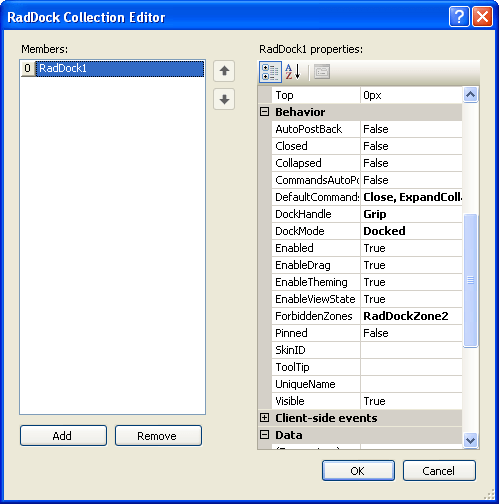

# Dock Collection Editor

 

There are two ways to add **RadDock** controls to a **RadDockZone** control at design time. You can drag a **RadDock** control directly from the toolbox onto the surface of the **RadDockZone** control or you can add the **RadDock** controls using the **RadDock Collection Editor**. The **RadDock Collection Editor** is also useful for locating **RadDock** controls and setting their properties when the **RadDockZone** control has many child **RadDock** controls.

To display the **RadDock Collection Editor**, click on the ellipsis button for the **Docks** property of the **RadDockZone** control.

* Click the **Add** button to append a new **RadDock** control to the collection.

* Use the up and down arrow buttons to rearrange the **RadDock** controls in the collection. This order determines the order in which **RadDock** controls are docked inside the **RadDockZone**.

* Select a **RadDock** control and click the **Remove** button to delete it from the list.

* Select individual **RadDock** controls to change their properties.

	

Some important properties of the **RadDock** controls in the **Docks** collection are as follows:

* **DockHandle**, **DockMode**, and **ForbiddenZones**: These properties let you specify the desired [drag-and-drop behavior]().

* **DefaultCommands** or **Commands** lets you add [commands]() to the **RadDock** title bar.

* **Text** lets you assign simple text to the **RadDock** control's [content area]().

* **CloseText**, **CollapseText**, **ExpandText**, **PinText**, and **UnpinText** let you [customize the tooltips for built-in commands]().

* **Skin** lets you set the [skin]() to override the default inherited from the parent **RadDockZone**.

* **UniqueName** givesthe **RadDock** control a unique name that the **RadDockLayout** component uses for maintaining position information. If this property is not set, **RadDockLayout** uses the **ID** property. It is important to set this property at runtime if the **RadDock** control is embedded in a repeating control, so that each instance has a unique name.

* **Tag** is a string you can use to store your own application-specific information with the **RadDock** control.

# See Also

 * [Creating RadDock Dynamically]()

 * [Adding Controls Inside Dynamically Created Docks]()
