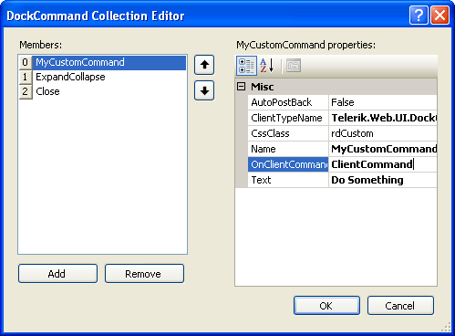

# DockCommand Collection Editor

The **DockCommand Collection Editor** lets you add [commands]() to a **RadDock** control. The commands you add here appear on the title bar of the control. To display the **DockCommand Collection Editor**, click on the ellipsis button for the **Commands** property of the **RadDock** control.

* Click the **Add** button to append a new command to the collection.

* Use the up and down arrow buttons to rearrange the commands in the collection. This order determines the order in which command icons appear in the title bar of the **RadDock** control.

* Select a command and click the **Remove** button to delete it from the list.

* Select individual commands to change properties for the specific command.
	

Each command in the **Commands** collection has the following properties

* **ClientTypeName:** Use this to indicate the type of command you want to add. The following classes are built-in:

	* **Telerik.Web.UI.DockPinUnpinCommand:** the built-in pin/unpin command.
	
	* **Telerik.Web.UI.DockExpandCollapseCommand:** the built-in expand/collapse command.
	
	* **Telerik.Web.UI.DockCloseCommand:** the built-in close command.
	
	* **Telerik.Web.UI.DockCommand:** the default class for custom commands. You can use this class directly, implementing the command behavior in the client-side **OnClientCommand** or server-side **Command** event handler, or you can create your own class that inherits from **DockCommand**.
	
	* **Telerik.Web.UI.DockToggleCommand:** the default class for custom commands with two states (such as the expand and collapse states of the built-in expand/collapse command).

* **AutoPostBack:** Set this to **true** if you want a postback where the server-side **Command** event fires when the user clicks on the command.

* **OnClientCommand:** this is the name of a Javascript function that responds to the client-side event when the user clicks on the command. This function can implement the response to the command and/or cancel the default processing of the command.

In addition to the three properties listed above, with custom commands you can set six additional properties:

* **Name:** This string is the name of the command. It is useful for identifying the command in an event handler.

* **CssClass:** This is the name of a class that gives the command its appearance on the title bar. Use this to customize the look of the custom commands you add to the title bar.

* **Text:** This string is the text that appears as a tool tip when the user hovers the mouse over the command icon.

* **AlternateCssClass:** (toggle commands only) This is the name of a class that gives the alternate state of the command its appearance on the title bar. Use this like the CssClass.

* **AlternateText:** (toggle commands only) This is the text that appears as a tool tip when the user hovers the mouse over the command icon when it is in the alternate state.

* **State:** (toggle commands only) This indicates the state of the command. It can be "Primary" or "Alternate".

# See Also

 * [Events Triggered on Command Execution]()

 * [Styling Custom Commands]()

 * [Specifying Command ToolTips]()

 * [OnClientCommand]()

 * [Command]()
