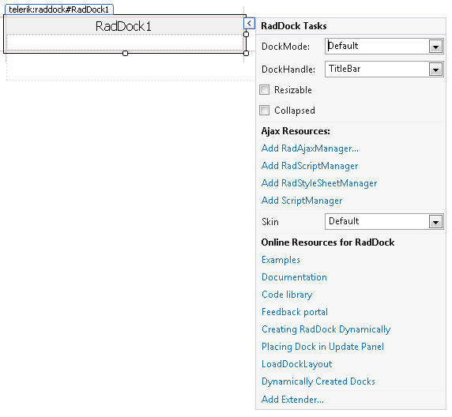

# Smart Tag

The Smart Tags for **RadDock**, **RadDockZone**, and **RadDockLayout** are identical. They all let you easily change the skin for your control or quickly get help. You can display the Smart Tag by right clicking on a **RadDock**, **RadDockZone**, **or RadDockLayout** control and choosing "Show Smart Tag".

As of Q2 2015 we have improved the smart tags of our controls by displaying the most popular control specific properties and adding links to their important online resources:

## Ajax Resources

* **Add RadAjaxManager...** adds a **RadAjaxManager** component to your Web page, and displays the **r.a.d.ajax Property Builder** where you can configure it.

* **Add RadStyleSheetManager** adds a **RadStyleSheetManager** to your Web page.

## Skin

The **Skin** drop-down displays a list of available [skins]() that you can apply to your control, along with an example of what the **RadDock** control looks like for each skin. Assign a skin by selecting the one you want from the list.

* When you set the **Skin** from the **RadDock** Smart Tag, the selected skin applies only to that **RadDock** control.

* When you set the **Skin** from the **RadDockZone** Smart Tag, the selected skin not only affects the appearance of the **RadDockZone** control, it becomes the default skin for any **RadDock** controls nested in the **RadDockZone** at design time. (Setting the **Skin** property of individual **RadDock** controls overrides this default.)

* When you set the **Skin** from the **RadDockLayout** Smart Tag, the selected skin becomes the default skin for all **RadDockZone** controls nested in the **RadDockLayout** at design time. (Setting the **Skin** property of individual **RadDockZone** controls overrides this default.) As **RadDockLayout** is not rendered on client Web pages, there is no visual impact on the **RadDockLayout** component itself.

## Learning Center

Links navigate you directly to RadDock examples, help, and code library.
