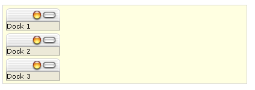

# Dock Zone Orientation

**RadDockZone** controls can lay out their children horizontally (by rows) or vertically (in a single column).You can set the orientation using the **Orientation** property. By default the value of the **Orientation** property is "Vertical". The **Orientation** property interacts with the **Height** property and the **FitDocks** property, as shown below.

## Vertical Orientation

When the value of the **Orientation** property is "Vertical" (the default), **RadDock** controls are docked in a single column.

## Height property (Vertical Orientation)

If the **Height** property is set, scrollbars appear in the **RadDockZone** if it cannot fit all docked **RadDock** controls:

If the **Height** property is not set, **RadDockZone** resizes vertically to fit all docked **RadDock** controls:

## FitDocks property (Vertical Orientation)

If the **FitDocks** property is **True** (the default) docked controls are widened to fit the **Width** of the **RadDockZone**:

If the **FitDocks** property is **False**, docked controls retain their own **Width**:
 

If the docked controls are wider than the **RadDockZone**, the docking zone expands to accommodate the docked controls.

## Horizontal Orientation

When the value of the **Orientation** property is "Horizontal", RadDock controls are docked in rows. The RadDock controls are ordered horizontally until they reach the **RadDockZone** width, after which they are ordered horizontally on the next row.

**Height property (Horizontal Orientation)**

If the **Height** property is set, Scrollbars appear in **RadDockZone** if it cannot fit all the rows of **RadDock** controls:

If the **Height** property is not set, **RadDockZone** resizes vertically to fit all the rows of docked **RadDock** controls:

## FitDocks property (Horizontal Orientation)

The **FitDocks** property has no effect if the **RadDockZone** has a horizontal orientation.

# See Also

 * [Drag And Drop]()
