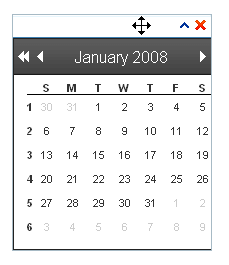
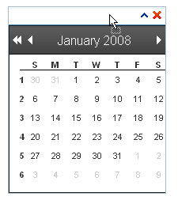
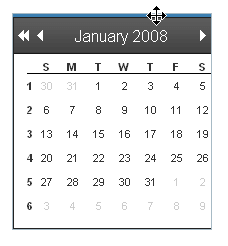
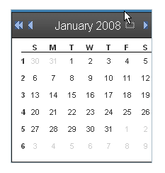
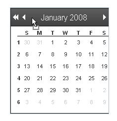
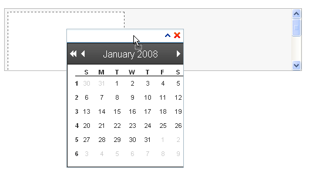
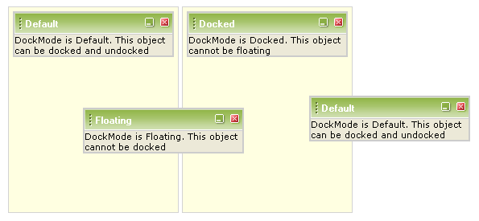

# Drag And Drop


__RadDock__ controls are designed to be dragged by the user and dropped to various locations around the Web page.

## Initiating a drag operation

The __DockHandle__ property controls where the user must click on the __RadDock__ control to initiate a drag operation.

## DockHandle = "TitleBar"

When __DockHandle__ is "TitleBar", the user initiates a drag operation by clicking anywhere on the title bar of the RadDockcontrol. When the user hovers the mouse over the title bar, the cursor changes to a move icon:
>caption 



When the user clicks on the title bar and begins to drag, the cursor changes to the drag icon:
>caption 



## DockHandle = "Grip"

When __DockHandle__ is "Grip", the RadDock control does not display a title bar. This maximizes the content area, but providesno access to the command icons. The user initiates a drag operation by clicking on the "Grip" area at the top of the control. When the user hoversthe mouse over the "Grip" area, the cursor changes to a move icon:
>caption 



When the user clicks on the title bar and begins to drag, the cursor changes to the drag icon:
>caption 



## DockHandle = "None"

When __DockHandle__ is "None", the __RadDock__ has no built-in area for the user to initiate a drag operation. You can specify your own handle for dragging by using the client-side __set_handle__ method inside an __OnClientInitialize__ event handler:

````JavaScript
	
	        function SetTheDockHandle(dock, args)
	        {
	            var calendar = $find("<%= RadCalendar1.ClientID %>");
	            dock.set_handle(calendar.get_element()); 
	        }
	
````


The user can then initiate a drag operation by clicking on the element you have specified:
>caption 



## Dropping the control

When the __RadDock__ control is dragged over a location where it will be docked in a __RadDockZone__ control if the user drops it, the __RadDockZone__ indicates where the __RadDock__ control will be docked:
>caption 



The __ForbiddenZones__ and __DockMode__ properties control where the user can drop a __RadDock__ control at the end of a drag operation. If the user drops the control in any location not allowed by the __ForbiddenZones__ and __DockMode__ properties, it snaps back to its previous location.

## Using ForbiddenZones

The __ForbiddenZones__ property lists the dock zones where the __RadDock__ control can't be docked. __ForbiddenZones__ is a list of strings, each of which matches the __UniqueName__ property of a __RadDockZone__ control. When the user drags the __RadDock__ control over a __RadDockZone__ whose __UniqueName__ property matches a string in the __ForbiddenZones__ property, the __RadDockZone__ does *not* indicate a docking rectangle and the user cannot dock the __RadDock__ control in that zone.

For a live example of the __ForbiddenZones__ property, see [Forbidden Zones](http://demos.telerik.com/aspnet-ajax/Dock/Examples/ForbiddenZones/DefaultCS.aspx).

## Using DockMode

__DockMode__ controls whether the __RadDock__ control must be docked in a __RadDockZone__ control, or whether it can be dropped anywhere on the page, to act as a floating control. __DockMode__ can be set to one of three values:

* __Default__: When __DockMode__ is "Default", the __RadDock__ control can be either docked or floating. The user can drag it to any location. If the dock is docked, it will be rendered as a direct child of the dock zone element; otherwise it will be a direct child of the form.

* __Floating__: When __DockMode__ is "Floating", the __RadDock__ control can not be docked in any dock zone. The user can drag it to any location, but when dropped over a dock zone, it remains floating. The HTML element of the dock is rendered as a direct child of the main form on the page.

* __Docked__: When __DockMode__ is "Docked", the __RadDock__ control must be docked in a dock zone. The user can only drag it to a new position within its current dock zone or drag it to a new dock zone. The HTML element of the dock is rendered as a direct child of the dock zone element.
>caption 



>note In case you want to display the RadDock in a particular location on your page, you need to dock it in a RadDockZone.This is the only mode that will render the dock at the location in the DOM tree that you have specified.For example, if you create a div HTML element in the page’s form and place inside a RadDock without RadDockZone,this dock is floating and will be rendered outside the div. However, if you wrap the dock in a dock zone,it will remain in the div element.
>


For a live example of the __DockMode__ property, see [DockMode](http://demos.telerik.com/aspnet-ajax/Dock/Examples/DockMode/DefaultCS.aspx).

# See Also

 * [Highlighting]()

 * [Dock Zone Orientation]()
