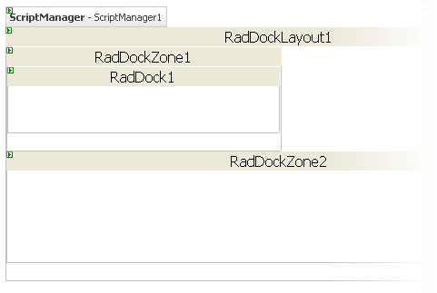
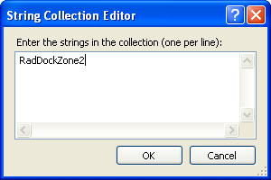
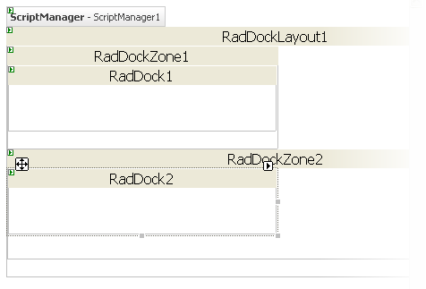

# Getting Started Overview

This tutorial will walk you through creating a Web page that uses **RadDock** controls. It shows how to:

* Use **RadDockLayout** to ensure that docking layouts persist after a postback.

* Use **RadDockZone** to provide a docking area for **RadDock** controls.

* Add content to the **RadDock** controls.

* Use **RadDock** properties to control where the **RadDock** control can appear.

Here is a detailed list of steps:

1. Drag a **RadDockLayout** component from the toolbox onto your Web page. The **RadDockLayout** component is responsible for ensuring that the layout of the **RadDock** controls on your page is maintained after any postbacks. This happens automatically, as long as the **RadDock** and **RadDockZone** controls are created inside the **RadDockLayout** control.

1. Drag a **RadDockZone** control from the toolbox onto the surface of the **RadDockLayout** component. The **RadDockZone** [Smart Tag]() should appear automatically. In the Smart Tag, set the **Skin** property to "Black":

	

1. Right-click the **RadDockZone**, and choose **Properties** from its context menu:

	

1. In the properties pane for the **RadDockZone** control, set the **Height** property to an empty string and the width property to "150px":

	

1. Drag a second **RadDockZone** control into the **RadDockLayout**. Using the properties pane,
	* Set its **Height** property to "100px".
	* Set its **Width** property to "600px".
	* Set its **Orientation** property to "Horizontal".

	

1. Drag a **RadDock** control from the toolbox into the first **RadDockZone**:

	

1. Use the properties pane to set:
	* the **Text** property to "This must be docked in Zone 1."
	* the **DockHandle** property to "Grip". This replaces the default title bar and command buttons with a simple grip control.
	* the **DockMode** property to "Docked". This restricts the **RadDock** control so that it must be docked in a dock zone.

	

1. Click the ellipsis button on the **ForbiddenZones** property to bring up the **String Collection Editor**. In the String Collection Editor, add a single string, "RadDockZone2". The **ForbiddenZones** collection holds the **UniqueName** properties of all dock zones where the **RadDock** control can't be docked. By adding "RadDockZone2" to this collection, you ensure that the **RadDock** control can't be docked in the second dock zone. Because its **DockMode** property is "Docked", this means that the only place the **RadDock** control can reside is docked in the remaining dock zone, RadDockZone1.

	

1. Drag a second **RadDock** control from the toolbox into the second **RadDockZone** control (RadDockZone2).

	

1. On the second RadDock control
	* Set the Text property to "This can't be closed."
	* Set the **DefaultCommands** property to "ExpandCollapse". This specifies that the title bar for the **RadDock** control contains a single icon, for expanding or collapsing the **RadDock** window.
	* Set the **DockMode** property to "Docked". This restricts the RadDock control so that it can only be placed in one of the two dock zones.

	

1. Drag a third **RadDock** control from the toolbox onto the second **RadDock** zone:

	

1. Using the Smart Tag that appears automatically when you place the **RadDock** control, set its **Skin** to "Vista".

	

1. In the properties pane for this RadDock control, set the **Title** property to "Calendar" and the **Height** property to "150px":

	

1. Drag a **RadCalendar** control from the toolbox onto the surface of the RadDock control:

	

1. On the Source view for the Web page, surround the declaration for the RadCalendar control between a `<ContentTemplate>` tag and a `</ContentTemplate>` tag:

	__ASP.NET__

		<telerik:RadDock
		   ID="RadDock3"
		   runat="server"
		   Skin="Vista"
		   Title="Calendar"
		   Width="150px">
		<ContentTemplate>
		  <telerik:RadCalendar RenderMode="Lightweight" ID="RadCalendar1" runat="Server" />
		</ContentTemplate>
		</telerik:RadDock> 

	>tip **Known issue -** There is a problem with the ContentTemplate tag when a control is added inside the RadDock at design time. The ContentTemplate tag disappears and should be added manually.

1. Run the application. Note that the appearance of the two dock zones differs, reflecting the different skins you assigned. The **RadDock** controls inherit the skin of their parent **RadDockZone**, except for the third **RadDock** control, where you explicitly set the **Skin** property. The second **RadDockZone** control has scrollbars because the **Height** property is not sufficient to display all of its docked windows:

	

1. Experiment with the drag-and-drop behavior of the **RadDock** controls:
	1. Click the mouse on the title bar of the second RadDock control. Try to drag it onto the space between the two dock zones. Note that it snaps back to its starting point.
	1. Drag the second RadDock control into the first dock zone. It can move to the new position because it is in a dock zone. The dock zone expands to hold the new control, because its **Height** property is not set.
	1. Try to drag the first **RadDock** control into the second dock zone. It snaps back because the second dock zone is in its **ForbiddenZones** list.
	1. Drag the first **RadDock** control around the first dock zone. you can change its position in the first dock zone.
	1. Drag the third **RadDock** control. Note that you can drop it anywhere on the page, not just in the dock zones. When you drop it in the dock zones, it is moved to a position in the horizontal or vertical layout.

	

# See Also

 * [Drag And Drop]()

 * [Overview]()

 * [Adding Content to RadDock]()

 * [Dock Zone Orientation]()

 * [Skins]()
