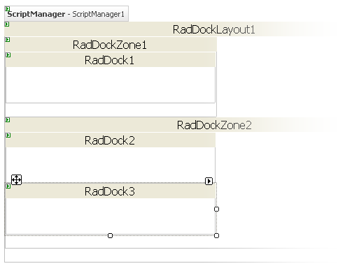
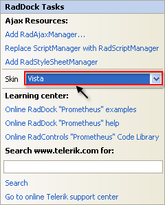

# Getting Started Overview


## 

This tutorial will walk you through creating a Web page that uses __RadDock__ controls. It shows how to:

* Use __RadDockLayout__ to ensure that docking layouts persist after a postback.

* Use __RadDockZone__ to provide a docking area for __RadDock__ controls.

* Add content to the __RadDock__ controls.

* Use __RadDock__ properties to control where the __RadDock__ control can appear.


1. Drag a __RadDockLayout__ component from the toolbox onto your Web page. The __RadDockLayout__ component is responsible for ensuring that the layout of the __RadDock__ controls on your page is maintained after any postbacks. This happens automatically, as long as the __RadDock__ and __RadDockZone__ controls are created inside the __RadDockLayout__ control.

1. Drag a __RadDockZone__ control from the toolbox onto the surface of the __RadDockLayout__ component. The __RadDockZone__[Smart Tag]() should appear automatically. In the Smart Tag, set the __Skin__ property to "Black":
>caption 


1. Right-click the __RadDockZone__, and choose __Properties__ from its context menu:
>caption 


1. In the properties pane for the __RadDockZone__ control, set the __Height__ property to an empty string and the width property to "150px":
>caption 


1. Drag a second __RadDockZone__ control into the __RadDockLayout__. Using the properties pane,

* Set its __Height__ property to "100px".

* Set its __Width__ property to "600px".

* Set its __Orientation__ property to "Horizontal".
>caption 


1. Drag a __RadDock__ control from the toolbox into the first __RadDockZone__:
>caption 


1. Use the properties pane to set:

* the __Text__ property to "This must be docked in Zone 1."

* the __DockHandle__ property to "Grip". This replaces the default title bar and command buttons with a simple grip control.

* the __DockMode__ property to "Docked". This restricts the __RadDock__ control so that it must be docked in a dock zone.
>caption 


1. Click the ellipsis button on the __ForbiddenZones__ property to bring up the __String Collection Editor__. In the String Collection Editor, add a single string, "RadDockZone2". The __ForbiddenZones__ collection holds the __UniqueName__ properties of all dock zones where the __RadDock__ control can't be docked. By adding "RadDockZone2" to this collection, you ensure that the __RadDock__ control can't be docked in the second dock zone. Because its __DockMode__ property is "Docked", this means that the only place the __RadDock__ control can reside is docked in the remaining dock zone, RadDockZone1.
>caption 


1. Drag a second __RadDock__ control from the toolbox into the second __RadDockZone__ control (RadDockZone2).
>caption 


1. On the second RadDock control,

* Set the Text property to "This can't be closed."

* Set the __DefaultCommands__ property to "ExpandCollapse". This specifies that the title bar for the __RadDock__ control contains a single icon, for expanding or collapsing the __RadDock__ window.

* Set the __DockMode__ property to "Docked". This restricts the RadDock control so that it can only be placed in one of the two dock zones.
>caption 


1. Drag a third __RadDock__ control from the toolbox onto the second __RadDock__ zone:
>caption 



1. Using the Smart Tag that appears automatically when you place the __RadDock__ control, set its __Skin__ to "Vista".
>caption 



1. In the properties pane for this RadDock control, set the __Title__ property to "Calendar" and the __Height__ property to "150px":
>caption 


1. Drag a __RadCalendar__ control from the toolbox onto the surface of the RadDock control:
>caption 


1. On the Source view for the Web page, surround the declaration for the RadCalendar control between a <ContentTemplate> tag and a </ContentTemplate> tag:

````ASPNET
	    <telerik:RadDock
	       ID="RadDock3"
	       runat="server"
	       Skin="Vista"
	       Title="Calendar"
	       Width="150px">
	    <ContentTemplate>
	      <telerik:RadCalendar ID="RadCalendar1" runat="Server" />
	    </ContentTemplate>
	    </telerik:RadDock> 
````

__Note:____Known issue -__ There is a problem with the ContentTemplate tag when a control is added inside the RadDock at design time. The ContentTemplate tag disappears and should be added manually.

1. Run the application. Note that the appearance of the two dock zones differs, reflecting the different skins you assigned. The __RadDock__ controls inherit the skin of their parent __RadDockZone__, except for the third __RadDock__ control, where you explicitly set the __Skin__ property. The second __RadDockZone__ control has scrollbars because the __Height__ property is not sufficient to display all of its docked windows:
>caption 


1. Experiment with the drag-and-drop behavior of the __RadDock__ controls:

1. Click the mouse on the title bar of the second RadDock control. Try to drag it onto the space between the two dock zones. Note that it snaps back to its starting point.

1. Drag the second RadDock control into the first dock zone. It can move to the new position because it is in a dock zone. The dock zone expands to hold the new control, because its __Height__ property is not set.

1. Try to drag the first __RadDock__ control into the second dock zone. It snaps back because the second dock zone is in its __ForbiddenZones__ list.

1. Drag the first __RadDock__ control around the first dock zone. you can change its position in the first dock zone.

1. Drag the third __RadDock__ control. Note that you can drop it anywhere on the page, not just in the dock zones. When you drop it in the dock zones, it is moved to a position in the horizontal or vertical layout.
>caption 


# See Also

 * [Drag And Drop]()

 * [Overview]()

 * [Adding Content to RadDock]()

 * [Dock Zone Orientation]()

 * [Skins]()
