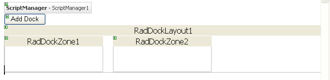

# Creating RadDock Dynamically

One common use of **RadDock** is creating dynamic personalized **Portal** sites. These sites are highly dynamic and require programmatic creation of the **RadDock** controls on the page related to the currently logged users based on database records. In this case the **RadDock** controls are often the core of the Page layout. To ensure proper operation of their content controls, you should follow the following simple rules:

1. Create the **RadDock** controls and their content in **Page_Init**. This is mandatory if they contain controls which initiate postback or AJAX callback events. If you create a **RadDock** control in other event, such as **Button_Click**, it must be recreated in **Page_Init** on the next postback so that its events can be raised properly.

1. Use the **LoadDockLayout** event of the **RadDockLayout** control to supply it with information about the initial positions of the **RadDock** controls: their index and parent **RadDockZone** control ID.

1. Use the **SaveDockLayout** event to save, in one place, the positions and the state of all **RadDock** controls inside the **RadDockLayout** control. If you need to, you can use any other event to store the positions and the state of the **RadDock** controls, for example **Button_Click**.

1. Always set the **UniqueName** property of the **RadDock** controls.

## Example

The following example demonstrates how to dynamically create RadDock controls on a Web site, similar to the [Dynamically Created Docks](https://demos.telerik.com/aspnet-ajax/Dock/Examples/DynamicDocks/DefaultCS.aspx) example.

1. Create a new ASP.NET AJAX-enabled Web Site. Add a **Button**, **RadDockLayout**, and a few **RadDockZone** controls inside the **RadDockLayout**:

	**ASP.NET**

		<form id="form2" runat="server">
		<asp:ScriptManager ID="ScriptManager1" runat="server" />
		

		    <asp:Button ID="Button1" runat="server" Text="Add Dock" />
		    <telerik:RadDockLayout id="RadDockLayout1" runat="server">
		        <telerik:RadDockZone ID="RadDockZone1" runat="server"  Width="200px" MinHeight="200px" Style="float:left;margin-right:20px;">
		        </telerik:RadDockZone>
		        <telerik:RadDockZone ID="RadDockZone2" runat="server" Width="200px" MinHeight="200px" Style="float:left">
		        </telerik:RadDockZone>
		    </telerik:RadDockLayout>
		

		</form>

	

1. The Web page needs some way to store the state of the **RadDock** controls so that it persists across visits to the page. **RadDock** includes a special class, named **DockState**, which is designed for storing the state information about a **RadDock** control. This example uses a list of these **DockState** objects to stores the state information for dynamically created **RadDock** controls. Normally, you would use a permanent medium such as a database to store the list. For simplicity, this example uses the **Session**.

	1. At the top of the code behind for your Web page, add two new **using** statements (C#) or **Imports** statements (VB) for System.Collections.Generic and Telerik.Web.UI:

		**C#**
		
			using System.Collections.Generic;
			using Telerik.Web.UI; 

		**VB**
		
			Imports System.Collections.Generic
			Imports Telerik.Web.UI 
	
	1. Add the following property definition to the class definition of your Web page:

		**C#**
			 
			private List<DockState> CurrentDockStates
			{
			 //Store the info about the added docks in the session.
			 private List<DockState> CurrentDockStates
			 {
			   get
			   {
				 List<DockState> _currentDockStates = (List<DockState>)Session["CurrentDockStates"];
				 if (Object.Equals(_currentDockStates, null))
				 {
				   _currentDockStates = new List<DockState>();
				   Session["CurrentDockStates"] = _currentDockStates;
				 }
				 return _currentDockStates;
			   }
			   set
			   {
				 Session["CurrentDockStates"] = value;
			   }
			 }
			} 

		**VB**
		
			Private Property CurrentDockStates() As List(Of DockState)
				Get
					Dim _currentDockStates As List(Of DockState) = _
					  DirectCast(Session("CurrentDockStates"), List(Of DockState))
					If [Object].Equals(_currentDockStates, Nothing) Then
						_currentDockStates = New List(Of DockState)()
						Session("CurrentDockStates") = _currentDockStates
					End If
					Return _currentDockStates
				End Get
				Set(ByVal value As List(Of DockState))
					Session("CurrentDockStates") = value
				End Set
			End Property

1. Add a **Click** event handler to the Button on the Web page. This event handler creates a new **RadDock** control and adds it to the first **RadDockZone** control. Note that when creating a new **RadDock** control, it must have a **UniqueName** so that the **RadDockLayout** component can distinguish it and accurately manage its state:

	**C#**
	     
		private RadDock CreateRadDock()
		{
		 int docksCount = CurrentDockStates.Count;
		 RadDock dock = new RadDock();
		 dock.ID = string.Format("RadDock{0}", docksCount);
		 dock.Title = string.Format("Dock {0}", docksCount);
		 dock.Text = string.Format("Added at {0}", DateTime.Now);
		 dock.UniqueName = Guid.NewGuid().ToString();
		 dock.Width = Unit.Pixel(300);
		 return dock;
		}
		protected void Button1_Click(object sender, EventArgs e)
		{
		 RadDock dock = CreateRadDock();
		 RadDockLayout1.Controls.Add(dock);
		 dock.Dock(RadDockZone1);
		} 

	**VB**
	
	    Private Function CreateRadDock() As RadDock
	        Dim docksCount As Integer = CurrentDockStates.Count
	        Dim dock As New RadDock()
	        dock.ID = String.Format("RadDock{0}", docksCount)
	        dock.Title = String.Format("Dock {0}", docksCount)
	        dock.Text = String.Format("Added at {0}", DateTime.Now)
	        dock.UniqueName = Guid.NewGuid().ToString()
	        dock.Width = Unit.Pixel(300)
	        Return dock
	    End Function
	    Protected Sub Button1_Click(ByVal sender As Object, ByVal e As EventArgs) Handles Button1.Click
	        Dim dock As RadDock = CreateRadDock()
	        RadDockLayout1.Controls.Add(dock)
	        dock.Dock(RadDockZone1)
	    End Sub
	
	>tip If you want the dynamically created **RadDock** controls to store additional information, you can use the **Tag** property to save that information. For an example that uses this technique, see [Adding Controls Inside Dynamically Created Docks]().

1. Run the application. Note that you never have more than one **RadDock** control. This is because the dynamically created controls disappear from the page whenever there is a postback, such as when the button **Click** event occurs. You must re-create these controls every time the page loads.

1. In order to let ensure that the state of all created **RadDock** controls persists over a postback, add code to save and load their state.

	1. Add a **SaveDockLayout** event handler to the **RadDockLayout** component. This event handler calls the **RadDockLayout.GetRegisteredDocksState** method to obtain the current list of dock states and saves the list to the **CurrentDockStates** property.

		**C#**     
			
			protected void RadDockLayout1_SaveDockLayout(object sender, DockLayoutEventArgs e)
			{
				CurrentDockStates = RadDockLayout1.GetRegisteredDocksState();
			} 
					
		**VB**
		
			Protected Sub RadDockLayout1_SaveDockLayout( _
						  ByVal sender As Object, _
						  ByVal e As DockLayoutEventArgs) _
						  Handles RadDockLayout1.SaveDockLayout
				CurrentDockStates = RadDockLayout1.GetRegisteredDocksState()
			End Sub

	1. Add a **Page_Init** event handler to your Web page that recreates the **RadDock** controls after a postback. It uses the **CurrentDockStates** property (which was set in the **SaveDockLayout** event handler) to initialize their properties using the **RadDock.ApplyState** method. This event handler does not need to add the **RadDock** controls to their parent dock zones, it is enough that they are added to the **RadDockLayout** or one of its children. The **RadDockLayout** control will restore the parent dock zones and position after the **LoadDockLayout** event.

		**C#**
			 
			protected void Page_Init(object sender, EventArgs e)
			{
			 for (int i = 0; i < CurrentDockStates.Count; i++)
			 {
			   RadDock dock = new RadDock();
			   dock.ID = string.Format("RadDock{0}", i);
			   dock.ApplyState(CurrentDockStates[i]);
			   RadDockLayout1.Controls.Add(dock);
			 }
			} 

		**VB**
		
			Protected Sub Page_Init(ByVal sender As Object, ByVal e As EventArgs) Handles Me.Init
				Dim i As Integer
				For i = 0 To CurrentDockStates.Count - 1
					Dim dock As RadDock = New RadDock()
					dock.ID = String.Format("RadDock{0}", i)
					dock.ApplyState(CurrentDockStates(i))
					RadDockLayout1.Controls.Add(dock)
				Next i
			End Sub

		>note When the **RadDock** controls are recreated on **Page_Init** , it is important that you always set the same value in their property **ID** . This way you will ensure that the layout of the **RadDock** controls will be persisted after a postback.

	1. Add a **LoadDockLayout** event handler. This event handler tells the **RadDockLayout** control the parent dock zones and indices of the **RadDock** controls that were added in the **Page_Init** event handler. **RadDockLayout** uses this information to restore the layout:

		**C#**
				 
			protected void RadDockLayout1_LoadDockLayout(object sender, DockLayoutEventArgs e)
			{
			 foreach (DockState state in CurrentDockStates)
			 {
			   e.Positions[state.UniqueName] = state.DockZoneID;
			   e.Indices[state.UniqueName] = state.Index;
			 }
			} 

		**VB**
		
			Protected Sub RadDockLayout1_LoadDockLayout( _
							ByVal sender As Object, _
							ByVal e As DockLayoutEventArgs) _
							Handles RadDockLayout1.LoadDockLayout
				For Each state As DockState In CurrentDockStates
					e.Positions(state.UniqueName) = state.DockZoneID
					e.Indices(state.UniqueName) = state.Index
				Next state
			End Sub

# See Also

 * [Lifecycle]()

 * [SaveDockLayout]()

 * [LoadDockLayout]()
