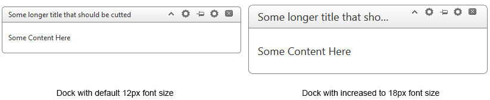

# Responsive, Adaptive and Elastic Capabilities


This article explains the **responsive design capabilities RadDock offers**.The [Lightweight RenderMode]() of RadDock supports	**elastic design since Q1 2014**.

@[template](/_templates/common/render-mode.md#resp-design-desc "slug-el: no, slug-fl: no")

## Elastic Design with RadDock
>caption Figure 1: Comparison between appearance of a RadDock with regular font size and with increased font size



**RadDock** is a control that can float freely on the page or be placed and fit inside a given zone. More details on the matter are available in the [Drag and Drop help article](). Thus, it does not create elastic design by itself, but can fit in a pagethat follows this pattern. This means that RadDock does not support dimensions set in percent,but its **Lightweight RenderMode** supports **changing the font size** without breaking the control's appearance - if the new size is larger than the original,the elements in the control will simply increase their size as well to accommodate the text.This fluid layout is achieved by using `em` units for setting dimensions and paddings in the control, instead of `px` because `em` units are tied to the font size. This allows dimensions and sizes to scale with the font size.

Elements that use images or images sprites, however, cannot be increased in size, so the commands will keep having their original dimensions and position(aligned to the top of the titlebar).

The following sample shows how to increase the font size of a RadDock and the effect can be seen in comparison in Figure 1.

````ASP.NET
<style type="text/css">
	div.RadDock
	{
		font-size: 18px;
	}
</style>
<telerik:RadDock ID="RadDock1" runat="server" RenderMode="Lightweight" Title="Some longer title that should be cut"
				 Top="100" Left="100" EnableRoundedCorners="true" Width="400" Skin="Default">
	<Commands>
		<telerik:DockCloseCommand />
		<telerik:DockCommand />
		<telerik:DockPinUnpinCommand />
		<telerik:DockToggleCommand />
		<telerik:DockExpandCollapseCommand />
	</Commands>
	<ContentTemplate>
		<p>
			Some Content Here
		</p>
	</ContentTemplate>
</telerik:RadDock>
````


# See Also

 * [Render Modes]()

 * [Drag And Drop]()
