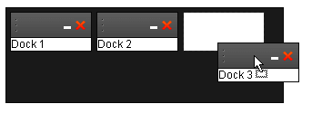

# RadDock Overview

The **Telerik Docking controls** consist of **RadDock**, **RadDockZone**, and **RadDockLayout**. Together, they can be used to create ASP.NET applications that contain movable content regions that can be dragged around the Web page, docked into docking zones, collapsed into a minimized state and expanded to display their content, pinned in place, and so on. 

#### Key Features
Using these controls, you get

* A [client-side API]() that includes the ability to manipulate **RadDock** controls in the same way the user can move them with the mouse and numerous [client-side events]() to respond to user actions.

* The ability to customize the [drag-and-drop behavior]() of individual **RadDock** controls,including specifying the **DockHandle** that the user clicks on to start a drag operation and controlling where the user can drop a control.

* Support for adding [Commands]() to the **RadDock** title bar and implementing their behavior in a variety of [events]().

* Numerous ways to supply [content]() to the RadDock controls.

* Many options for [controlling appearance](), including

* Built-in [skins]() to quickly change the look and feel.

* The ability to create your own [custom skins]().

* Support for [title bar templates]() to customize the title bar of a control.

* The ability to assign CSS classes to [control the appearance of custom commands]() or to [highlight docking zones]() when they can accept a control for docking.

* Options for configuring the way docking zones [lay out their docked controls]().

* The ability to [specify tooltips]() for the commands in the title bar.

* [Server-side events]() that let you [save the layout]() of docked controls in a database or other permanent storage medium and [load it at a later time](), [respond to commands](), and [respond when the user changes the layout]() of docked controls.

* Support for [dynamically creating RadDock controls]() that [contain custom controls](), so that you can build personalized portal pages.

* [Compliance to multiple standards]().

* Support for many major browsers, including Internet Explorer 5.5 and above, Netscape 7.1 and above (all operating systems), Mozilla 1.0 and above (all operating systems),and Firefox 1.0 and above (all operating systems.

	

# See Also

 * [Structure]()
