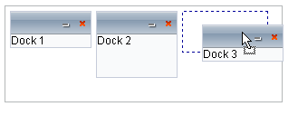
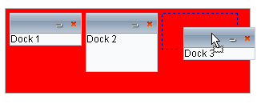

# Highlighting

By default, when the user drags a **RadDock** control over a **RadDockZone** control that can accept it, the only indication is a placeholder that appears where the **RadDock** control will be docked:

You can highlight the entire dock zone as well as showing the placeholder, providing the user with feedback about the limits of the dock zone as well as where the **RadDock** control will be docked. To highlight the dock zone when it is ready to accept and dock a **RadDock** control, use the **HighilghtedCssClass** property.

To use the **HighlightedCssClass** property,

1. Define a CSS class that will be applied to the 
 tag that is the rendered image of the dock zone. You can use a separate CSS file and link to it, or you can define the CSS class in the <head> tag of the Web page:

	__ASP.NET__

		<head runat="server">
		    <title>Untitled Page</title>
		    
	</head>

	>note Note the use of the **!important** modifier on the CSS rule. This is to force the rule to override any more specific CSS rules for in the CSS file for the RadDockZone's skin.Without the **!important** modifier, the CSS rule would not necessarily take effect.
	

1. Set the **HighlightedCssClass** property of the **RadDockZone** control to the name of your new CSS class:

	__ASP.NET__

		<telerik:raddockzone id="RadDockZone1" runat="server" skin="WebBlue" orientation="Horizontal"
	        height="100px" highlightedcssclass="MyHighlight"></telerik:raddockzone>

When the **HighlightedCssClass** property is set, the **RadDockZone** uses the new CSS class when a **RadDock** control is dragged over the zone (as long as the **RadDockZone** is not listed in the **RadDock** control's **ForbiddenZones** property).

# See Also

 * [Drag And Drop]()

 * [Controlling RadDock's Appearance]()

 * [Tutorial: Creating a Custom Classic Skin]()

 * [Tutorial: Creating a Custom Lightweight Skin]()

 * [OnClientDockPositionChanging]()
