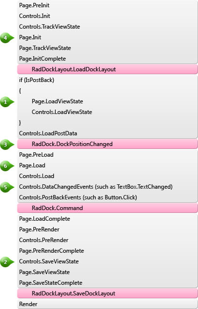

# Lifecycle

When dynamically creating **RadDock** controls, it is important to observe the events cycle and carefully consider where to add the proper piece of code. Below is the schema of the control life cycle and the page life cycle. It is crucial to comply with the provided notes when creating a complicated dynamic site.

* When the Page loads its ViewState on postback (**point 1**), the control tree and the control IDs should be exactly the same as it was when they were saved before the postback (**point 2**) - otherwise you will get ViewState exceptions.

* You should create the RadDock controls before RadDock.DockPositionChanged (**point 3**), in order to ensure their proper operation. Usually, the best place is Page.Init (**point 4**).

* If you are using event handlers that respond to changed data or user events, you should create the controls before the server-side events (**point 5**).

* You can save the dock state anywhere after Page.Load(**point 6**). For example, you could use a Button.Click event. In most cases we recommend the **RadDockLayout.SaveDockLayout** event because it is raised automatically in the proper moment.

# See Also

 * [Creating RadDock Dynamically]()

 * [SaveDockLayout]()

 * [LoadDockLayout]()
