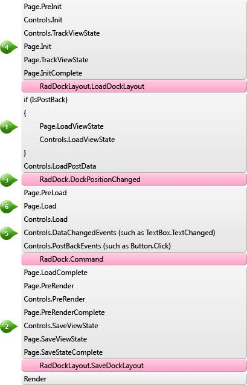

# Lifecycle

## 

When dynamically creating __RadDock__ controls it is important to observe the events cycle and carefully consider where to add the proper piece of code. Below is the schema of the control life cycle and the page life cycle. It is crucial to comply with the provided notes when creating a complicated dynamic site.

* When the Page loads its ViewState on postback (__point 1__), the control tree and the control IDs should be exactly the same as it was when they were saved before the postback (__point 2__) - otherwise you will get ViewState exceptions.

* You should create the RadDock controls before RadDock.DockPositionChanged (__point 3__), in order to ensure their proper operation. Usually, the best place is Page.Init (__point 4__).

* If you are using event handlers that respond to changed data or user events, you should create the controls before the server-side events (__point 5__).

* You can save the dock state anywhere after Page.Load(__point 6__). For example, you could use a Button.Click event. In most cases we recommend the __RadDockLayout.SaveDockLayout__ event because it is raised automatically in the proper moment.

# See Also

 * [Creating RadDock Dynamically]()

 * [SaveDockLayout]()

 * [LoadDockLayout]()
