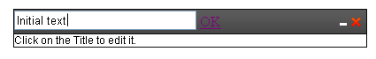

# Title Bar Template


In addition to the content template, which is described in [Adding Content](), __RadDock__ also supports a title bar template for customizing the appearance of the title bar.

>note Note that in the examples below, there is no need to add icons for the __RadDock__ commands to the title bar template. They appear automatically.
>


## Setting the TitlebarTemplate in the markup

You can specify the title bar template at design time in the markup:

````ASPNET
	<telerik:RadDock
	   runat="server"
	   id="RadDock1"
	   text="Click on the title to edit it">
	 <TitlebarTemplate>
	   <asp:UpdatePanel runat="server" id="UpdatePanel1">
	     <ContentTemplate>
	       <asp:LinkButton
	           id="LinkButton2"
	           runat="server"
	           OnClick="LinkButton_Click"
	           style="text-decoration: none;
	           color: Gray;
	           cursor: move;"
	           Text="Initial text">
	       </asp:LinkButton>
	       <asp:TextBox
	           runat="server"
	           id="TextBox1"
	           width="200px"
	           visible="false" />
	       <asp:LinkButton
	           runat="server"
	           id="LinkButton1"
	           onclick="LinkButton_Click">
	         <!-- No Text -->
	       </asp:LinkButton>
	     </ContentTemplate>
	   </asp:UpdatePanel>
	 </TitlebarTemplate>
	</telerik:RadDock>
````


In the codebehind, you can directly access the controls in the title bar template:


````C#
	
	            protected void LinkButton_Click(object sender, EventArgs e)
	            {
	                if (TextBox1.Visible) // finished editing
	                {
	                    LinkButton2.Visible = true;
	                    TextBox1.Visible = false;
	                    LinkButton2.Text = TextBox1.Text;
	                    LinkButton1.Text = "";
	                }
	                else // show textbox for editing
	                {
	                    LinkButton2.Visible = false;
	                    TextBox1.Visible = true;
	                    TextBox1.Text = LinkButton2.Text;
	                    LinkButton1.Text = "OK";
	                }
	            } 
				
````
````VB
	
	    Protected Sub LinkButton_Click(ByVal sender As Object, ByVal e As EventArgs) Handles LinkButton1.Click, LinkButton2.Click
	        If TextBox1.Visible Then
	            ' finished editing
	            LinkButton2.Visible = True
	            TextBox1.Visible = False
	            LinkButton2.Text = TextBox1.Text
	            LinkButton1.Text = ""
	        Else
	            ' show textbox for editing
	            LinkButton2.Visible = False
	            TextBox1.Visible = True
	            TextBox1.Text = LinkButton2.Text
	            LinkButton1.Text = "OK"
	        End If
	    End Sub
	
````


The template and event handler above create a __RadDock__ control with a title that can be edited:
>caption 



## Setting the TitlebarTemplate in the code-behind

You can provide a title bar template at runtime by setting the __TitlebarTemplate__ property to an instance of a class that implements __ITemplate__:


````C#
	
		public class DockTitleTemplate : ITemplate // creating a class, implementing the ITemplate interface
		{
			TextBox txt = new TextBox();
			Button btn = new Button();
			LinkButton lnk = new LinkButton();
			RadDock dock;
	
			public DockTitleTemplate(RadDock dock)
			{
				this.dock = dock;
			}
	
			public void InstantiateIn(Control container)
			{
				lnk.ID = "lnk1";
				lnk.Text = "initial text";
				lnk.Click += new EventHandler(lnk_Click);
	
				txt.ID = "txt1";
				txt.Visible = false;
	
				btn.ID = "btn1";
				btn.Click += new EventHandler(btn_Click);
				btn.Text = "ok";
				btn.Visible = false;
	
				container.Controls.Add(lnk);
				container.Controls.Add(txt);
				container.Controls.Add(btn);
			}
			protected void lnk_Click(object sender, EventArgs e)
			{
				txt.Text = lnk.Text;
				txt.Visible = true;
				btn.Visible = true;
				lnk.Visible = false;
	
				var script = String.Format("function f(){{enableDockDrag(false,'{0}','{1}');Sys.Application.remove_load(f);}}Sys.Application.add_load(f);", this.dock.ClientID, txt.ClientID);
				ScriptManager.RegisterStartupScript(dock.Page, dock.Page.GetType(), "disableDrag", script, true);
				// disable the dragging of RadDock, when the link is clicked
	
			}
			protected void btn_Click(object sender, EventArgs e)
			{
				lnk.Text = txt.Text;
				txt.Visible = false;
				btn.Visible = false;
				lnk.Visible = true;
	
				var script = String.Format("function f(){{enableDockDrag(true,'{0}','{1}');Sys.Application.remove_load(f);}}Sys.Application.add_load(f);", this.dock.ClientID, txt.ClientID);
				ScriptManager.RegisterStartupScript(dock.Page, dock.Page.GetType(), "enableDrag", script, true);
				// enable the dragging of RadDock, when the Ok button is clicked
			}
	
````
````VB
	
		Public Class DockTitleTemplate
			Implements ITemplate
			' creating a class, implementing the ITemplate interface
			Private txt As New TextBox()
			Private btn As New Button()
			Private lnk As New LinkButton()
			Private dock As RadDock
	
			Public Sub New(dock As RadDock)
				Me.dock = dock
			End Sub
	
			Public Sub InstantiateIn(container As System.Web.UI.Control) Implements System.Web.UI.ITemplate.InstantiateIn
				lnk.ID = "lnk1"
				lnk.Text = "initial text"
				AddHandler lnk.Click, AddressOf lnk_Click
	
				txt.ID = "txt1"
				txt.Visible = False
	
				btn.ID = "btn1"
				AddHandler btn.Click, AddressOf btn_Click
				btn.Text = "ok"
				btn.Visible = False
	
				container.Controls.Add(lnk)
				container.Controls.Add(txt)
				container.Controls.Add(btn)
			End Sub
			Protected Sub lnk_Click(sender As Object, e As EventArgs)
				txt.Text = lnk.Text
				txt.Visible = True
				btn.Visible = True
				lnk.Visible = False
	
				Dim script = [String].Format("function f(){{enableDockDrag(false,'{0}','{1}');Sys.Application.remove_load(f);}}Sys.Application.add_load(f);", Me.dock.ClientID, txt.ClientID)
				ScriptManager.RegisterStartupScript(dock.Page, dock.Page.[GetType](), "disableDrag", script, True)
				' disable the dragging of RadDock, when the link is clicked
	
			End Sub
			Protected Sub btn_Click(sender As Object, e As EventArgs)
				lnk.Text = txt.Text
				txt.Visible = False
				btn.Visible = False
				lnk.Visible = True
	
				Dim script = [String].Format("function f(){{enableDockDrag(true,'{0}','{1}');Sys.Application.remove_load(f);}}Sys.Application.add_load(f);", Me.dock.ClientID, txt.ClientID)
				ScriptManager.RegisterStartupScript(dock.Page, dock.Page.[GetType](), "enableDrag", script, True)
				' enable the dragging of RadDock, when the Ok button is clicked
			End Sub
		End Class
	#End Region
	End Class
````


The following APSX page markup is used for the example. Through the client script the dragging of the RadDock is disabled while text is entered in the TextBox and it is enabled again after the OK button is pressed. You need to add this functionality as well in order to implement the scenario successfully.

````ASPNET
		<telerik:RadDockLayout runat="server" ID="RadDockLayout1">
			<telerik:RadDockZone runat="server" ID="RadDockZone1" Width="300" MinHeight="200">
			</telerik:RadDockZone>
		</telerik:RadDockLayout>
		<script type="text/javascript">
			function enableDockDrag(enable, dockId, textboxId) { // this script enables/disables the RadDock dragging
				var dock = $find(dockId);
				if (enable) {
					dock._initializeDrag();
					var textbox = $find(textboxId);
					if (textbox) {
						$addHandler(textbox, "mousedown", function (e) {
							e.stopPropagation();
						});
					}
				}
				else dock._disposeDrag();
			} 
		</script>
````


The RadDock control is created from the code-behind and the TitlebarTemplate is specified:


````C#
	
		protected override void OnInit(EventArgs e)
		{
			base.OnInit(e);
			RadDock dock = new RadDock();
			dock.ID = "RadDock1";
			dock.Text = "This is a custom TitleTemplate example";
			dock.Width = Unit.Pixel(300);
			dock.Height = Unit.Pixel(100);
			dock.TitlebarTemplate = new DockTitleTemplate(dock); // the TitlebarTemplate is set
			RadDockZone1.Controls.Add(dock);
		}
	
````
````VB
		Protected Overrides Sub OnInit(e As EventArgs)
			MyBase.OnInit(e)
			Dim dock As New RadDock()
			dock.ID = "RadDock1"
			dock.Text = "This is a custom TitleTemplate example"
			dock.Width = Unit.Pixel(300)
			dock.Height = Unit.Pixel(100)
			dock.TitlebarTemplate = New DockTitleTemplate(dock)
			' the TitlebarTemplate is set
			RadDockZone1.Controls.Add(dock)
		End Sub
	
	#End Region
	
	#Region "dock-titlebar-template_VB_7"
	
		Public Class DockTitleTemplate
			Implements ITemplate
			' creating a class, implementing the ITemplate interface
			Private txt As New TextBox()
			Private btn As New Button()
			Private lnk As New LinkButton()
			Private dock As RadDock
	
			Public Sub New(dock As RadDock)
				Me.dock = dock
			End Sub
	
			Public Sub InstantiateIn(container As System.Web.UI.Control) Implements System.Web.UI.ITemplate.InstantiateIn
				lnk.ID = "lnk1"
				lnk.Text = "initial text"
				AddHandler lnk.Click, AddressOf lnk_Click
	
				txt.ID = "txt1"
				txt.Visible = False
	
				btn.ID = "btn1"
				AddHandler btn.Click, AddressOf btn_Click
				btn.Text = "ok"
				btn.Visible = False
	
				container.Controls.Add(lnk)
				container.Controls.Add(txt)
				container.Controls.Add(btn)
			End Sub
			Protected Sub lnk_Click(sender As Object, e As EventArgs)
				txt.Text = lnk.Text
				txt.Visible = True
				btn.Visible = True
				lnk.Visible = False
	
				Dim script = [String].Format("function f(){{enableDockDrag(false,'{0}','{1}');Sys.Application.remove_load(f);}}Sys.Application.add_load(f);", Me.dock.ClientID, txt.ClientID)
				ScriptManager.RegisterStartupScript(dock.Page, dock.Page.[GetType](), "disableDrag", script, True)
				' disable the dragging of RadDock, when the link is clicked
	
			End Sub
			Protected Sub btn_Click(sender As Object, e As EventArgs)
				lnk.Text = txt.Text
				txt.Visible = False
				btn.Visible = False
				lnk.Visible = True
	
				Dim script = [String].Format("function f(){{enableDockDrag(true,'{0}','{1}');Sys.Application.remove_load(f);}}Sys.Application.add_load(f);", Me.dock.ClientID, txt.ClientID)
				ScriptManager.RegisterStartupScript(dock.Page, dock.Page.[GetType](), "enableDrag", script, True)
				' enable the dragging of RadDock, when the Ok button is clicked
			End Sub
		End Class
	#End Region
	End Class
````


# See Also

 * [Overview]()
