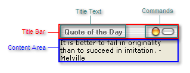
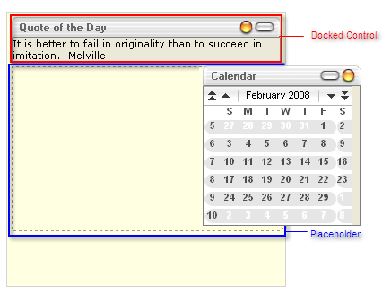

# Structure Overview

The structure of the docking controls are described below.

## RadDock

**RadDock** is a movable content placeholder, which can be dragged around the screen, docked into **RadDockZone** controls, collapsed, expanded, pinned, and so on.

The main visual elements of the control are:

* **Title Bar** - this is the upper part of the control. It is the container of the **Title Text** and the **Commands**.

* To customize the title bar, use the **Title** property or the **TitleBarTemplate**.

* To customize the commands, use the **DefaultCommands** or **Commands** property.

* **Content Area** - this is the lower part of the control. It can be customized using **Text** property or the **ContentTemplate**.

## RadDockZone

**RadDockZone** is a static placeholder, where you can dock **RadDock** controls. It can also display a **placeholder** to show the position where a **RadDock** control is about to be docked.

## RadDockLayout

**RadDockLayout** is the control that is responsible for automatic position management of the **RadDock** controls on the page. It has no visual representation on the client. At design time, you must place all **RadDockZone** and **RadDock** controls into the **RadDockLayout** control so that it can manage their layout. Otherwise, the layout of **RadDockZone** and **RadDock** controls will not persist after a postback.

>note By handling the [SaveDockLayout]() and [LoadDockLayout]() events you can easily implement applications which persist the **RadDock** controls' positions in a database or other storage medium.
>

# See Also

 * [Overview]()

 * [Drag And Drop]()

 * [Overview]()

 * [Adding Content to RadDock]()

 * [Title Bar Template]()
