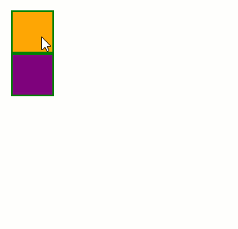

# Axis

Setting the **Axis** property to either `Horizontal` or `Vertical` will restrain the dragged element movement only that axis.



>caption Example

````ASP.NET
<telerik:RadDraggable runat="server" Axis="Horizontal" TargetSelectors="#HorizontalAxis">
</telerik:RadDraggable>

<telerik:RadDraggable runat="server" Axis="Vertical" TargetSelectors="#VerticalAxis">
</telerik:RadDraggable>

<div id="HorizontalAxis"></div>
<div id="VerticalAxis"></div>

<style>
    #HorizontalAxis,
    #VerticalAxis {
        width: 50px;
        height: 50px;
        border: 2px solid green;
    }
    #HorizontalAxis {
        background-color: orange;
    }
    #VerticalAxis {
        background-color: purple;
    }
</style>
````

 