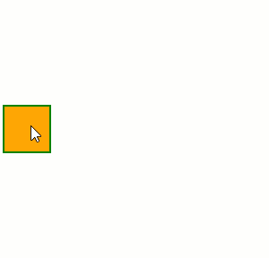

# Distance

Define the minimum Distance the mouse needs to travel before the Drag will start.



>caption Example

````ASP.NET
<telerik:RadDraggable runat="server" Distance="100" TargetSelectors="#DistanceDraggable">
    <CursorOffsetSettings Top="5" Left="-5" />
</telerik:RadDraggable>

<div id="DistanceDraggable"></div>

<style>
    #DistanceDraggable {
        width: 50px;
        height: 50px;
        background-color: orange;
        border: 2px solid green;
    }
</style>
````
 
