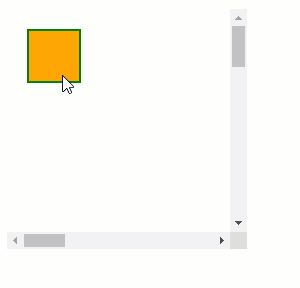
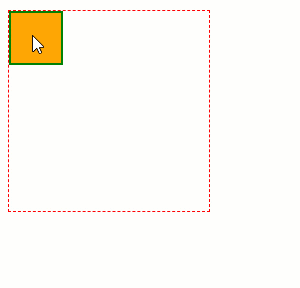
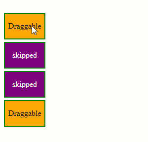
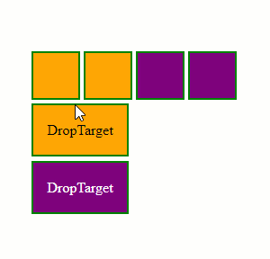
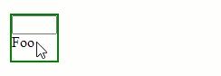

# Drag and Drop Functionality Overview

In this article, you will see different Drag and Drop functionalities with links for more details in each section.

## Hint

The Hint is an element that appears as dragged, a clone of the original element or a completely custom one

By default, the Draggable creates an exact clone of the Target Element. 

Using the `Hint` property, you can set a hint-handler (JavaScript function) to change the Draggable element to something else.

Visit the the [Hint]() page for more details.

## AutoScroll

Enables automatic scrolling of the container once the dragged element approaches the boundaries.

Visit the the [AutoScroll]() page for more details.

## Axis

Restraining the dragged element movement only on a single axis.

Visit the the [Axis]() page for more details.

## Containers

Restricting the hint movement within the boundaries of an element.

Visit the the [Containers]() page for more details.

## Distance

The distance the user needs to drag and element to engage the actual dragging process.

Visit the the [Distance]() page for more details.

## Filter

Define Filters to enable Dragging elements with specific selectors.

Visit the the [Filter]() page for more details.

## Group

Allows Draggable elements to be dropped only on DropTargets with the same group.

Visit the the [Group]() page for more details.

## Ignore

Ignore specific elements within a Draggable that should not trigger the Drag

Visit the the [Ignore]() page for more details.
 
## Client-Side Programming

APIs and Events to allow interacting with the Control using JavaScript.

Visit the the [Client-Side Programming]() page for more details.

 