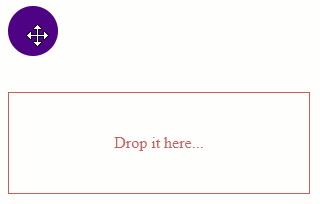

# WebForms Drag and Drop Overview

With the R1 2022 release, **Telerik UI for ASP.NET AJAX** introduces the **RadDraggable**, **RadDropTarget** and **RadDropTargetArea** controls as tools to help you implement drag-and-drop scenarios with just a few lines of code. 

In addition, you can leverage the **RadDragDropManager** control to facilitate the creation of draggables and drop targets as well as reuse predefined settings and events.

The Drag and Drop controls are Web Forms wrappers of the [Kendo UI Drag & Drop](https://docs.telerik.com/kendo-ui/controls/interactivity/draganddrop/overview) widgets, thus share the same functionality and smooth interactivity.

Apart from the regular dragging and dropping, the Drag and Drop controls bring some cool features and events that give you full control on customizing the appearance and behavior.


## Key Features

- [Hint]() - An element that appears as dragged, a clone of the original element or a completely custom one
- [AutoScroll]() - Enables automatic scrolling of the container once the dragged element approaches the boundaries
- [Axis]() - Restraining the dragged element movement only on a single axis
- [Containers]() - Restricting the hint movement within the boundaries of an element
- [Distance]() - The distance the user needs to drag and element to engage the actual dragging process
- [Filter]() - Define multiple elements as draggable within a container
- [Group]() - Allows Draggable elements to be dropped only on DropTargets with the same group
- [Ignore]() - Ignore specific elements within a Draggable that should not trigger the Drag functionality.
- [Client-Side Programming]() - APIs and Events to interact with the Controls using JavaScript.

## Basic Drag and Drop Scenario

For a step by step tutorial explaining the example below, check out the [Getting Started]() article.



>caption Sample Code

````ASP.NET
<telerik:RadDraggable runat="server" TargetSelectors=".myDraggableElement">
</telerik:RadDraggable>

<asp:Panel ID="Panel1" runat="server" CssClass="myDraggableElement"></asp:Panel>

<telerik:RadDropTarget runat="server" TargetSelectors=".myDropTargetElement">
    <ClientEvents OnDrop="DropTargetOnDrop" />
</telerik:RadDropTarget>

<asp:Panel ID="Panel2" runat="server" CssClass="myDropTargetElement">
    <asp:Label ID="Label2" runat="server" Text="Drop it here..."></asp:Label>
</asp:Panel>

<script>
    function DropTargetOnDrop(sender, args) {
        // Get reference to the DropTarget element
        var $dropTargetJqueryOject = args.get_dropTarget();

        // Assign a new CSS class to DropTarget
        $dropTargetJqueryOject.addClass('fill');


        // Find the Label within the DropTarget element
        var lbl2 = $get('<%= Label2.ClientID %>');

        // Change the Label Text
        lbl2.innerText = "You did great! Draggable dropped.";
    }
</script>

<style>
    /* Draggable Element */
    .myDraggableElement {
        width: 50px;
        height: 50px;
        background-color: indigo;
        border-radius: 50%;
        cursor: move;
    }
    /* Initial style */
    .myDropTargetElement {
        width: 300px;
        height: 100px;
        line-height: 100px;
        border: 1px solid indianred;
        text-align: center;
        color: indianred;
        user-select: none;
    }
    /* Change the style On Drag */
    .myDropTargetElement.fill {
        border: none;
        background-color: indigo;
        color: hotpink;
    }
</style>
````

## See Also
 * [ASP.NET AJAX Drag and Drop Manager](https://www.telerik.com/products/aspnet-ajax/drag-and-drop-manager.aspx)
 * [Online Demo](https://demos.telerik.com/aspnet-ajax/dragdropmanager/overview/defaultvb.aspx)


