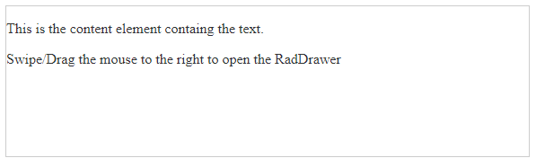

# Getting Started 


The following tutorial demonstrates how you can add the **RadDrawer** control. The end result will be similar to **Figure 1**:

>caption Figure 1: RadDrawer 



1. Add a **ScriptManager** control on a Web Form.


1. Add a **RadDrawer** control to the page, and set its properties:

    * `Mode` - sets the mode of the RadDrawer to Push/Overlay.
    * `SwipeToOpen` - enables/disables the swipe gestures for toggling the RadDrawer.
    * `DrawerWidth` - sets the width of the RadDrawer items container.
    * `ContentTemplate` - sets the content of the RadDrawer.
    * `Template` - gets a hierarchical HTML structure that would represent the RadDrawer items.


The end result should be similar to the following:

````ASP.NET

<telerik:RadDrawer runat="server" ID="RadDrawer1" Mode="push" DrawerWidth="200" SwipeToOpen="true">
    <ContentTemplate>
        <p style="user-select: none">
            This is the content element containg the text.
        </p>
        <p style="user-select: none">
            Swipe/Drag the mouse to the right to open the RadDrawer
        </p>
    </ContentTemplate>
    <Template>
        <ul> 
            <li data-role='drawer-item' class='k-state-selected'>
                <span class='k-item-text'>First Item</span>
            </li> 
            <li data-role='drawer-item'>
                <span class='k-item-text'>Second Item</span>
            </li> 
            <li data-role='drawer-separator'></li> 
            <li data-role='drawer-item'>
                <span class='k-item-text'>Third Item</span>
            </li> 
            <li data-role='drawer-item'>
                <span class='k-item-text'>Fourth Item</span>
            </li> 
        </ul>
    </Template>
</telerik:RadDrawer>

````

Next, you can check the [Functionality]() of the RadDrawer and [how to handle the RadDrawer interactions]().
