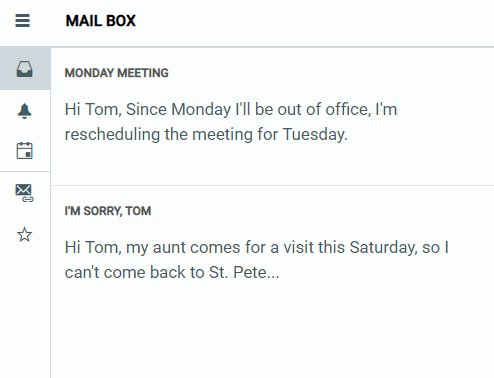

# RadDrawer Overview

RadDrawer operates on the client and provides a dismissible or always visible panel. It can act as a sidebar for navigation in your responsive web applications. It can also be used for updating a content of a section of the page.

RadDrawer is available as of R3 2019 and it is a server-side WebForms wrapper over the [Kendo UI Drawer for jQuery](https://docs.telerik.com/kendo-ui/controls/navigation/drawer/overview) widget.

>caption Figure 1: RadDrawer allows you to create easily a mobile-like dismissible panel used for navigation in responsive web applications or for changing a content of a section in the page.

## Key Features

* Renders and operates on the client-side

* Overlay and Push mode

* Right and Left position

* Gesture Support

* Mini mode
  
# See Also

 * [Overview demo](https://demos.telerik.com/aspnet-ajax/drawer/overview/defaultcs.aspx?skin=material)
  
