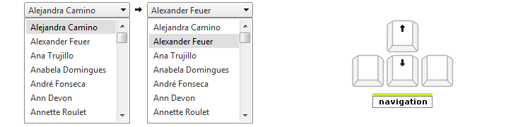

# Keyboard Support

## 

__RadDropDownList__ provides support for the two relevant aspects of keyboard support:

* __Access Keys__ - You can specify a key that lets the end-user move focus directly to the dropdownlist. Once focus is on the dropdownlist, the user can use the arrow keys for navigation. The access key is defined using the __AccessKey__ property. For example, if you set the __AccessKey__ property to "W", focus moves to the combobox when the user types "Alt+W".

* __Key Navigation__-RadDropDownList allows end-users to navigate the dropdownlist structure using the arrow keys, the PageUp/PageDown keys and the Enter key:

* The "Alt + W" focuses the drop-down list. 

* The "Alt + Up" arrow opens the drop-down list. 

* The "PageUp" or "PageDown" arrows to scroll to the previous/next “page” in the drop down listof items.

* The "Esc" key to close the list without changing the selection.

* The up and down arrow keys allows user to navigate along the items in the drop down list in the corresponding direction.

* The "Enter" key selects the current item in the list.

* Typing a letter moves focus to the next instance of a visible item, whose text begins with that letter.

* Typing a sequence of letters moves focus to the first matched item, whose text starts with that sequence.

* The "Alt+Down" arrow closes the drop-down list.

>note In order to enable the keyboard support in browsers, different from Internet Explorer, you shoud set the __TabIndex__ property of the RadDropDownList.
>

