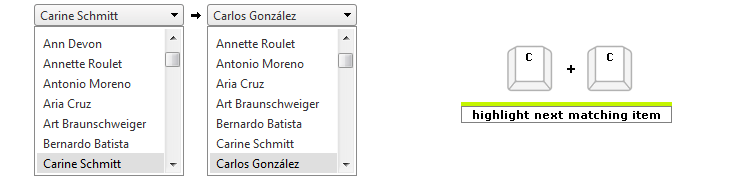

# Keyboard Support

A critical requirement for software accessibility is keyboard support as a complete alternative to pointing devices (mouse, etc.).

Keyboard support is comprised of command key, focus key, and keyboard navigation. RadDropDownList will seamlessly switch between mouse and keyboard navigation.

Setting the control's **KeyboardNavigationSettings** (*introduced in R2 2016 - ver.2016.2.504*), allows you to associate an activation combination (**CommandKey** + **FocusKey**), which moves focus directly to the **RadDropDownList** and enables keyboard navigation.

>tip Certain keyboard combinations are reserved and used as shortcuts in the browsers.
>

**Example:** Setting the **KeyboardNavigationSettings** for **RadDropDownList**

````ASPNET
<telerik:RadDropDownList ID="RadDropDownList1" runat="server" >
    <KeyboardNavigationSettings CommandKey="Alt" FocusKey="M" />
</telerik:RadDropDownList>
````

## Keyboard Navigation

* **CommandKey** + **FocusKey** (for example Alt + M) focuses the RadDropDownList. 

* The **Alt** + **Down** arrow opens the drop-down list. 

* The **PageUp** or **PageDown** scroll to the previous/next portion of items in the dropdown.

* The **Up** and **Down** arrow keys allow the user to navigate along the items in the dropdown in the corresponding direction.

* The **Enter** key selects the current item in the list.

* Typing a letter moves focus to the next instance of a visible item, whose text begins with that letter.

* Typing a sequence of letters moves focus to the first matched item, whose text starts with that sequence.

* The **Alt** + **Up** arrow or **Esc** closes the dropdown.

# See Also

 * [Keyboard Support Demo](http://demos.telerik.com/aspnet-ajax/dropdownlist/examples/accessibility/keyboardsupport/defaultcs.aspx)
