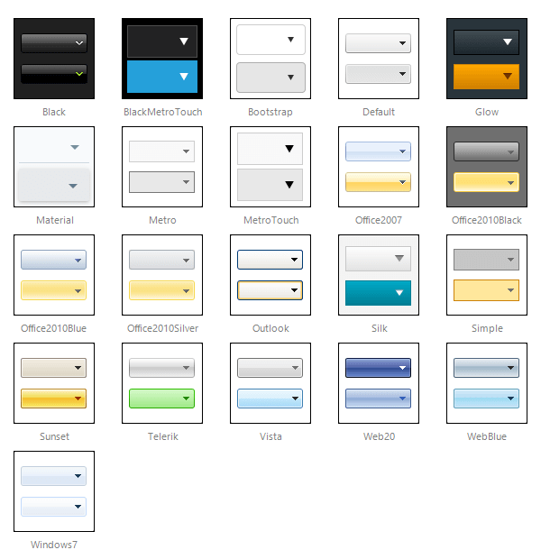

# Skins

To make customizing the appearance of **RadDropDownList** as easy as possible, the control uses **skins.** A skin is a set of images and a CSS stylesheet that can be applied to RadDropDown elements (items, images, etc.) and defines their look and feel.

**RadDropDownList** is installed with a number of built-in skins: 

 @[template - Material skin is available only in Lightweight mode](/_templates/common/skins-notes.md#material-only-in-lightweight) 

