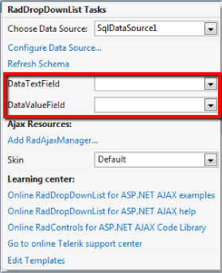

# Data Binding

## 

You can bind RadDropDownList to a Data Source and configure its Data Bindings entirely in Design Time through the Smart Tag.

Once the Data Source has been chosen from the Smart Tag, additional dropdown fields will show - **DataTextField**and **DataValueField**. You need to choose the fields in the Data Source which will serve data respectively for the **Text** and **Value** properties of the RadDropDownList Items.

