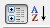

# Item Builder

The __RadDropDownList Item Builder__ lets you define items __inline__ (in the aspx page).

## RadDropDownList Item Builder

There are two ways to bring up the RadDropDownList Item Builder:

* From the __RadDropDownList__[ Smart Tag ](), click on the __Build RadDropDownList__ link.

* Right-click on the __RadDropDownList__ control and select __Build RadDropDownList__ from its pop-up menu.

You can add, edit, delete and re-arrange items:

|  __Button__  |  __Description__  |
| ------ | ------ |
||Click the Add button to append a DropDownListItem to the list.|
||Use the up and down arrow buttons to rearrange the items in the list. This order determines the order the items appear in the drop-down list.|
||Select an item and click the Delete button to delete it from the list.|
||Select individual items to change their properties using the property pane on the right of the __RadDropDownList Item builder__ . Use the sorting controls above the property paneto sort the properties by category or alphabetically.|

## RadDropDownListItem Properties

For each __RadDropDownListItem__,

* __Text__ is the string that the user sees for the item in the drop-down list.

* __Value__ is the value associated with the item. It determines the value of the dropdownlist's __SelectedValue__ property when the item is selected.

* __ToolTip__ is a string that appears in the tooltip window when the user hovers the mouse over the item in the drop-down list.

>note Setting the tooltip can enable an accessibility feature: Special accessibility readers like JAWS can pronounce the tooltip of the highlighted item.
>

* __Selected__ lets you control which item is initially selected when the __RadDropDownList__ first appears.

>note Only one item can be selected at a time. If you set __Selected__ to __True__ for an item, the __Selected__ property of all other items is automatically set to __False__ .
>

* __Enabled__ determines whether the user can select the item from the drop-down list.

* __CssClass__ is the name of a CSS style to be applied to the dropdownlist item. The style can be declared in the CSS file of the applied [skin](02F6B25B-299B-4415-BEAC-4B40BF8A3CF4).
