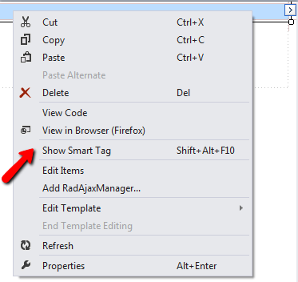
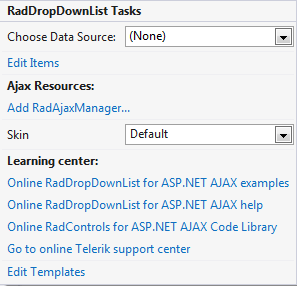
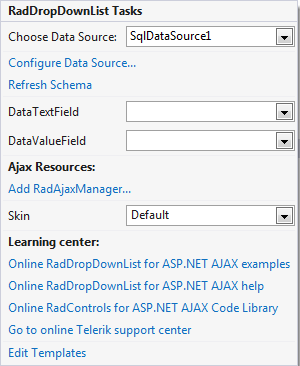

# Smart Tag

The **RadDropDownList** Smart Tag allows easy access to frequently needed tasks. You can display the **Smart Tag** by right clicking on a **RadDropDownList** control in the design window, and choosing **Show Smart Tag.**

## Smart Tag of unbound RadDropDownList

When **RadDropDownList** is unbound, the Smart Tag looks like the following:

Using the unbound **RadDropDownList** Smart Tag you can perform the following:

## RadDropDownList Tasks

* **Choose Data Source** lets you bind RadDropDownList declaratively by selecting a data source from a drop-down list of all available data source components. If you select **`<New Data Source...>`** the standard Windows [Data Source Configuration Wizard](http://msdn2.microsoft.com/en-us/library/ms247282(VS.80).aspx) appears, where you can create and configure a data source component.

* **Build RadDropDownList** opens the [RadDropDownList Item builder](), where you can add static items to the DropDownList and set their properties.

* **Skin** lets you select from a list of available skins to customize the look of your **RadDropDownList**.

## Smart Tag of bound RadDropDownList

When **RadDropDownList** is bound to a data source, the Smart Tag looks like the following:

Using the Smart Tag of bound **RadDropDownList** lets you perform any task you can perform with the Smart Tag of unbound RadDropDownList. In addition, you can choose **Configure Data Source...** to open the standard [Data Source Configuration Wizard](http://msdn2.microsoft.com/en-us/library/ms247282(VS.80).aspx), where you can configure the currently bound data source component.

Once the Data Source is chosen, you can select each of the following: **DataTextField** and **DataValueField**. These should be fields in the Data Source which will serve data respectively for **Text** and **Value** properties of RadDropDownList Items.
