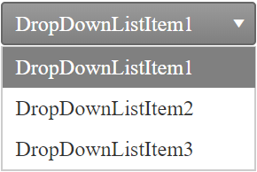

# Getting Started

This tutorial will walk you through creating a **RadDropDownList** and shows how to Create a simple RadDropDownList with elements set in design time.

## Creating a simple RadDropDownList

1. Drag a RadDropDownList from the Toolbox onto your web page.

2. The [Smart Tag]() should appear automatically. From the Smart Tag, choose **Edit Items...**
	>caption 

	

3. The **[RadDropDownList Item Builder]()** appears.

4. Click the **Add item** icon in the upper left corner. A new **RadDropDownListItem** appears in the item builder.
	>caption 

	

5. Set the **Text** property to "DropDownListItem1".

6. Add two more items in the same way.

7. Press **OK** to exit the **RadDropDownList Item Builder**.

8. Back in the Smart Tag, choose a **Skin** from the drop-down control.
	>caption 

	

9. Run the application. Open the drop-down list to see the items.
	>caption 

	
