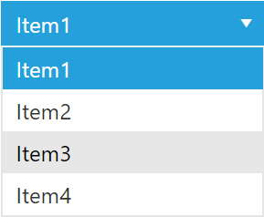

# DropDownList Overview

Telerik RadDropDownList for ASP.NET AJAX is lightweight and easy to use control for simple selection:

````ASP.NET
<telerik:RadDropDownList ID="RadDropDownList1" runat="server" Skin="Metro">
    <Items>
        <telerik:DropDownListItem Text="Item1" Value="Value1" Selected="true" />
        <telerik:DropDownListItem Text="Item2" Value="Value2" />
        <telerik:DropDownListItem Text="Item3" Value="Value3" />
        <telerik:DropDownListItem Text="Item4" Value="Value4" />
    </Items>
</telerik:RadDropDownList>
````







## Why choose RadDropDownList?

* Because of its intuitive and lightweight UI for selecting single item from a predefined list.

* Because of the mobile friendly experience that brings to the end user. No need of any additional configuration to use it in mobile application.

* And last but not least, a very important fact about RadDropDownList is its ability to be populated with data from various data sources. The control can be populated by defining declarative items, by server-side binding (DataSource controls), and by client-side binding (Web service and OData).

## End-user scenarios

* Control which allows the user to create related dropdownlists. The main goal is to populate the next dropdownlist based on the selected item in the previous dropdownlist.

* Control which offers support for ODataDataSource control which will query the oData service.

* Control which offers RadGrid/FormView integration and could be used in edit/insert form of RadGrid/FormView etc.

## Summary of features supported by RadDropDownList

* **Data Binding**

	* [Declarative entries]() – defined in the markup.

	* [Server-side]() – server API for setting data source using DataSource controls, to which RadDropDownList is bound.

	* [Client-side]() – client API for setting data source using Web services and OData, to which RadDropDownList is bound.

* [**Virtual Scroll Rendering**]() – similar behavior as the LOD, but will enable access to items in a non-sequential manner. For instance, if you want to scroll to the bottom of the DropDown, you won’t need to load all the items in between. In order to utilize the Virtual Scroll Rendering the DropDownHeight property must be set.

* [**Default Message**]() property of the RadDropDownList enables the ability to set control's text if no item is selected. The Default Message property could be very useful, when one needs to provide more information about the content of the RadDropDownList.

* [**Templates**]() – provides the ability to define your own visual presentation of the entries contained in the drop-down area. Server as well as client templates are supported out-of-the-box by RadDropDownList.

* [**Client-side API**]()

* [**Server-side API**]()
