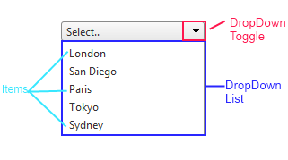

# RadDropDownList Structure


## 

The structure of the **RadDropDownList** control is as follows:



The top of the control has an area, which displays the selected item of the default message if no item is selected. Next is a drop-down toggle, which controls whether the Drop-down list is visible. The drop-down list contains a collection of items, from which the user can choose.

## The asociated markup code

````ASPNET
	            <telerik:RadDropDownList ID="RadDropDownList1" runat="server" DefaultMessage="Select.." DropDownHeight="110px" >
	                <Items>
	                    <telerik:DropDownListItem Text="London" />
	                    <telerik:DropDownListItem Text="San Diego" />
	                    <telerik:DropDownListItem Text="Paris" />
	                    <telerik:DropDownListItem Text="Tokyo" />
	                    <telerik:DropDownListItem Text="Sydney" />
	                </Items>
	            </telerik:RadDropDownList>
````


