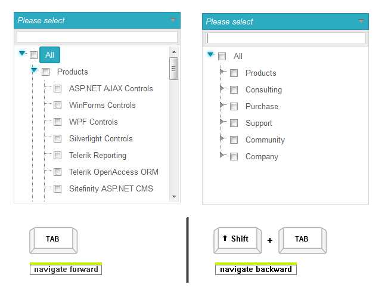

# Keyboard Support

## Keyboard support

As a part of Q2 2013 **RadDropDownTree** control introduces fully built-in **Keyboard Support**

* **Access Keys** - You can specify a key that lets the end-users move the focus directly to the RadDropDownTree. The access key is defined using the **AccessKey** property. For example, if you set the **AccessKey** property to **"P"**, the focus moves to the DropDownTree when the user presses **"Alt+P"** (for IE).

* **Key Navigation**- RadDropDownTree allows end-users to navigate through the nodes in the dropdown.

1. Use the **"Alt + DownArrow/UpArrow"** to open/close the dropdown or the Esc key (to close the dropdown when opened)

1. Once the dropdown is opened you can move the focus to the filter field and then to the nodes by using the **"Tab"** key.

1. After the focus is set to the dropdown the user can use the **UpArrow and DownArrows** to navigate up and down the tree and the**RightArrow and LeftArrow** to expand and collapse the nodes respectively.

* **Action Key** -When the focus is set to a node, pressing the "Space" key checks the node.

>caption  Key combinations supported by different browsers 

| Browser | Focus | Action Key | Navigation Forward | Navigation Backward |
| ------ | ------ | ------ | ------ | ------ |
| **Internet Explorer** |Alt + **Access Key** |Space|Tab|Shift + Tab|
| **Firefox** |Alt + Shift + **Access Key** |Space|Tab|Shift + Tab|
| **Chrome** |Not Supported|Space|Tab|Shift + Tab|
| **Safari** |Alt + **Access Key** (Alt + Shift + **Access Key** )|Space|Tab|Shift + Tab|
| **Opera** |Not Supported|Space|Tab|Shift + Tab|
