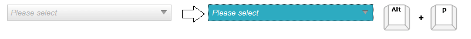
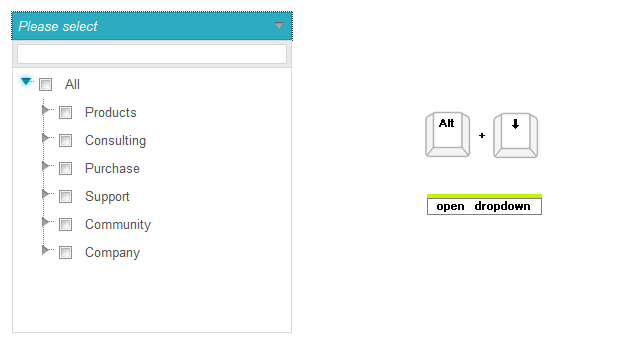
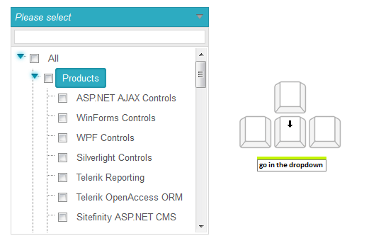
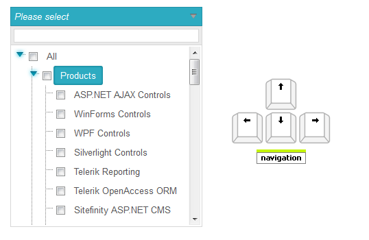
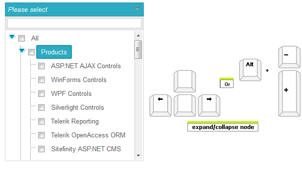
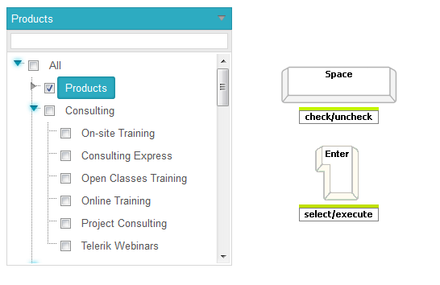

# Keyboard Support

## Keyboard support

As a part of Q2 2013 **RadDropDownTree** control introduces fully built-in **Keyboard Support**. If you set a **TabIndex** to it, you can also focus it like a simple form input through the **Tab** key along with other inputs on the page.

The following list explains the specific behaviors and keyboard shortcuts you can use to navigate through the dropdown tree.

* **Access Key** - You can specify a key that moves the focus directly to the RadDropDownTree element. The access key is defined using the **AccessKey** property. For example, if you set the **AccessKey** property to **P**, the focus moves to the DropDownTree when the user presses **"Alt+P"** (for IE). While the focus is on this element, you can use **Tab** or **Shift** + **Tab** to move between all form elements.

    

* **Key Navigation** - RadDropDownTree allows end-users to navigate through the nodes in the dropdown.
    
    1. When the main element of the drpodown tree is focused, use **Alt** + **Down Arrow** to open the dropdown.
    
        
    
    1. Once the dropdown is opened you can move the focus to the filter field and then to the nodes by using the **Down Arrow** key.
    
        
        
        >tip Once focus is on the treeview, to reach the filter textbox again, press the **AccessKey** and then **Down Arrow** once more. Alternatively, close the dropdown through **Esc** and open it again through **Alt** + **Down Arrow**, and press **Down Arrow**.
    
    1. After the focus is set to the tree, use the **Up Arrow** and **Down Arrow** to navigate up and down the tree and the **Right Arrow** and **Left Arrow** to expand and collapse the nodes. Using **Alt** + **+**/**-** also expands/collapses an item.
    
        
        
        
        
    1. When the focus is in the tree, start typing to get a "starts with" match for the nodes. The first node that matches the typed text will be focused. Once text no longer matches a node, the current node will remain focused.
    
    1. To close the dropdown,  press the **Esc** key. This will focus the main element so you can move out of the dropdown and through the rest of the form via **Tab** or **Shift** + **Tab**. You can also return to the main element by using its **Access Key**.

* **Action Key** -When the focus is set to a node, pressing the **Space** key checks the node without closing the dropdown. Pressing **Enter** selects the node and closes the dropdown.

    

>caption  Key combinations supported by different browsers 

| Browser | Focus | Action Key | Navigation Forward | Navigation Backward |
| ------ | ------ | ------ | ------ | ------ |
| **Internet Explorer** |Alt + **Access Key** |Space|Tab|Shift + Tab|
| **Firefox** |Alt + Shift + **Access Key** |Space|Tab|Shift + Tab|
| **Chrome** |Not Supported|Space|Tab|Shift + Tab|
| **Safari** |Alt + **Access Key** (Alt + Shift + **Access Key** )|Space|Tab|Shift + Tab|
| **Opera** |Not Supported|Space|Tab|Shift + Tab|

## See Also

* [Live Demo - RadDropDownTree Keyboard Support](https://demos.telerik.com/aspnet-ajax/dropdowntree/examples/functionality/keyboard-support/defaultcs.aspx)

