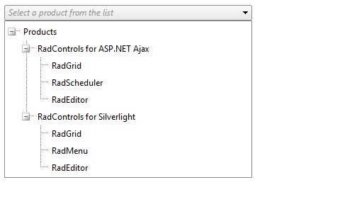

# Binding to Array, ArrayList and Generic List


Binding RadDropDownTree to a data source that implements __IEnumerable__, such as Array or ArrayList, can create a flat data structure as well as a hierarchy if the proper __ID__ -> __ParentID__ relationship is set.

Here is a general outline of __IEnumerable__ data binding:

1. Create the collection.

1. Add values to the collection and set the __DataSource__ property of RadDropDownTree to the instance of the collection.

1. Call the __DataBind()__ method.

The collection is automatically mapped to the __Text__ property of the respective tree Node.

## Binding to an Array

The examples below takes an array of strings as a data source.


````ASPNET
	            <telerik:RadDropDownTree ID="RadDropDownTree1" runat="server" Width="250px" DefaultMessage="Select a car from the list">
	                <DropDownSettings Width="250px" />
	            </telerik:RadDropDownTree>
````


````C#
	    protected void Page_Load(object sender, EventArgs e)
	    {
	        if (!IsPostBack)
	        {
	            string[] cars = new string[] { "Porsche Carrera", "Ferrari F430", "Aston Martin DB9" };
	            RadDropDownTree1.DataSource = cars;
	            RadDropDownTree1.DataBind();
	        }
	    }
````
````VB.NET
	    Protected Sub Page_Load(ByVal sender As Object, ByVal e As EventArgs) Handles Me.Load
	        If Not IsPostBack Then
	            Dim cars As String() = New String() {"Porsche Carrera", "Ferrari F430", "Aston Martin DB9"}
	            RadDropDownTree1.DataSource = cars
	            RadDropDownTree1.DataBind()
	        End If
	    End Sub
````


## Binding to an ArrayList

If you have a collection (any collection implementing __ICollection__ or __IEnumerable__) that contains objects (as opposed to simple values),you can take advantage of __DataTextField__, and __DataValueField__ properties to map object properties from the object directly to the __Text__ or __Value__ fields. If the __DataFieldID__ and __DataFieldParentID__ properties are set, RadDropDownTree will create a hierarchy of Nodes, determining the Root ones using the following algorithm:

>tip - their __DataFieldParentID__ property must be __null__ if it is of nullable (e.g. __int?__ ) or reference (e.g. __string__ ) type.
> -example:- 
> __ID__  __ParentID__ 
>1 (null)
>2 1
>- their __DataFieldParentID__ property must return the __default value__ if it is value type (e.g. __0__ for __int__ , __Guid.Empty__ for __Guid__ ).
> -example:- 
> __ID__  __ParentID__ 
>1 0
>2 1
>


Below you can find an example of a hierarchical data binding:


````ASPNET
	            <telerik:RadDropDownTree ID="RadDropDownTree1" runat="server" Width="350px" DefaultMessage="Select a car from the list">
	                <DropDownSettings Width="350px" />
	            </telerik:RadDropDownTree>
````


````C#
	    protected void Page_Load(object sender, EventArgs e)
	    {
	        if (!IsPostBack)
	        {
	            Car[] cars = new Car[] {
	               new Car("Cars", 00000, 0, 4),
	               new Car("Porsche Carrera", 79100, 4, 1),
	               new Car("Ferrari F430", 229955, 4, 2),
	               new Car("Aston Martin DB9", 168000, 4, 3),            
	           };
	
	            RadDropDownTree1.DataSource = cars;
	            RadDropDownTree1.DataTextField = "Name";
	            RadDropDownTree1.DataValueField = "Price";
	            //establishing Parent-Child hierarchy 
	            RadDropDownTree1.DataFieldParentID = "Parent";
	            RadDropDownTree1.DataFieldID = "Id";
	
	            RadDropDownTree1.DataBind();
	        }
	    }
	
	    public class Car
	    {
	        public Car(string name, double price, int parent, int id)
	        {
	            _name = name;
	            _price = price;
	            _parent = parent;
	            _id = id;
	
	        }
	        private string _name;
	        public string Name
	        {
	            get { return _name; }
	            set { _name = value; }
	        }
	        private double _price;
	        public double Price
	        {
	            get { return _price; }
	            set { _price = value; }
	        }
	        private int _parent;
	        public int Parent
	        {
	            get { return _parent; }
	            set { _parent = value; }
	        }
	        private int _id;
	        public int Id
	        {
	            get { return _id; }
	            set { _id = value; }
	        }
	
	    }
````
````VB.NET
	    Protected Sub Page_Load(ByVal sender As Object, ByVal e As EventArgs) Handles Me.Load
	
	
	        If Not IsPostBack Then
	
	            Dim cars As Car() = New Car() {
	                New Car("Cars", 0, 0, 4),
	                New Car("Porsche Carrera", 79100, 4, 1),
	                New Car("Ferrari F430", 229955, 4, 2),
	                New Car("Aston Martin DB9", 168000, 4, 3)}
	
	            RadDropDownTree1.DataSource = cars
	            RadDropDownTree1.DataTextField = "Name"
	            RadDropDownTree1.DataValueField = "Price"
	            RadDropDownTree1.DataFieldParentID = "Parent"
	            RadDropDownTree1.DataFieldID = "Id"
	            RadDropDownTree1.DataBind()
	        End If
	    End Sub
	
	
	    Public Class Car
	        Public Sub New(ByVal name As String, ByVal price As Double, ByVal parent As Integer, ByVal id As Integer)
	            _name = name
	            _price = price
	            _parent = parent
	            _id = id
	        End Sub
	        Private _name As String
	        Public Property Name() As String
	            Get
	                Return _name
	            End Get
	            Set(ByVal value As String)
	                _name = value
	            End Set
	        End Property
	        Private _price As Double
	        Public Property Price() As Double
	            Get
	                Return _price
	            End Get
	            Set(ByVal value As Double)
	                _price = value
	            End Set
	        End Property
	        Private _parent As Integer
	        Public Property Parent() As Integer
	            Get
	                Return _parent
	            End Get
	            Set(ByVal value As Integer)
	                _parent = value
	            End Set
	        End Property
	        Private _id As Integer
	        Public Property Id() As Integer
	            Get
	                Return _id
	            End Get
	            Set(ByVal value As Integer)
	                _id = value
	            End Set
	        End Property
	    End Class
````


## Binding to a Generic List



````ASPNET
	            <telerik:RadDropDownTree ID="RadDropDownTree1" runat="server" Width="350px" DefaultMessage="Select a product from the list">
	                <DropDownSettings Width="350px" />
	            </telerik:RadDropDownTree>
````


````C#
	 protected void Page_Load(object sender, EventArgs e)
	    {
	        if (!IsPostBack)
	        {
	            BindToIEnumerable(RadDropDownTree1);
	        }
	    }
	
	    private static void BindToIEnumerable(RadDropDownTree dropdowntree)
	    {
	        List<SiteDataItem> siteData = new List<SiteDataItem>();
	
	        siteData.Add(new SiteDataItem(1, 0, "Products"));
	        siteData.Add(new SiteDataItem(2, 1, "RadControls for ASP.NET Ajax"));
	        siteData.Add(new SiteDataItem(3, 1, "RadControls for Silverlight"));
	        siteData.Add(new SiteDataItem(4, 2, "RadGrid"));
	        siteData.Add(new SiteDataItem(5, 2, "RadScheduler"));
	        siteData.Add(new SiteDataItem(6, 2, "RadEditor"));
	        siteData.Add(new SiteDataItem(7, 3, "RadGrid"));
	        siteData.Add(new SiteDataItem(8, 3, "RadMenu"));
	        siteData.Add(new SiteDataItem(9, 3, "RadEditor"));
	
	        dropdowntree.DataTextField = "Text";
	        dropdowntree.DataFieldID = "ID";
	        dropdowntree.DataFieldParentID = "ParentID";
	        dropdowntree.DataSource = siteData;
	        dropdowntree.DataBind();
	    }
	
	    internal class SiteDataItem
	    {
	        private string _text;
	        private int _id;
	        private int _parentId;
	
	        public string Text
	        {
	            get { return _text; }
	            set { _text = value; }
	        }
	
	
	        public int ID
	        {
	            get { return _id; }
	            set { _id = value; }
	        }
	
	        public int ParentID
	        {
	            get { return _parentId; }
	            set { _parentId = value; }
	        }
	
	        public SiteDataItem(int id, int parentId, string text)
	        {
	            _id = id;
	            _parentId = parentId;
	            _text = text;
	        }
	    }
````
````VB.NET
	    Protected Sub Page_Load(sender As Object, e As EventArgs) Handles Me.Load
	
	        If Not Page.IsPostBack Then
	
	            BindToIEnumerable(RadDropDownTree1)
	        End If
	
	    End Sub
	
	    Private Shared Sub BindToIEnumerable(ByVal dropdowntree As RadDropDownTree)
	        Dim siteData As New List(Of SiteDataItem)()
	
	        siteData.Add(New SiteDataItem(1, 0, "Products"))
	        siteData.Add(New SiteDataItem(2, 1, "RadControls for ASP.NET Ajax"))
	        siteData.Add(New SiteDataItem(3, 1, "RadControls for Silverlight"))
	        siteData.Add(New SiteDataItem(4, 2, "RadGrid"))
	        siteData.Add(New SiteDataItem(5, 2, "RadScheduler"))
	        siteData.Add(New SiteDataItem(6, 2, "RadEditor"))
	        siteData.Add(New SiteDataItem(7, 3, "RadGrid"))
	        siteData.Add(New SiteDataItem(8, 3, "RadMenu"))
	        siteData.Add(New SiteDataItem(9, 3, "RadEditor"))
	
	        dropdowntree.DataTextField = "Text"
	        dropdowntree.DataFieldID = "ID"
	        dropdowntree.DataFieldParentID = "ParentID"
	        dropdowntree.DataSource = siteData
	        dropdowntree.DataBind()
	    End Sub
	
	    Friend Class SiteDataItem
	        Private _text As String
	        Private _id As Integer
	        Private _parentId As Integer
	
	        Public Property Text() As String
	            Get
	                Return _text
	            End Get
	            Set(ByVal value As String)
	                _text = value
	            End Set
	        End Property
	
	
	        Public Property ID() As Integer
	            Get
	                Return _id
	            End Get
	            Set(ByVal value As Integer)
	                _id = value
	            End Set
	        End Property
	
	        Public Property ParentID() As Integer
	            Get
	                Return _parentId
	            End Get
	            Set(ByVal value As Integer)
	                _parentId = value
	            End Set
	        End Property
	
	        Public Sub New(ByVal id As Integer, ByVal parentId As Integer, ByVal text As String)
	            _id = id
	            _parentId = parentId
	            _text = text
	        End Sub
	    End Class
````

