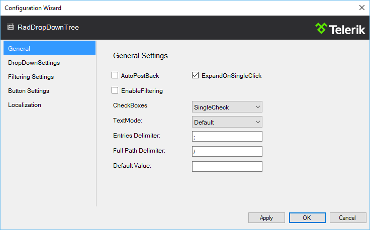
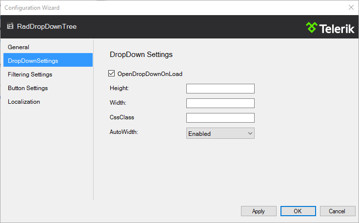
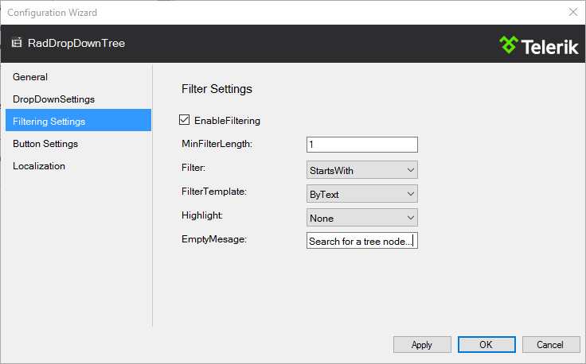
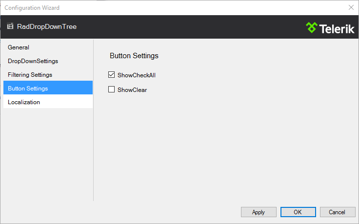
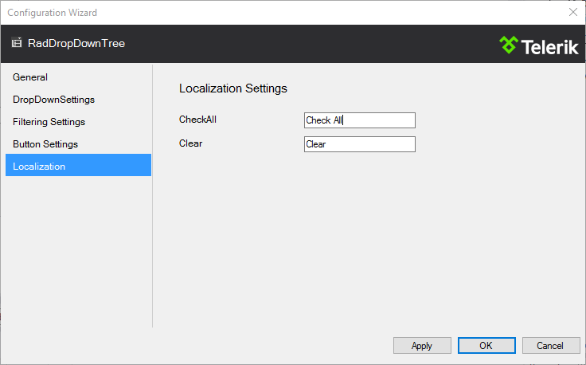

# RadDropDownTree Configuration Wizard

The **RadDropDownTree Configuration Wizard** lets you initially configure the RadDropDownTree control at design-time.

To open the Configuration Wizard, simply click the **Open Configuration Wizard** link in the RadDropDownTree **[Smart Tag]()**. 

>caption Figure 1: RadDropDownTree Smart Tag

## General Configuration

The **General** tab allows configuration of the Expand, Postback and Filtering behaviour of the control. It also offers CheckBoxes and TextMode settings to be set. An Entries delimiter, Path delimiter and Default value could also be set on this tab of the Configuration Wizard.

>caption Figure 2: Configuration Wizard general settings

## DropDown Settings

The **DropDownSettings** tab exposes configuration of some DropDown properties. The tabl allows you to set height and width dimensions, you can set a CSS class, you can set whether its width should be calculated according to the width of the longest item in the DropDown and you can check a box to indicate whether the DropDown should be opened on initial load of the control.

>caption Figure 3: Configuration Wizard DropDown settings

## Filtering Settings

The **Filtering Settings** tab allows you to configure the filtering behaviour of the RadDropDownTree. You can configure the MinFilterLength, Filter type (StartsWith or Contains), FilterTemplate and Filter Highlight properties here. You can also set a text value for the EmptyMessage filter.

>caption Figure 4: Configuration Wizard Filtering settings

<Comment: Feedback for the programming team. It would be more consistent if the name of the tabs in this control matched with the title above the properties on the right. In some cases (DropDown Properties, Button Settings) they do, in others (General, Filtering Settings, Localization) they do not.>

## Button Settings

The **Button Settings** tab allows you to configure if the ShowCheckAll and ShowClear buttons are going to be displayed. 

>caption Figure 5: Configuration Wizard Button settings

## Localization

The **Localization** tab allows you to change the default messages for the buttons embedded within the RadDropDownTree (by default they are "Check All" and "Clear"). 

>caption Figure 5: Configuration Wizard Localization

# See Also

 * [Overview]()

 * [Smart Tag]()
